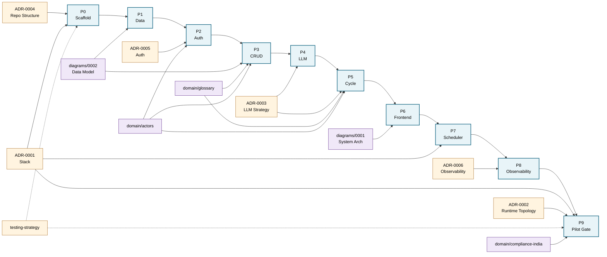

# Build Plan — MVP Pilot Delivery

> Phase-by-phase milestones for Claude Code to deliver, with verifiable acceptance criteria and a map back to the source documents that constrain each phase.

> **How to use this**: read top-to-bottom once for the overall shape. After that, jump to whichever phase you're verifying. Each phase's "Acceptance criteria" rows are checkboxes you tick yourself. Source docs tell you where to look if Claude Code's output drifts from the spec.

---

## Overall build shape

10 phases, P0 through P9. Each phase has a hard prerequisite on the prior — you cannot do auth (P2) before the data layer (P1), can't do LLM service (P4) before auth (because LLM calls are scoped by `hc_id` from the JWT), etc.

Pilot is **launchable at end of P9.** P5 onward could in theory be done in a different order if you wanted to ship a non-AI MVP first, but that's not the plan here — AI is the differentiator, so it lands as soon as the data and auth substrate exist.

---

## Build sequence (flowchart)

```mermaid
flowchart LR
    P0[P0<br/>Scaffolding] --> P1[P1<br/>Data Layer]
    P1 --> P2[P2<br/>Auth Service]
    P2 --> P3[P3<br/>Domain CRUD]
    P3 --> P4[P4<br/>LLM Service]
    P4 --> P5[P5<br/>HC Cycle Workflows]
    P5 --> P6[P6<br/>Frontend]
    P6 --> P7[P7<br/>External Scheduler]
    P7 --> P8[P8<br/>Observability Live]
    P8 --> P9[P9<br/>Pilot Smoke Gate]
    P9 --> Launch((Pilot<br/>Launch))

    classDef phase fill:#e8f4f8,stroke:#1a6985,stroke-width:2px,color:#000
    classDef launch fill:#d1f0c8,stroke:#2d6e1f,stroke-width:3px,color:#000
    class P0,P1,P2,P3,P4,P5,P6,P7,P8,P9 phase
    class Launch launch
```

---

## Phase-by-phase milestones

Each phase below has the same shape: **Goal**, **Deliverables**, **Acceptance criteria**, **Source docs**.

---

### Phase 0 — Repo Scaffolding
**Phase plan**: [`Unit_001_HcCoreCycle/PHASE-00-repo-scaffolding.md`](specs/Unit_001_HcCoreCycle/PHASE-00-repo-scaffolding.md)

**Goal**: Empty but correct repo structure. Worker boots, frontend skeleton boots, local Postgres up. No domain code yet.

**Deliverables**:

- Folder layout matching `ADR-0004` exactly (backend/, frontend/, prompts/, docs/, scripts/, archive/, .claude/)
- `backend/pyproject.toml` with FastAPI, SQLAlchemy 2.0, Alembic, Pydantic v2, httpx, asyncpg
- `backend/wrangler.toml` configured for Python Workers
- `backend/.wranglerignore` excluding `.venv` (workers-py #92 workaround)
- `frontend/package.json` with Next.js 15, Tailwind, shadcn/ui
- `.env.example` documenting every env var (no secrets)
- `.gitignore` standard + `.env`, `.dev.vars`, `node_modules`, `.venv`
- `docker-compose.yml` for local Postgres
- Empty `backend/src/main.py` with one health-check route returning `{"status":"ok"}`

**Acceptance criteria** (you verify):

- [ ] `tree -L 3` matches ADR-0004 layout (no extra dirs, no missing dirs)
- [ ] `cd backend && uv sync` succeeds
- [ ] `cd backend && uv run pywrangler dev` boots Worker on `localhost:8787`
- [ ] `curl localhost:8787/health` returns `{"status":"ok"}`
- [ ] `cd frontend && npm install && npm run dev` boots Next.js on `localhost:3000`
- [ ] `docker compose up -d postgres` brings Postgres up; `psql` connection works
- [ ] `git status` shows no committed secrets; `.env.example` has placeholders only

**Source docs**: `decisions/0004-repo-structure.md`, `decisions/0001-stack-selection.md`

---

### Phase 1 — Data Layer
**Phase plan**: [`Unit_001_HcCoreCycle/PHASE-01-data-layer.md`](specs/Unit_001_HcCoreCycle/PHASE-01-data-layer.md)

**Goal**: Every table from the ERD exists in the database. Async session factory works. Migrations are reversible.

**Deliverables**:

- SQLAlchemy 2.0 models for every entity in `diagrams/0002-data-model.md`
- Models include: `users`, `clients`, `sessions`, `moms`, `briefs`, `action_items`, `check_ins`, `consents`, `diet_charts`, `prep_recipes`, `diet_chart_recipes`, `content_assignments`, `hc_style_snippets`, `llm_calls`, `auth_refresh_tokens`, `audit_log`
- Foreign keys + cascade rules per ERD (cascade-on-delete from `clients` to all client-scoped tables, including `hc_style_snippets`)
- Alembic initialized; first migration creates everything
- `backend/src/db/session.py` async session factory using `asyncpg`
- All session methods are `async def` (per ADR-0001 Consequence #3)

**Acceptance criteria**:

- [ ] `alembic upgrade head` runs clean against local Postgres
- [ ] `\dt` in psql shows all expected tables
- [ ] `alembic downgrade base` works without errors (reversibility)
- [ ] Test script writes one row to each table and reads it back
- [ ] Cascade test: insert `client` + 3 `hc_style_snippets` referencing it; delete client; verify snippets gone in same transaction
- [ ] Cascade test: same for `moms`, `action_items`, `check_ins` referencing the client
- [ ] No sync DB calls anywhere (`grep -r "Session(" backend/src` returns only async usage)

**Source docs**: `diagrams/0002-data-model.md` (primary), `decisions/0003-llm-strategy.md` §4 (`llm_calls` schema), `decisions/0005-auth-strategy.md` (`auth_refresh_tokens`), `decisions/0006-observability.md`

---

### Phase 2 — Auth Service
**Phase plan**: [`Unit_001_HcCoreCycle/PHASE-02-auth-service.md`](specs/Unit_001_HcCoreCycle/PHASE-02-auth-service.md)

**Goal**: HC and client can sign in via Google. JWT issued, refresh works, revoke works, protected endpoints enforced.

**Deliverables**:

- `backend/src/auth/` module with: Google OAuth handler, JWT issuer/verifier, refresh token rotation, revocation
- HTTP client factory enforcing `User-Agent` header (workers-py #68 workaround)
- FastAPI dependency `require_role(role)` for protected endpoints
- Endpoints: `/api/auth/google/start`, `/api/auth/google/callback`, `/api/auth/refresh`, `/api/auth/logout`, `/api/auth/sessions` (list active)
- JWT claims exactly per `ADR-0005` (`sub`, `role`, `hc_id`, `iat`, `exp`, `iss`)
- Refresh tokens stored as SHA256 hashes (never plaintext)
- HTTP-only Secure SameSite=Lax cookie for refresh; access token in response body
- Client onboarding via HC-issued one-time invite token

**Acceptance criteria**:

- [ ] HC sign-in flow: redirect → callback → access token + refresh cookie returned
- [ ] Access token decoded externally (jwt.io) shows correct claims
- [ ] Hitting protected endpoint with no JWT → 401
- [ ] Hitting protected endpoint with expired JWT → 401
- [ ] Refresh endpoint rotates: old refresh token rejected on second use
- [ ] Logout: refresh token in DB has `revoked_at` set; subsequent refresh attempt → 401
- [ ] "Sign out everywhere" revokes all sessions for that user
- [ ] Tenant scoping: HC1's JWT cannot access HC2's data even if URL says so
- [ ] `httpx` calls have `User-Agent` header (verified with mitmproxy or similar)
- [ ] `auth_refresh_tokens` row records `user_agent` and `last_used_at`

**Source docs**: `decisions/0005-auth-strategy.md` (primary), `domain/actors.md`

---

### Phase 3 — Domain CRUD
**Phase plan**: [`Unit_001_HcCoreCycle/PHASE-03-domain-crud.md`](specs/Unit_001_HcCoreCycle/PHASE-03-domain-crud.md)

**Goal**: HC can manage clients, sessions, MOMs (placeholder text), briefs (placeholder text), action items, check-ins. No AI yet — text fields filled manually.

**Deliverables**:

- API routes for: `clients` (create/read/list/invite), `sessions` (create/read/list/end), `moms` (create/read/update — manual text), `briefs` (read), `action_items` (create/read/update/list), `check_ins` (create/read/list)
- All routes scoped by JWT `hc_id`
- Coach-reviewed gate enforced: `mom.status` ∈ {`draft`, `reviewed`, `sent`}; client API can only see `sent`
- Pagination on list endpoints
- Pydantic request/response schemas per route

**Acceptance criteria**:

- [ ] HC1 creates client → invites → client signs in via Google → linked to HC1
- [ ] HC1 creates session for their client; session shows up in HC1's session list
- [ ] HC2 cannot see HC1's session (403 or 404, not data leak)
- [ ] HC creates MOM (status='draft') → updates to status='sent'
- [ ] Client API endpoint hits MOM with status='draft' → 404 (not visible)
- [ ] Same client API hits MOM with status='sent' → 200 with content
- [ ] Action item created during session shows up in client's "open items" list
- [ ] Pagination: list with 25+ items returns first page + cursor

**Source docs**: `diagrams/0002-data-model.md`, `domain/glossary.md`, `domain/actors.md`

---

### Phase 4 — LLM Service
**Phase plan**: [`Unit_001_HcCoreCycle/PHASE-04-llm-service.md`](specs/Unit_001_HcCoreCycle/PHASE-04-llm-service.md)

**Goal**: AI drafts work end-to-end via OpenRouter. Snippet library captures HC edits. Validation + retry + telemetry all wired.

**Deliverables**:

- `backend/src/llm_service/` module per `ADR-0003` §1
- OpenRouter client via `httpx.AsyncClient` with `User-Agent` and no-training/no-retention headers
- `models` array configured with pinned chain from `ADR-0001` (Llama 3.3 → Gemma 3 → GPT-OSS → Nemotron; DeepSeek R1 reachable separately as escape hatch)
- Pydantic schemas in `prompts/schemas/` for: `mom`, `brief`, `action_items`
- Validation retry loop: 1 retry on stricter format hint, then `LLMValidationError`
- Every call writes one `llm_calls` row (success or failure) with all fields per `ADR-0003` §4
- Snippet capture: when HC edits AI draft and sends, diff captured as `snippet_type='edit'`
- Snippet selection: top-N recent snippets within 2K-token budget injected into system prompt
- Prompt files in `prompts/` with YAML frontmatter (`version`, `created`, `notes`)
- First three prompts working: `mom.md`, `brief.md`, `action_items.md`

**Acceptance criteria**:

- [ ] Generate MOM end-to-end: session → POST `/api/sessions/<id>/mom/draft` → returns valid Pydantic-shaped response
- [ ] `llm_calls` row has all fields populated; `final_status='ok'`, `validation_failed=false` on happy path
- [ ] Mock the primary model returning malformed JSON → second call (retry) succeeds → `retry_count=1` recorded
- [ ] Mock all models returning malformed JSON → `final_status='failed_validation'` → caller sees `LLMValidationError`
- [ ] Mock primary model returning HTTP 500 → OpenRouter chain falls through → `model_served` ≠ `model_requested`, `fallback_count > 0`
- [ ] HC edits MOM → on send, row appears in `hc_style_snippets` with `snippet_type='edit'`, `original_text` and `hc_modified_text` both populated, `client_id` set
- [ ] Next MOM call for same HC includes that snippet in the system prompt (verified by logging assembled prompt)
- [ ] Snippet token budget enforced: with 50+ snippets, the assembled prompt's snippet section ≤ 2K tokens
- [ ] No-training/no-retention headers verified in OpenRouter request (check OpenRouter dashboard or capture request)
- [ ] Cascade test: delete client → all that client's snippets purged in same transaction (re-verify Phase 1 still holds)

**Source docs**: `decisions/0003-llm-strategy.md` (primary), `decisions/0001-stack-selection.md` (LLM chain + snippet sections)

---

### Phase 5 — HC Cycle Workflows + Client File Library
**Phase plan**: `Unit_001_HcCoreCycle/PHASE-05-hc-cycle-workflows.md` *(write before P5 build sprint begins)*

**Goal**: The actual product loop. Two parts that ship together but verify independently.

- **Part A — HC Cycle Workflows**: pre-session brief generation, MOM workflow end-to-end, action item lifecycle, triage flags, AST view, M000 first-session edge case. Plus persistent `session_notes` (the textarea HC types into during/after a session).
- **Part B — Client File Library**: HC uploads files per session (their own notes, Zoom AI summaries, PDFs from clients). Files live on disk in a per-client / per-session folder structure. File contents feed the LLM as additional session context alongside `session_notes`. Zoom-summary files are tagged so they don't pollute style-snippet learning.

Verification has two subsections (Part A and Part B). Each is tickable independently — Part A can be marked verified before Part B, so a Part B issue does not block Part A from being considered done.

---

#### Part A — HC Cycle Workflows

**Deliverables (Part A)**:

- Add `sessions.session_notes` column (text, nullable). HC types observations during/after session. Persisted; viewable; editable freely (every edit overwrites; new draft regeneration uses latest content).
- Pre-session brief endpoint: pulls prior MOM + AST (open action items, recent status, trends) + snippet payload + recent check-ins → calls LLM service → returns brief
- MOM workflow end-to-end: HC opens session → enters notes → generates draft (`POST /mom/draft` already exists from P4, now also persists `session_notes`) → reviews → edits (snippet capture fires per P4) → sends (`status='sent'`, client visibility unlocks)
- Re-draft: HC may regenerate the MOM draft after editing `session_notes`. Each regeneration writes a new `llm_calls` row; the MOM `draft_text` is overwritten with the new draft.
- Action items: lifecycle states (`open`, `in_progress`, `completed`, `missed`); transitions captured. Existing P3 CRUD extended: `missed` is auto-set when an action item passes its `due_date` without completion (job for P7; in P5, manual transition is acceptable).
- Triage flag aggregation: missed action items, sentiment flags, recency-based concerns surface in next brief
- Sentiment flag stub: manual tagging at MVP (per `ADR-0003` deferral); auto-detection deferred
- AST view (Action / Status / Trends) computed for client at request time, used by brief generation and exposed via `GET /clients/{id}/ast` for HC visibility
- M000 first-session edge case: empty AST and empty snippets — brief endpoint returns the "M000 prep" view per `SPEC-0001 §Stage 2` rather than a normal brief

**Acceptance criteria (Part A)**:

- [ ] End-to-end M00N session: HC opens session → enters notes in textarea → notes persist on save → generates brief (uses prior MOM + AST + snippets) → conducts session (manual) → generates MOM draft → edits → sends
- [ ] `sessions.session_notes` is viewable via `GET /sessions/{id}` and editable via `PATCH /sessions/{id}`; HC can re-edit after a draft has been generated
- [ ] Brief includes: 1+ snippet (if available), open action items count, last MOM summary, recent check-in summary
- [ ] Re-draft path: HC edits `session_notes`, regenerates draft, second `llm_calls` row appears with the new prompt content
- [ ] Action items from sent MOM appear in next brief's AST as `open`
- [ ] Action item not completed by next session → flagged in next brief's triage section (manual transition acceptable in P5; auto-flagging deferred to P7)
- [ ] Coach-reviewed gate verified again at workflow level: client cannot view brief content (briefs are HC-internal)
- [ ] AST endpoint returns structured response: open items list, status summary, trend tags
- [ ] M000 flow: first session has empty AST and empty snippets — brief endpoint returns the "M000 prep" view (intake notes + checklist) instead of a normal brief

---

#### Part B — Client File Library

**Deliverables (Part B)**:

- Storage layout: `client_session_library/CP<NNNN>_<Sanitized_FirstName>_<Sanitized_LastName>/<YYYY-MM-DD>_session-<NN>/` on AWS S3 Mumbai (per `ADR-0001`)
  - Per-HC tenant isolation: each HC has their own top-level prefix (S3 prefix per HC, or per-HC bucket — implementation choice in PHASE-05 plan)
  - Per-client subfolder uses the existing `clients.code` (`CP0001`, `CP0002`, ...) plus sanitized name (`[A-Za-z0-9_.-]`, max 40 chars)
  - Per-session subfolder uses session date (IST) + zero-padded session number for that client
- New `client_files` table tracking file metadata: `id`, `session_id`, `hc_user_id`, `original_filename`, `storage_path` (S3 key), `mime_type`, `size_bytes`, `uploaded_at`, `is_zoom_summary` (BOOLEAN, default false). Tenant-scoped per ADR-0005; cascade-delete on client deletion.
- `session_notes.txt` mirroring: when `sessions.session_notes` is saved/updated (Part A endpoint), backend ALSO writes a `session_notes.txt` file into that session's library folder. **DB column is canonical** (Option A, decided 2026-05-04); file is a read-only mirror written on every save. HC may view the file for backtrack reference; if they edit it on disk, the next textarea save overwrites their edit. Document this clearly in the spec and in `domain/glossary.md`.
- Multi-file upload endpoint: `POST /sessions/{session_id}/files` (multipart). Accepts 1+ files in one request. Returns the list of created `client_files` rows with their IDs and storage paths.
- File listing endpoint: `GET /sessions/{session_id}/files`. Returns metadata for all files in this session.
- File deletion endpoint: `DELETE /sessions/{session_id}/files/{file_id}`. Removes both the S3 object and the `client_files` row. Tenant-scoped.
- Zoom-summary tagging: files uploaded with `is_zoom_summary=true` (HC-set via UI, default false) are flagged. The default filename pattern `zoom_ai_summary_<...>` may auto-set the flag — provisional convention to be finalized later. Document the placeholder in the spec.
- LLM prompt assembly (`backend/src/llm_service/prompts.py`) — extend the MOM and brief prompt assembly to include file content. Per Option (b): use distinct headers in the assembled prompt:
  - `## HC's typed notes:` followed by `sessions.session_notes` content
  - `## Uploaded files:` followed by file content (concatenated, with file-name sub-headers)
- Snippet capture exclusion: the snippet capture path (P4's `snippets.capture()`) must NOT learn style from content originating in files where `is_zoom_summary=true`. The HC's edits to LLM drafts are still snippet-eligible regardless of source — what matters is that Zoom AI's voice never enters the snippet library. Verify by integration test.
- File content size limits and validation: max file size per upload (suggested 25 MB; finalize in spec); accepted MIME types (`text/plain`, `text/markdown`, `application/pdf`, `application/vnd.openxmlformats-officedocument.wordprocessingml.document` for .docx, plus a small whitelist — finalize in spec). Reject anything outside the whitelist.
- Re-draft after upload: HC uploads files → regenerates MOM draft → new `llm_calls` row reflects expanded session content. Same path as Part A re-draft.

**Acceptance criteria (Part B)**:

- [ ] HC uploads 1+ files for a session via `POST /sessions/{id}/files` → files appear in S3 at the documented path → `client_files` rows created
- [ ] `client_files` rows are tenant-scoped: HC2 cannot see HC1's file metadata via any endpoint
- [ ] When `sessions.session_notes` is saved, `session_notes.txt` exists in the session's S3 folder with matching content
- [ ] If HC edits `session_notes` again, the file is overwritten with the new content
- [ ] HC generates MOM draft after uploading files → assembled prompt (visible in `llm_calls.prompt_text` via decryption) contains both "HC's typed notes:" and "Uploaded files:" sections with the right content under each
- [ ] HC uploads a file with `is_zoom_summary=true` → that file's content reaches the LLM but does NOT produce a `hc_style_snippets` row when the HC subsequently edits the draft (the edit is captured as a snippet only if the underlying source was the HC's own content, not the Zoom AI's)
- [ ] HC uploads multiple files in one request → all appear in S3 and `client_files`
- [ ] HC deletes a file via `DELETE /sessions/{id}/files/{file_id}` → S3 object gone, `client_files` row gone
- [ ] Cascade-delete: revoking client consent (`DELETE FROM clients WHERE id = X`) removes all `client_files` rows AND all S3 objects under that client's prefix (test the cascade explicitly — S3 cleanup may need a separate sweep job; document in the spec if so)
- [ ] File size and MIME validation: oversized or wrong-MIME file → 400 with clear error
- [ ] Pseudonymization preserved: file content is part of `prompt_text` but the storage path itself uses `clients.code` (not `clients.full_name`), so even on filesystem inspection, no client identity leaks

---

**Source docs**: `domain/glossary.md` (HC cycle terms; new terms for client library, session_notes mirror), `domain/actors.md`, `decisions/0003-llm-strategy.md`, `decisions/0001-stack-selection.md` (S3 Mumbai), `decisions/0006-observability.md` (PII redaction continues), `Unit_001_HcCoreCycle/SPEC-0001-hc-core-cycle.md` (HC cycle stages and acceptance — Part B will require a SPEC-0001 update to incorporate the file library concept; Part A may or may not — phase plan to decide)

---

### Phase 6 — Frontend
**Phase plan**: `Unit_001_HcCoreCycle/PHASE-06-frontend.md` *(write before P6 build sprint begins)*

**Goal**: HC can do the entire core cycle through the browser.

**Deliverables**:

- Next.js 15 App Router structure
- Sign-in screen (Google OAuth redirect)
- HC dashboard: today's sessions, recent clients, pending action items
- Client list + client detail (history, current AST)
- Session view: pre-session brief, in-session notes area, post-session MOM editor
- MOM editor: shows AI draft, allows edit, "Send" button transitions to status='sent'
- Action items view (per client + cross-client)
- Sign out, session list (own auth sessions, with "revoke" buttons)
- Tailwind + shadcn/ui per `ADR-0001`

**Acceptance criteria**:

- [ ] HC signs in → lands on dashboard
- [ ] Click into a session → see brief → run a mock session → MOM draft appears
- [ ] Edit MOM → click Send → MOM status updates to `sent`
- [ ] After send, query DB: a new row in `hc_style_snippets` reflects the edit (round-trip Phase 4 acceptance)
- [ ] Click into a client → see their AST, history
- [ ] Sign out → redirected to sign-in; refresh cookie cleared
- [ ] Mobile viewport (Chrome devtools at 375px wide) is usable, not broken

**Source docs**: `decisions/0001-stack-selection.md` (frontend stack), `decisions/0004-repo-structure.md` (frontend layout), `domain/glossary.md` (UI terminology)

---

### Phase 7 — External Scheduler
**Phase plan**: `Unit_001_HcCoreCycle/PHASE-07-external-scheduler.md` *(write before P7 build sprint begins)*

**Goal**: Periodic background tasks run via external scheduler hitting Worker endpoints. APScheduler is *not* used (per `ADR-0001` — incompatible with Workers no-threading).

**Deliverables**:

- Worker endpoint(s) for scheduled tasks, authenticated by shared secret in header (`X-Scheduler-Token`)
- At minimum: snippet-retirement sweep (soft-retire snippets > 180 days unreinforced — manual heuristic at MVP)
- GitHub Actions cron OR EasyCron config committed to repo
- All scheduled tasks idempotent (safe to run twice)
- Endpoint logs structured event (`event=scheduled_task_run`)

**Acceptance criteria**:

- [ ] External scheduler hits the endpoint daily; verified by structured log entries
- [ ] Endpoint without correct `X-Scheduler-Token` returns 401
- [ ] Running the task twice in succession produces the same end state as once (idempotent)
- [ ] Snippet retirement: insert a 200-day-old snippet → run task → snippet has `retired_at` set
- [ ] Snippet retirement: insert a recent snippet → run task → snippet `retired_at` remains NULL

**Source docs**: `decisions/0001-stack-selection.md` (background jobs row), `decisions/0006-observability.md` (logging conventions)

---

### Phase 8 — Observability Live
**Phase plan**: `Unit_001_HcCoreCycle/PHASE-08-observability-live.md` *(write before P8 build sprint begins)*

**Goal**: Errors land in Sentry, structured logs appear in Cloudflare dashboard, `llm_calls` dashboards answer the trigger questions.

**Deliverables**:

- Sentry SDK initialized at app startup (verify Pyodide-compat first; fall back to thin HTTP reporter if SDK fails)
- PII scrubbing per `ADR-0006`: emails, phone, names, health content never reach Sentry
- Structured JSON logging on every request (start + end-of-request, with all standard fields per `ADR-0006`)
- Five SQL dashboard queries documented in `docs/standards/` or inline in `ADR-0006`:
  1. Validation failure rate, rolling 7 days (trigger #8 monitor)
  2. Fallback rate by chain position
  3. Mean latency per model
  4. Calls per task type per day
  5. Token consumption projection
- Sentry alert rules configured (any new error → notify; >5/hour → escalate; any `kind=llm_validation` during pilot → same-day review)

**Acceptance criteria**:

- [ ] Force a deliberate exception in dev → appears in Sentry within 30s, no PII visible
- [ ] Cloudflare Workers Logs dashboard shows JSON-formatted lines with all standard fields
- [ ] Run all 5 dashboard SQL queries against pilot data → results sensible (not empty, not absurd)
- [ ] Snippet content does NOT appear in any log line (grep test)
- [ ] Email/phone do NOT appear in any Sentry breadcrumb (test by signing in and triggering an error)
- [ ] Cross-reference table from `ADR-0006` walked once: every signal traces to a trigger, every trigger has a known signal source

**Source docs**: `decisions/0006-observability.md` (primary), `decisions/0003-llm-strategy.md` §4 (`llm_calls` schema)

---

### Phase 9 — Pre-Pilot Smoke Gate
**Phase plan**: `Unit_001_HcCoreCycle/PHASE-09-pilot-smoke-gate.md` *(write before P9 build sprint begins)*

**Goal**: Production-config Worker proven against real RDS Mumbai + real OpenRouter + real S3 Mumbai. Cloudflare platform features enabled. Pilot HC seeded with snippet examples.

**Deliverables**:

- `scripts/smoke-test.py`: end-to-end script that (1) queries production RDS Mumbai, (2) makes one OpenRouter call against primary model with a sample snippet payload, (3) reads one S3 Mumbai object — all from a deployed Worker, not local
- Cloudflare dashboard configured: rate limiting rules, WAF basic, cache rules where applicable, DDoS protection (per `ADR-0002` "Cloudflare platform features ≠ Workers code")
- Pilot HC onboarding flow run: HC reviews 3–5 sample AI drafts and edits them; resulting `hc_style_snippets` rows populated
- `compliance-india.md` reviewed against current implementation: consent table populated, India-region DB confirmed, real deletion path tested
- `SESSION_LOG.md` updated with pilot launch entry

**Acceptance criteria**:

- [ ] `scripts/smoke-test.py` exits 0 against production-config Worker
- [ ] Cloudflare dashboard shows rate limiting + WAF + cache rules enabled (screenshot recorded)
- [ ] Pilot HC has ≥ 5 snippets in `hc_style_snippets` after onboarding
- [ ] Consent UX: HC's first client gives signed-PDF consent; row in `consents` table
- [ ] DPDP deletion test: simulate consent revocation for the test client → all client data + snippets purged in single transaction; verified by post-deletion query
- [ ] First real M000 session completes end-to-end with the pilot HC and a real client
- [ ] No Sentry errors in first 24 hours post-launch (or all errors triaged and logged)

**Source docs**: `decisions/0001-stack-selection.md` (open follow-ups, smoke-test gate), `decisions/0002-runtime-topology.md` (CF platform features), `domain/compliance-india.md` (DPDP posture)

---

## Traceability matrix

Quick lookup: which docs constrain which phases. `●` = primary source. `○` = secondary reference.

| Document                   | P0 | P1 | P2 | P3 | P4 | P5 | P6 | P7 | P8 | P9 |
| -------------------------- | -- | -- | -- | -- | -- | -- | -- | -- | -- | -- |
| ADR-0001 stack             | ● | ○ |    |    | ○ |    | ○ | ● |    | ● |
| ADR-0002 runtime topology  |    |    |    |    |    |    |    |    |    | ● |
| ADR-0003 LLM strategy      |    | ○ |    |    | ● | ● |    |    | ○ |    |
| ADR-0004 repo structure    | ● |    |    |    |    |    | ○ |    |    |    |
| ADR-0005 auth              |    | ○ | ● | ○ |    |    |    |    |    |    |
| ADR-0006 observability     |    | ○ |    |    | ○ |    |    | ○ | ● |    |
| diagrams/0001 system arch  | ○ |    |    |    | ○ |    | ○ | ○ |    | ○ |
| diagrams/0002 data model   |    | ● | ○ | ● | ○ | ○ |    |    |    |    |
| domain/glossary            |    |    |    | ● | ○ | ● | ○ |    |    |    |
| domain/actors              |    |    | ● | ● |    | ● | ○ |    |    |    |
| domain/compliance-india    |    | ○ |    | ○ |    |    |    |    |    | ● |
| standards/CONTRIBUTING     | ● |    |    |    |    |    |    |    |    |    |
| standards/testing-strategy | ● | ● | ● | ● | ● | ● | ● | ● | ● | ● |

Reading the matrix: when verifying Phase 4 (LLM Service), open `decisions/0003-llm-strategy.md` first (●), and have `decisions/0001-stack-selection.md` and `diagrams/0002-data-model.md` and `decisions/0006-observability.md` ready as supporting refs (○).

---

## Fishbone — what feeds each phase

Spine = phase order (left to right). Upper bones = ADRs and standards. Lower bones = domain docs and diagrams. Each connection means: that doc is a primary source for that phase.

Dotted lines (`testing-strategy → P0, P9`) mean it applies across all phases but is most actively verified at scaffold (test infra setup) and pilot gate (full coverage check).

---

## How to use this when working with Claude Code

Suggested loop per phase:

1. **Write the PHASE file first.** Before any code: create `docs/specs/Unit_001_HcCoreCycle/PHASE-NN-kebab-title.md` using `docs/specs/template-phase-plan.md`. Fill in Scope and the Deliverables you intend to ship. Get SoJo's confirmation. Only then start implementation. (P0–P4 already have their PHASE files; P5 onward must follow this rule.)
2. **Open the relevant phase section above.** Read Goal + Source docs.
3. **Open the source docs** in another tab. Skim them, especially the section the matrix marks as `●`.
4. **Tell Claude Code**: "Implement Phase N per `docs/build-plan.md`. Source docs are X, Y, Z. When you're done, I'll verify against the acceptance criteria."
5. **When Claude Code says it's done**: walk the acceptance criteria checkboxes one by one. Don't accept "all good" — actually run the queries / hit the endpoints / check the headers.
6. **If any checkbox fails**: send Claude Code back. Don't move to Phase N+1 until Phase N is fully ticked.
7. **When phase is fully ticked**: complete the PHASE file (fill §6 Verification, §7 Lessons, §8 Carry-over), update `SESSION_LOG.md` with phase completion, move to next.

If a phase reveals a gap in the source docs (e.g. ambiguity Claude Code surfaces), update the doc *first*, then continue. Don't let undocumented decisions accumulate.

---

## What's not in this plan (and why)

- **Pricing / billing flow** — out of pilot scope. HC is not paying through the platform at MVP.
- **Multi-tenant scaling** (multiple HCs) — out of MVP scope. Architecture supports it; UX hasn't been designed.
- **Sentiment auto-detection** — deferred per `ADR-0003`. Manual tagging only at MVP.
- **Embedding-based snippet selection** — deferred per `ADR-0003`. Recency-weighted only at MVP.
- **Mobile app** — out of scope. Responsive web only.
- **Integrations** (Zoom webhook ingest, calendar sync, etc.) — out of scope at pilot. Architecture is webhook-friendly; no work happens until HC requests it.

---

## Changelog

| Date       | Change         | Reason                                                                      |
| ---------- | -------------- | --------------------------------------------------------------------------- |
| 2026-04-28 | Initial draft. | Build sequence and verification structure needed before Claude Code starts. |
| 2026-05-04 | Added phase-plan links for P0–P4; added "write PHASE file first" as step 1 in the How-to-use loop; added step 7 (complete PHASE file after verification). | Naming cleanup session established the PHASE file convention; PHASE-04 written retroactively and linked. P5 onward must write PHASE file before build sprint. |
| 2026-05-05 | Reframed P5: split into Part A (HC Cycle Workflows — original P5 scope plus persistent `session_notes` column) and Part B (Client File Library — new scope: `client_files` table, S3-backed per-client/per-session folder structure, multi-file uploads, Zoom-summary tagging, file content as additional LLM prompt input, `session_notes.txt` mirror with DB as canonical). Each part has its own deliverables, acceptance criteria, and verification subsection in the eventual PHASE-05 plan. | New product decisions emerged during P5 prep conversation: HC needs in-app textarea for quick notes (persistent + editable) AND file uploads for richer session content (Zoom AI summaries, PDFs, external notes). Both feed the LLM prompt under distinct headers. Splitting into parts keeps verification gateable while the phase ships as one PHASE file. |
