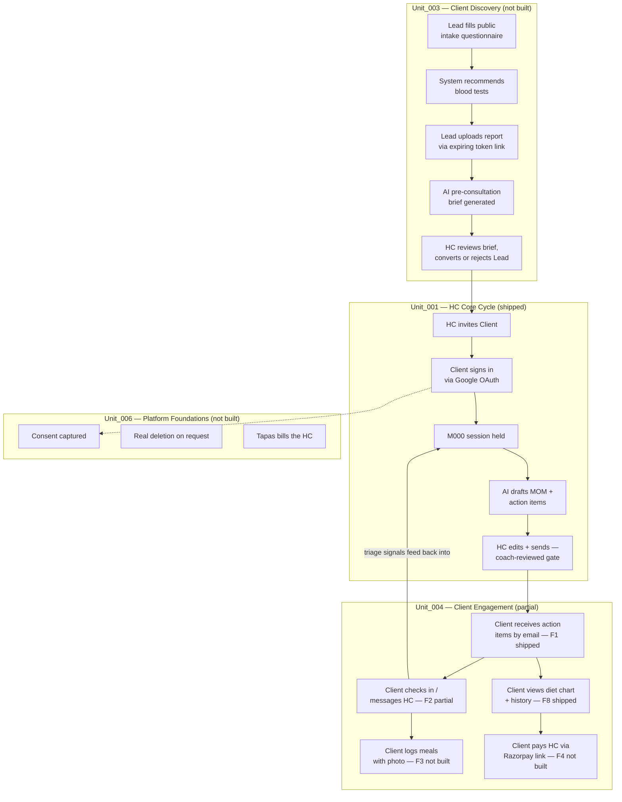
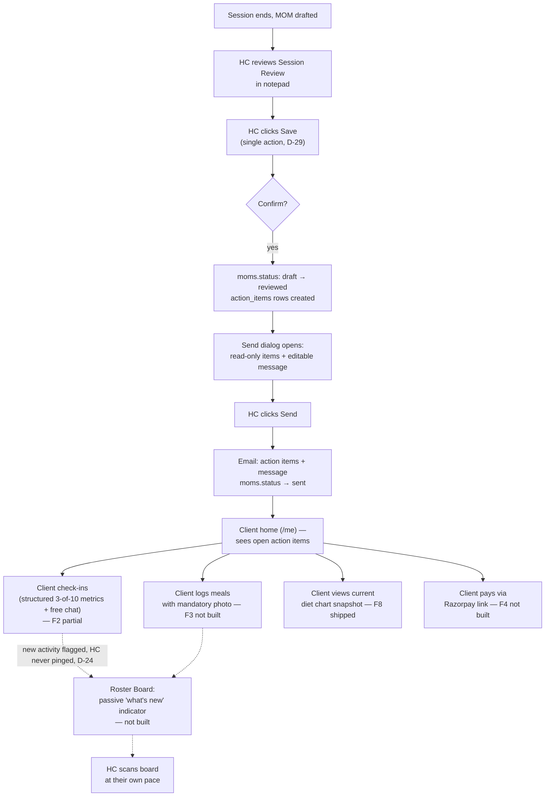
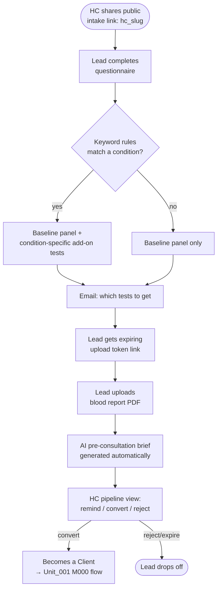

# Tapas — Product & Business Overview

> **Purpose of this document**: a single reference for (a) briefing a fresh AI conversation on what Tapas is and where it stands, and (b) a business/market read for a co-founder, investor, or advisor. Written 2026-07-30. Reflects the state of 4 active git worktrees (branches `feature/unit-003-client-discovery-pipeline`, `feature/unit-004-one-stop-spot`, `feature/unit-005-macro-calculator`, `feature/unit-006-platform-foundations`) plus `main`.
>
> Companion document: `docs/business/tapas-security-review.md` (engineer-facing, code-level security review — kept separate deliberately).

---

## 1. Product identity

**Tapas** (formerly "Parivarthan," renamed 2026-07-14 — see `docs/decisions/0008-platform-rename-parivarthan-to-tapas.md`) is a health-coaching practice-management platform for **independent health coaches (HCs) in India** — nutritionists, wellness coaches, dietitians running their own client roster, not a clinic or hospital system.

**Core bet**: an HC's real bottleneck isn't giving advice, it's the administrative overhead around each session — prepping, writing up notes, chasing check-ins, tracking commitments, answering "what did we agree on again?" on WhatsApp. Tapas absorbs that overhead with AI assistance, while keeping a hard rule that AI never talks to a client directly — everything the client sees has been reviewed and sent by the HC (the **"coach-reviewed gate"**).

**Current stage**: pre-pilot. The core HC-facing loop (Unit_001) is built and stable. Client-facing surfaces (the other half of the product — Unit_004) are partially built. Three further units (lead-intake, custom macro calculator, platform foundations) are fully specced but not yet implemented. No real HC or client has used the product outside of the one SoJo test account referenced in the session log.

**North star** (from Unit_004's own spec): *a solo HC running ~20 clients can eliminate WhatsApp as their practice-management layer* — plans delivered, check-ins collected, payments settled, all inside Tapas.

**Jurisdiction**: India-first, DPDP Act 2023-governed. Architecture is deliberately multi-actor (coach / client / future admin) from day one, per `CLAUDE.md` §9 — this is a constraint baked into the data model, not a UI limitation.

> **Architecture note — read this before concluding anything about HC count**: the platform has supported multiple concurrent HCs as a day-one design decision, not a pilot-scale limitation. `docs/decisions/0005-auth-strategy.md` explicitly designs Tapas as "a multi-tenant consumer SaaS" (§ADR-0005) with `hc_user_id` as the tenant boundary — every Client belongs to exactly one HC, and one HC's JWT cannot access another HC's data (enforced at the query layer, verified by 10+ cross-tenant integration tests in `backend/tests/integration/`, e.g. `test_get_client_cross_tenant_returns_404`). The only thing gating a **second real HC's onboarding** is the DPDP consent/DSAR process (see `docs/domain/compliance-india.md`) — today that's a manual signed-PDF + operator-export process, explicitly "not scalable but defensible at N=1," slated to be replaced by Unit_006 PHASE-02/03. That is a **compliance-readiness gate**, not a software constraint. Don't conflate the two — the pilot's real first-wave limit is operational/legal readiness, not what the architecture can technically support.

---

## 2. Feature inventory by unit

Status legend: 🟢 Shipped & merged · 🟡 Partially shipped · 🔵 Specced, not yet built · ⚪ Scoped only (not yet individually designed)

### Unit_001 — HC Core Cycle · 🟢 Shipped (Status: Accepted)
The central product loop — what the platform fundamentally exists to support.

| Feature | Detail |
|---|---|
| Client onboarding | HC creates client → sends invite → client signs in via Google OAuth (real account, not a magic link) |
| Session lifecycle | HC creates/edits sessions; session notes captured pre-MOM |
| Pre-session AI brief | AI-drafted, HC-internal only; includes **AST** (Action/Status/Trends) and **triage flags** (missed action item, no check-in in 14 days, distress mention) |
| MOM (Session Review) | AI-drafted post-session summary + action items + follow-ups; **HC edits before anything is final** — the coach-reviewed gate |
| Action items | Client commitments, manual due dates (deliberately no auto-default), status tracked, freely changeable by HC |
| Check-ins | Client-submitted, HC can flag/clear sentiment; excluded from AST/recap while still pending (fixed 2026-07-27ish, see recent commits) |
| Client file uploads | Cloudflare R2-backed; Zoom AI Companion summaries auto-detected and excluded from HC style-snippet capture |
| Style snippet flywheel | Captures the HC's own edits to AI drafts over time, feeds future drafts back in the HC's voice — a real personalization loop, not just a fixed prompt |
| LLM service | OpenRouter, model fallback chain (Llama 3.3 70B → Gemma 3 27B → Nemotron 120B), every call logged with prompt version, token counts, latency, and cost |
| Auth | Google OAuth 2.0 + PKCE, refresh-token rotation with replay detection, strict tenant isolation (cross-tenant access returns 404, never 403 — never leaks existence) |
| Infra | Cloud Run (GCP, `asia-south1`), Postgres (AWS RDS, Mumbai), custom domain `app.tapas.fitness` via a Cloudflare Worker reverse proxy |

### Unit_002 — Supplement Recommendations · 🟢 Shipped (Status: Accepted)
Simple, deliberately narrow: HC keeps a permanent, client-scoped log of supplement recommendations (name/dosage/duration/reason), editable and soft-deletable. Free-text name today (mock dropdown) — no brand catalog, no client visibility, no LLM involvement. Medications explicitly excluded (wellness supplements only).

### Unit_003 — Client Discovery Pipeline · 🔵 Specced, not built (Status: Draft)
Automates everything before a prospective client's first session (M000):

| Stage | What happens |
|---|---|
| 1. Public intake form | Lead completes a questionnaire (free text / multiple choice / 1–10 scale, no branching logic) at a permanent, system-generated public URL (`hc_slug`) |
| 2. Auto lab-test recommendation | Standard baseline panel + condition-specific add-ons (keyword-rule matched, e.g. "PCOD" → hormonal panel) |
| 3. Blood report upload | Lead uploads via an expiring, token-gated link (same pattern as client invite tokens) |
| 4. AI pre-consultation brief | Generated once, automatically, from questionnaire + report text — HC-internal only, never shown to the Lead |

HC gets a pipeline view of all leads by stage, with manual remind/convert/reject actions. Unserious leads drop off naturally before ever reaching the HC's calendar.

### Unit_004 — One Stop Spot (Client Engagement) · 🟡 In progress — **this branch**
The client's side of the product. Before this unit, the client is invisible to the platform.

**Shipped:**
- **F1** — Post-session action items delivered by email: HC finalizes the AI-drafted action-item list ("Save" locks it and writes real `action_items` rows), then a Send dialog fires an email with the items + a personal, editable message.
- **F8** — Diet chart send with version history: HC's private working chart is untouched; "Send to client" freezes an immutable snapshot. Client always sees the latest snapshot; history shows only sent snapshots, never in-progress edits.
- **F6** — Meeting link (manual URL) + full Google Calendar integration: month/week calendar view, pick an existing event or create one with a Meet link, linked to a session. Incremental OAuth consent, no calendar content persisted beyond the linked event's id/link.
- **F2 (foundation only)** — Client portal exists: role-aware login redirect, `/me/*` route tree, client home page showing their own open action items.

**Specced, not yet built:**
- **F2 (remainder)** — Check-ins lifecycle (HC can now *request* a check-in that starts unanswered, layered on the existing client-initiated flow — same storage, not a new table; 10 fixed metrics, client rates any 3 per week, can change which 3 weekly), free-text async messaging (permanent once sent, no edit/delete, photo attachments), diet-chart client view.
- **F3** — Logged meals: 5 fixed daily slots (Breakfast/Morning Snack/Lunch/Evening Snack/Dinner), **mandatory** photo per entry, HC reacts with happy/neutral/sad, grouped by day.
- **F4** — Payments: each HC self-onboards their own Razorpay account; Tapas is never the merchant of record and never holds client money. v1 is deliberately minimal — pending/paid only, no partial payments, no refund flow in-app, no recurring billing.
- **Roster Board "what's new" indicator** — passive, per-client signal of new activity (message/check-in/meal). Deferred in every phase's self-review so far; nothing built.

Cross-cutting rule for this whole unit (D-24): the **HC is never proactively pinged** for client activity — they scan the Roster Board when they choose. The **client** is always emailed when the HC does something client-facing.

### Unit_005 — Macro-Driven Diet Charts, Part A: Agnostic Macro Calculator · 🔵 Specced, not built (Status: Draft)
A deliberate niche differentiator: instead of forcing the HC into a fixed list of textbook formulas (Mifflin-St Jeor, Katch-McArdle, etc. — the norm for competing platforms), the HC **defines their own formulas** from a library of client variables, constants, and chained intermediate values, saves them as a named reusable preset, and applies it to any client to produce target protein/carbs/fat/fibre/calories.

Explicitly scoped down for v1: metric units only, no activity-multiplier table, no formula branching/conditionals, no history of past computed values, and — importantly — **no automatic population into the diet chart** yet (that's a future Part C; today it's a reference number the HC reads while building the chart by hand). No recipe/food library either (future Part B). 100% HC-internal; clients never see this.

### Unit_006 — Platform Foundations · 🔵 Specced, not built (Status: Draft — PHASE-01 ready for an implementation plan)
Not a "feature" in the pitch-deck sense — the set of things a real, trustworthy production platform needs regardless of which features it sells. Identified by auditing the actual repo, not assumption.

| Phase | Scope |
|---|---|
| PHASE-01 | HC settings/profile: new `business_name` field; existing Google-sourced `display_name`/`photo_url` exposed read-only |
| PHASE-02 | Account/data lifecycle — **real deletion**, not the existing soft-delete flag (`users.deleted_at`) alone. DPDP requires irreversible deletion, not a flag. |
| PHASE-03 | Legal/consent — in-app Terms/Privacy pages; a `consents` table already exists in the data model but nothing uses it yet |
| PHASE-04 | Operator/admin visibility — using the existing binary `is_operator` flag, not a new RBAC system |
| PHASE-05 | Baseline error/empty states |
| PHASE-06 | Monetization — how **Tapas itself** charges HCs (separate from Unit_004's F4, which is HC→client payment) |
| PHASE-07 | Final pilot-readiness re-verification |

---

## 3. Flow diagrams

### 3.1 Whole-product actor flow

How a prospective client becomes a paying, engaged client, and how the HC operates across the full lifecycle. Dotted boxes are not-yet-built units.

### 3.2 Core HC cycle, detail (Unit_001 — shipped, already documented in `Unit_001_HcCoreCycle/SPEC-0001-hc-core-cycle.md`)

```mermaid
flowchart LR
    subgraph M000 [M000: Onboarding]
        A1[HC creates client] --> A2[HC invites] --> A3[Client signs in via Google] --> A4[M000 session held] --> A5[MOM drafted] --> A6[HC edits + sends MOM]
    end
    subgraph BS [Between Sessions]
        B1[Client check-ins] --> B2[Action item updates] --> B3[Triage signals accumulate]
    end
    subgraph M00N [M00N: Subsequent Session]
        C1[Pre-session brief generated] --> C2[HC reviews brief] --> C3[Session held] --> C4[MOM drafted] --> C5[HC edits + sends MOM] --> C6[Snippet captured from edits]
    end
    A6 --> B1
    B3 --> C1
    C5 --> B1
```

### 3.3 Client engagement loop (Unit_004 — mixed shipped/planned)

### 3.4 Lead intake funnel (Unit_003 — specced, not built)

---

## 4. Market positioning

Benchmarked against six comparable platforms: **Practice Better** and **Nutrium** (dietitian/wellness-practice focused), **TrueCoach** (fitness-training focused, nutrition bolted on via MyFitnessPal), **Healthie** (the most enterprise-leaning, full EHR-style platform many digital-health startups build on top of), **CoachAccountable** (generalist life/business coaching), and **Kore App** — an India-specific competitor giving dietitians their own branded client app, the closest existing analogue to Unit_004's own north star.

### 4.1 Where Tapas is genuinely differentiated

| Differentiator | Why it holds up | Competitor comparison |
|---|---|---|
| **Coach-reviewed AI gate** | Every AI-drafted artifact (MOM, action items, pre-consultation brief) is structurally blocked from reaching a client until the HC edits and explicitly sends it — this is enforced in the data model (`moms.status`: draft → reviewed → sent), not just a UI convention. | Practice Better's AI charting and Healthie's AI scribe assist documentation; neither enforces a hard review-before-delivery gate the way Tapas's MOM→action-items pipeline does. |
| **HC-authored macro formula engine** (Unit_005) | HC defines their own arithmetic formulas from variables/constants/chained values and saves them as reusable presets — not a fixed textbook-formula dropdown. | No verified competitor precedent found (Trifecta, Macros Inc, CoachRx: fixed proprietary formula; My PT Hub: manual override of a number, not a formula builder). This is real whitespace, not just marketing framing — though it's also unbuilt, so it's a differentiator only once shipped. |
| **AST + triage-flagged pre-consultation brief** (Unit_003, unbuilt) | Auto-synthesizes questionnaire + blood report into a structured, flagged briefing the HC reads once, before ever meeting the lead. | Competitors surface raw intake history/notes; none auto-generate a synthesized pre-call brief with flagged risk signals. |

### 4.2 Where Tapas is behind table-stakes

| Gap | Who already has it | Tapas today |
|---|---|---|
| Native or branded mobile app | Kore App (branded per-coach app is its core pitch), TrueCoach, Practice Better | Web PWA only, at `/me/*`, shared across all HCs (no per-HC branding) |
| Push notifications | Kore App leans on this heavily for client adherence | Email-only client notifications (D-24); no push anywhere in any unit |
| Group/cohort program delivery | Practice Better, Nutrium (both support one-to-many) | Every unit assumes strict 1:1 HC↔client |
| Recurring/subscription billing | Healthie, CoachAccountable, Kore App | Unit_004 F4 explicitly v1-scopes to one-off payment links only (D-27) |
| Client self-service booking/scheduling | CoachAccountable, Kore App | No client-initiated scheduling anywhere; HC drives all calendar coordination (Unit_004 F6) |

### 4.3 Read

Tapas isn't competing on feature-count breadth — Healthie and Practice Better are both far more feature-complete today. Its edge is a stricter safety/trust posture (the coach-reviewed gate) and a genuinely novel planning tool (the formula engine) aimed at coaches who've outgrown rigid competitor tooling. The table-stakes gaps above are mostly known and either already scoped-out deliberately (recurring billing, group programs) or simply not yet reached in the roadmap (native app, push, self-booking) — none are surprises, but §7 flags which of these deserve a deliberate "yes/no, and when" decision rather than staying implicit.

---

## 5. Feature ideation — not yet specced anywhere in Tapas

Nine ideas surfaced from the competitor research, each tied to a specific precedent, organized by theme. "Extends" means it plugs into an existing unit's data model; "new territory" means no existing unit touches this today.

### Engagement
1. **Client self-service booking/scheduling page** — *(precedent: CoachAccountable, Kore App)*. Extends Unit_004 F6 (Google Calendar integration already exists on the HC side); would need a client-facing slot-picker reading the HC's calendar availability.
2. **Push notifications for the client PWA** — *(precedent: Kore App's adherence-driving reminders)*. Extends Unit_004's existing notification model (D-24) — this is additive to the client side only, doesn't touch the HC-side "never pinged" rule.
3. **Client-facing progress graphs/trend visualization** — *(precedent: TrueCoach's progress graphs, Nutrium's progress tracking)*. Extends Unit_004 F2's check-in metrics (D-22 already collects the data; nothing visualizes it back to the client today).

### Monetization
4. **Recurring/subscription payment plans** — *(precedent: Healthie, CoachAccountable, Kore App)*. Extends Unit_004 F4, which currently explicitly excludes this (D-27) — a deliberate v1 simplification, worth revisiting once F4 v1 is validated with real HCs.

### Coach efficiency / growth
5. **Group/cohort program delivery** (one HC → many clients on a shared plan) — *(precedent: Practice Better, Nutrium)*. New territory — every current unit assumes 1:1; would be a genuinely new data-model shape (a "program" or "cohort" entity), not a small extension.
6. **White-label/branded client app shell per HC** — *(precedent: Kore App's core pitch to Indian coaches — the closest direct competitor)*. New territory — Tapas is currently a shared multi-tenant product with no per-HC branding surface at all. Worth flagging as potentially the single highest-leverage gap given Kore App targets the identical market segment.
7. **Public API / integration surface** — *(precedent: Healthie, which several digital-health startups build on top of as backend infra)*. New territory — no unit currently exposes anything beyond Tapas's own frontend.

### Clinical/nutrition depth
8. **Micronutrient-level dietary analysis**, not just macro targets — *(precedent: Nutrium)*. Extends Unit_005, which currently stops at protein/carbs/fat/fibre/calories.
9. **Native food/recipe database** for diet-chart building — *(precedent: Nutrium's recipe library, India-specific food databases like Ntuitive)*. This directly validates Unit_005's own stated future "Part B" (recipe/food macro library) — not a new idea so much as confirmation the existing roadmap is aimed correctly.

*Caveat carried over from the research pass: exact 2026 feature parity for some India-market players (Ntuitive, Nutrena, NutriAdmin) wasn't deeply verified — only Kore App was profiled in depth. If India-specific positioning becomes the primary pitch, that's worth a follow-up pass before treating Kore App as the only local benchmark.*

---

## 6. UX enhancement ideas

Distinct from net-new features — these are ways to make what's already specced or shipped feel better to use.

- **Roster Board "what's new" indicator is UX debt, not just a missing feature.** It's been deferred across three separate Unit_004 phase self-reviews (02a, 02b, 02c) without ever landing — every phase punts it to "whichever ships last." Worth deciding explicitly whether this ships with the next Unit_004 phase or gets its own dedicated slot, rather than continuing to defer by default.
- **Client progress visualization** (feature idea #3 above) is also a UX win on its own: check-in data is currently collected but invisible to the client who submitted it — a bare feedback loop feels transactional rather than motivating.
- **Diet chart send confirmation copy** (D-18) was deliberately kept to a simple yes/no rather than a full re-preview, with typo-catching explicitly deferred to "a future, better diet-chart editing UI." That future UI work is still open — worth tracking as its own item rather than letting it stay an implicit deferral inside a spec's decision log.
- **Google Calendar reconnect friction**: connected HCs must manually reconnect weekly while the OAuth app remains in "Testing" publishing status (no verified domain/privacy policy yet). This is a real, recurring UX papercut for any HC actually using F6 today, not just a security/ops item — worth prioritizing Google app verification for UX reasons alone, independent of the security angle covered in Report B.
- **Onboarding for the HC's own settings/profile** (Unit_006 PHASE-01) is scoped as "expose + one new field, not a rebuild" — deliberately minimal. Once PHASE-02 (deletion) and PHASE-03 (consent) land on the same settings page, this is a natural point to revisit whether the settings page's information architecture still makes sense as a single flat page, or needs its own tabbed structure — flagging now so it isn't a surprise later.

---

## 7. Open strategic questions for SoJo

1. Is the **branded/white-label client app shell** (feature idea #6) worth prioritizing given Kore App already occupies that exact positioning in the same Indian coach market? If yes, this likely reshapes Unit_004's client-facing architecture more than any other idea here.
2. Is **group/cohort delivery** (feature idea #5) a real roadmap item, or explicitly out of scope for the kind of solo-HC practice Tapas is built for? This is architecturally significant (new data-model shape) enough to want an explicit yes/no rather than leaving it implicit.
3. Should the **macro-formula-builder** (Unit_005) be a headline marketing differentiator, given the competitor research found zero precedent for it — or is that too easy to copy once competitors notice, and better kept as a quiet retention feature?
4. Given **recurring billing** was deliberately excluded from Unit_004 F4's v1 (D-27), is there an appetite to revisit that once F4 ships and gets real HC usage, or is one-off-link payment intentionally permanent for this product's philosophy (HC self-onboards their own Razorpay, Tapas stays out of the money flow)?
5. Push notifications (feature idea #2) would be the first client-side proactive channel beyond email — does this fit the product's existing "HC is never disturbed, client is always told" philosophy (D-24), or does it need its own explicit design decision about tone/frequency to avoid becoming exactly the nagging-app experience Tapas is positioned against?

---

## 8. Pilot readiness gate

For scenario-planning a market-entry sequence: which open items are **hard blockers** (must close before any real pilot user, regardless of HC count), which are **acceptable at N=1** but block scaling past it, and which aren't a code problem at all. Assembled from `tapas-security-review.md` and `docs/domain/compliance-india.md` — see the architecture note in §1 for why "HC count" and "compliance readiness" are two separate axes, not one.

| # | Item | Type | Why | Resolves via | Confidence |
|---|---|---|---|---|---|
| 1 | No rate limiting on `/api/auth/*` | 🔴 Hard blocker | Exploitable today at any HC count — credential-stuffing/token-guessing has no throttle | Add rate limiting middleware | Confirmed — Report B §2.1 |
| 2 | `_not_empty_in_prod` dead validator | 🔴 Hard blocker | Could let an empty JWT signing key reach prod undetected on a misconfigured deploy | Fix the validator to actually raise | Confirmed — Report B §2.1 |
| 3 | No client-deletion pathway exists | 🔴 Hard blocker | `compliance-india.md` commits in writing to a 30-day erasure right; DB cascade FKs are correctly wired but nothing triggers them — no endpoint exists | Build an actual deletion endpoint that exercises the existing cascade | New finding, verified in code 2026-07-30 — added to Report B §2.1a |
| 4 | Consent capture UX | 🟡 Acceptable at N=1 | Manual signed-PDF process, self-described as "not scalable but defensible at N=1" | Labeled under Unit_006's "consent" scope | Phase label only (commonly called PHASE-03) — the spec explicitly states PHASE-02 through PHASE-07 aren't individually designed yet, only one-line-scoped |
| 5 | DSAR (data export) endpoints | 🟡 Acceptable at N=1 | Manual operator export today | **Not assigned to any Unit_006 phase in the current spec** | Genuine open gap — needs its own design pass before it has an owner |
| 6 | Grievance redressal UX | 🟡 Gates public marketing, not HC count | Email-based today | **Not assigned to any Unit_006 phase in the current spec** | Same as above — unconfirmed, needs an owner |
| 7 | Breach notification procedure | ⚪ Not a code phase | Required before any non-pilot client | Internal runbook + lawyer review | Operational/legal task, independent of any build phase |
| 8 | Google Calendar OAuth stuck in "Testing" | 🟡 UX papercut, not a hard blocker | 7-day token expiry forces the connected HC to reconnect weekly | Google app verification (domain + privacy policy for `tapas.fitness`) | Confirmed — `SESSION_LOG.md` |

**Reading this**: rows 1–3 are non-negotiable before *any* real pilot user touches the system, including a single design-partner HC — none of them are about HC count. Rows 4–6 are the actual DPDP-driven N=1 gate, and two of them (5, 6) don't have a committed build owner yet — worth deciding now rather than discovering it mid-pilot. Row 7 needs no code. Row 8 won't block starting a pilot but will create weekly friction for whichever HC is first.

---

