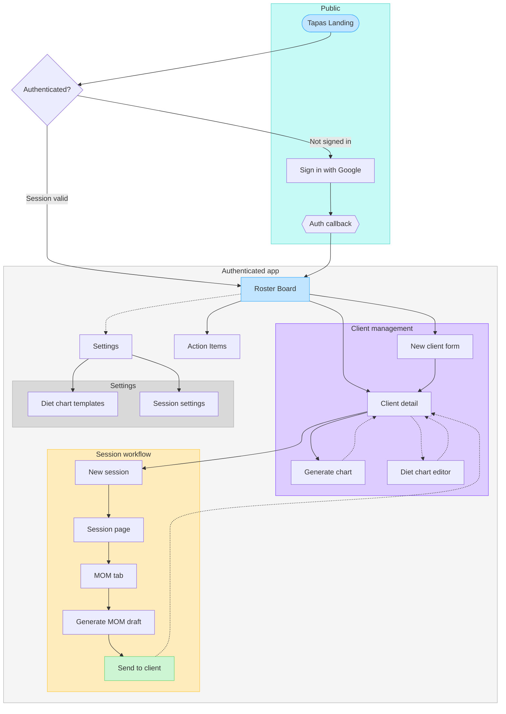

# User Flow — Tapas (Coach-facing MVP)

> Source of truth for the coach user flow across all built screens.
> Reflects the state after PHASE-10 (Roster Board, Client Detail restructure, MOM generation, public landing page).

---

## Diagram



---

## Walkthrough

**Entry**
A visitor hits `/` (Tapas Landing). The page silently tries a token refresh — if the cookie is valid, they land directly on the Roster Board. If not, they see the marketing page and click "Get started" → `/sign-in` → Google OAuth → `/auth/callback` → Roster Board.

**Daily loop**
The Roster Board (`/dashboard`) is the hub. The coach sees their active client grid, today's session pills, and any milestone/flag signal. From here every branch fans out.

**Client flow**

- `+ New client` → form → on save lands on Client detail
- Clicking a client card → Client detail directly

**Client detail**
The main working screen. From here the coach can:

- Start a new session → Session page
- Generate a diet chart inline (template picker, skeleton → reveal)
- Open the full diet chart editor (`/clients/[id]/diet-chart`)
- Review open action items and supplements

**Session workflow (the core loop)**
New session → Session page → MOM tab → Generate draft (skeleton → fade-in reveal) → edit → Send. After send, the dotted edge returns to Client detail — the coach picks the next client.

**Settings**
Accessible via the nav (dotted edge from dashboard = not the primary path). Diet chart templates is where coaches manage their reusable chart formats — the source for the inline Generate flow.

---

## Decisions embedded

- `flowchart TD` chosen over `LR` — the auth gate + app hierarchy reads top-to-bottom naturally
- Dotted edges (`-.->`) = optional or return paths; solid edges = primary forward flow
- `sendMom` is green — it's the meaningful completion event in the session loop
- `settings` kept as a connector node outside `settingsZone` — it maps to the real nav link

---

## Changelog

| Date       | Change          | Why                                           | Downstream effects |
| ---------- | --------------- | --------------------------------------------- | ------------------ |
| 2026-06-30 | Initial diagram | PHASE-10 shipped — first complete coach flow | None yet           |

```
```
