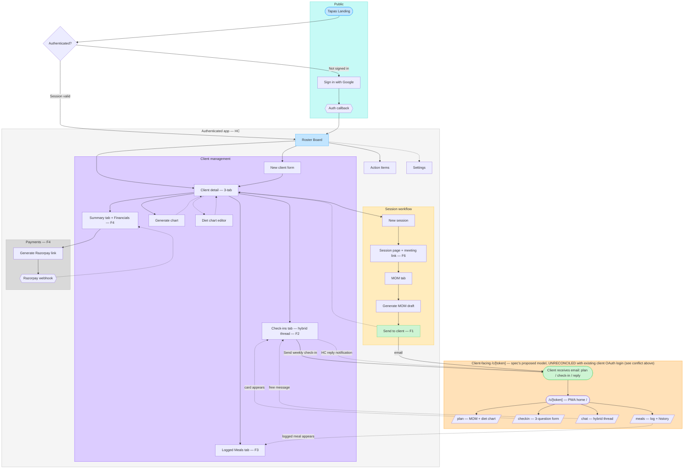
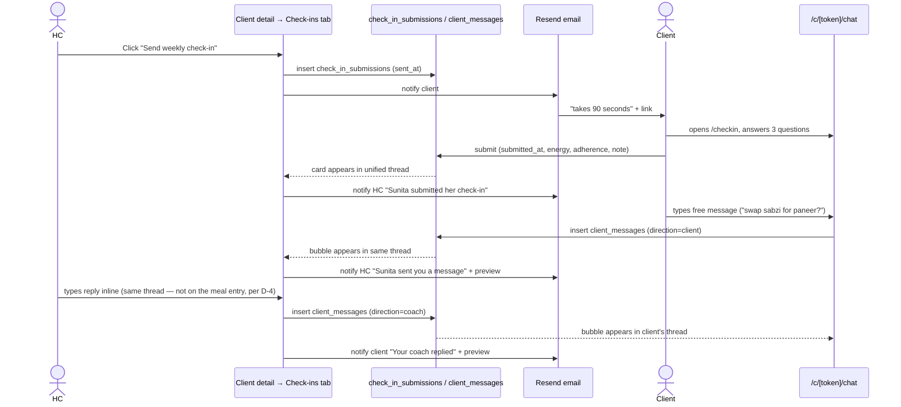
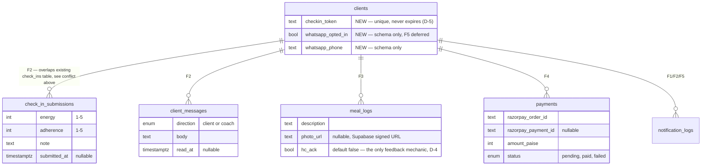

# Client-Facing Flow — Unit_004 One Stop Spot (Proposed)

> **Status: PROPOSED — nothing in this diagram is built yet.** Unlike `0003-user-flow.md` (which reflects shipped screens), this file reflects `docs/specs/Unit_004_OneStopSpot/SPEC-0001-one-stop-spot.md` as drafted. Confirmed by code inspection (2026-07-06): no `resend` dependency, no `email.py`, no `meeting_url`, `razorpay`, or `checkin_token` anywhere in `backend/`. PHASE-01 has a written plan (`PHASE-01-email-delivery.md`) but has not been executed.
>
> Once a phase ships, fold its part of this diagram into `0003-user-flow.md` (coach-side changes) and `0002-data-model.md` (schema additions) per the diagram maintenance rules in `CLAUDE.md` §8, and shrink this file to just the still-unbuilt remainder.

---

## ✅ Resolved 2026-07-06 — see `SPEC-0001-one-stop-spot.md` D-14

The conflict below is **resolved**: clients use the existing Google OAuth + client-JWT login (D-14 in the spec's decisions log), not a token-link model. D-5 and D-7 (the decisions that created this conflict) are formally superseded. F1 turned out not to need a client portal at all (email-only — see the spec's F1 section), so this doesn't block F1; it's now OQ-7 in the spec (client-facing route scheme, to be settled when F2 is brainstormed). Diagram 1 below is kept as-is, unedited, as a record of what the conflict looked like — do not build against its orange zone.

## ⚠️ Known conflict — resolve before PHASE-02 (historical — see resolution above)

The spec's F2 (`SPEC-0001` §3) assumes clients access the platform via a **never-expiring URL token** (`/c/{token}/*`, no login — Decision D-5). This is **not the auth model that's already built**:

- `docs/decisions/0005-auth-strategy.md` §7–8 (Accepted): clients authenticate via **Google OAuth + a real client JWT** (`role: "client"`), onboarded through an HC-issued invite (`ClientInviteToken`, 7-day TTL).
- `backend/src/api/me.py` already implements JWT-authenticated client endpoints: `submit_check_in`, `list_my_moms`, `get_my_mom`, `list_my_action_items`, `patch_my_action_item`.
- `backend/src/api/check_ins.py` + the `check_ins` table (`payload: JSONB`, `sentiment_flag`) already exist, are HC-facing (list/flag), and already feed AST/triage/pre-session-brief per `domain/glossary.md`'s Sentiment flag / Triage flag entries.

The spec's proposed `check_in_submissions` (fixed columns: `energy`, `adherence`, `note`) duplicates the *purpose* of the existing `check_ins.payload` table without reconciling schemas or auth models. **This diagram draws the spec as written** (orange zone below) so SoJo can see exactly what it implies — it is not a recommendation to build it this way. Suggest adding this as **OQ-6** in `SPEC-0001` before PHASE-02 starts: does F2 replace the OAuth client-login model, extend it, or run alongside it for unauthenticated one-off actions (e.g. reading an emailed plan) while authenticated actions (chat, check-in submission) go through the existing `/api/me/*` + JWT path?

---

## Diagram 1 — Updated user flow: HC-side changes + proposed client zone

Same conventions as `0003-user-flow.md`: `flowchart TD`, solid edges = primary forward flow, dotted edges = optional/return paths.

---

## Diagram 2 — F2 hybrid Check-ins model (Decision D-1 / D-4)

The structured card and the freeform message are triggered differently but land in the same reverse-chronological thread. HC replies to a meal log go through this thread too (D-4) — never inline on the meal entry.

---

## Diagram 3 — New/modified tables (SPEC-0001 §6)

---

## Walkthrough

**F1 (P0, action items delivery)** — ~~HC clicks Send → real email via Resend, reusing the existing `POST /api/sessions/{id}/mom/send` endpoint (Decision D-9, no new endpoint). Clean, no architectural conflicts — just not yet built.~~ **Superseded 2026-07-06** — F1 was fully re-brainstormed; see `SPEC-0001-one-stop-spot.md` D-10–D-15 and its F1 section for the current design (HC reviews/freezes the Session Review → action items promoted to the `action_items` table → send dialog with a read-only action-items block + editable message → email fires). The diagrams above (1–3) describe the *pre-redesign* F1/F2 model and are not updated for this — Diagrams 2 and 3 in particular (the hybrid check-ins sequence and the `check_in_submissions`/`client_messages` ER sketch) are F2 content, still unrevised as of this note.

**F2 (P0, hybrid check-ins)** — One thread, two entry types: structured cards (HC-triggered, 3 fixed questions) and free messages (either direction), unioned by timestamp (Decision D-1). This is the spec's most interesting piece and the one that collides with the existing `check_ins` table + client-OAuth model (see conflict above).

**F3 (P1, meals)** — One-way feed + 👍 acknowledgement only; any real HC reply routes through Check-ins, not inline (Decision D-4) — deliberate, to avoid a split conversation.

**F4 (P1, payments)** — Razorpay link generation + webhook. OQ-2 (self-onboarding vs. marketplace/aggregator) is an explicit blocker before PHASE-04.

**F5 (P2, WhatsApp)** — Deferred (Decision D-3); email fills the gap for MVP. `whatsapp_opted_in`/`whatsapp_phone` columns land now so the later migration is trivial.

**F6/F7 (P2, polish)** — Meeting link field, PWA installability. Small, additive, low risk.

---

## Decisions embedded

- Colors and edge conventions inherited from `0003-user-flow.md` for visual continuity — orange (`#FFE1B8`/`#FF9F1C`) is new, marking the proposed client-portal zone as distinct from shipped zones.
- Diagram 1 draws the spec's token-link model as written, not as a recommendation — the conflict callout at the top is load-bearing; don't read the orange zone as decided.
- Diagram 2 uses a sequence diagram (not flowchart) because the hybrid model's value is in the two independent trigger paths converging on one thread — a flowchart understates the async back-and-forth.
- Diagram 3 intentionally shows `check_in_submissions` overlapping `check_ins` rather than silently merging them — the merge decision belongs to SoJo, not to this diagram.

---

## Open questions carried from SPEC-0001 §8 (+ one new)

| #                           | Question                                                                                                                                           | Blocks            | Status                                               |
| --------------------------- | -------------------------------------------------------------------------------------------------------------------------------------------------- | ----------------- | ---------------------------------------------------- |
| OQ-2                        | Razorpay: per-HC self-onboarding vs. Tapas marketplace/aggregator?                                                                                 | PHASE-04          | Open                                                 |
| OQ-5                        | Meal photos in F3 v1: optional upload or text-only first?                                                                                          | PHASE-02 revision | Open                                                 |
| ~~OQ-6 (this diagram's original numbering)~~ | ~~Does F2's token-link client access replace, extend, or run alongside the already-built Google-OAuth client JWT model?~~ | — | **Resolved 2026-07-06 → D-14 in SPEC-0001**: Google OAuth wins, token-link model dropped. Renumbered **OQ-7** in the spec (narrower follow-on: route scheme under OAuth, not which auth model). |

---

## Changelog

| Date       | Change                                                                                                        | Why                                                                  | Downstream effects                                                                                                                        |
| ---------- | ------------------------------------------------------------------------------------------------------------- | -------------------------------------------------------------------- | ----------------------------------------------------------------------------------------------------------------------------------------- |
| 2026-07-06 | Initial diagram — drawn from SPEC-0001 as authored, cross-checked against ADR-0005 and current backend code. | SoJo asked for flow diagrams to review before offering spec changes. | Flags a real conflict between SPEC-0001 F2 and the shipped client-auth model (ADR-0005 §8) — needs a decision before PHASE-02 planning. |
