# Spec-0001: HC Core Cycle

**Status**: Accepted
**Date**: 2026-04-28
**Owner**: SoJo
**Relates to**: ADR-0003 (LLM strategy), ADR-0005 (auth), ADR-0006 (observability), `domain/glossary.md`, `domain/actors.md`, `diagrams/0002-data-model.md`

---

## Goal

The HC Core Cycle is the central product loop. It is what the platform exists to support: an HC and a client meeting periodically, the HC preparing for each session, conducting it, recording outcomes, tracking client commitments between sessions, and adapting based on what's working. AI assistance (drafts, summaries, surfacing) reduces the HC's administrative burden while keeping the HC as the sole client-facing voice.

This spec describes that loop end-to-end: the stages, the data movement at each stage, the AI involvement at each stage, the actors, and what "done" looks like for each interaction.

---

## Non-goals

- **Live session conduct**: the platform does not handle the video call itself. HCs use Zoom (or any external tool); the platform ingests outputs, not the call stream.
- **Client-side coaching app**: clients receive output from the HC; they do not have a coaching dashboard. They can view their own sent MOMs and submit check-ins, nothing more.
- **Auto-response to clients**: AI never sends content directly to clients. Coach-reviewed gate is absolute.
- **Sentiment auto-detection** (deferred per ADR-0003): manual flagging at MVP.
- **Multi-HC collaboration on a single client**: one HC owns one client at MVP. No handoff workflows.
- **Real-time messaging**: clients communicate with HC via existing channels (WhatsApp, email). The platform does not host live chat.

---

## Actors and roles

Cross-reference `domain/actors.md`.

| Actor | Role | What they do in this cycle |
|---|---|---|
| Health Coach (HC) | Primary user | Reviews briefs, conducts sessions, edits MOM drafts, sends MOMs, manages action items |
| Client | Secondary user | Sees sent MOMs, submits check-ins, marks action items complete |
| Junior HC (AI) | Internal | Drafts MOMs, briefs, action items; never client-facing |

---

## Domain terms

Cross-reference `domain/glossary.md`. Used here:

- **HC Cycle** — the recurring sequence: pre-session prep → session → post-session deliverables → between-session check-ins → next session
- **M000** — the first session in a client's journey with this HC
- **M00N** — the Nth session (M001, M002, …)
- **MOM** — Minutes of Meeting; post-session record, AI-drafted, HC-edited, HC-sent
- **Pre-session brief** — AI-drafted summary the HC reads before each session; internal only
- **AST** — Action / Status / Trends; the structured slice of client state used in briefs
- **Action item** — client commitment with optional due date
- **Triage flag** — warning surfaced in pre-session brief (missed action item, sentiment shift, distress mention)
- **Sentiment flag** — automated tag on check-in or session content (auto-detect deferred per ADR-0003; manual at MVP)
- **Coach-reviewed gate** — invariant: no AI-generated content reaches client without HC review

---

## The cycle — stages

```mermaid
flowchart LR
    subgraph M000 [M000: Onboarding]
        A1[HC creates client] --> A2[HC invites] --> A3[Client signs in via Google] --> A4[M000 session held] --> A5[MOM drafted] --> A6[HC edits + sends MOM]
    end
    subgraph BS [Between Sessions]
        B1[Client check-ins] --> B2[Action item updates] --> B3[Triage signals accumulate]
    end
    subgraph M00N [M00N: Subsequent Session]
        C1[Pre-session brief generated] --> C2[HC reviews brief] --> C3[Session held] --> C4[MOM drafted] --> C5[HC edits + sends MOM] --> C6[Snippet captured from edits]
    end
    A6 --> B1
    B3 --> C1
    C5 --> B1
```

Stages described below.

---

### Stage 1 — Client onboarding (pre-M000)

**Actors**: HC

**Flow**:
1. HC creates a client record in their dashboard. Required fields: name, contact (email used for Google sign-in), brief intake notes (free text). Optional: goals, current health context, history.
2. System sends an invitation link to the client (email or copy-link, HC's choice). Link contains a one-time invite token (per ADR-0005).
3. Client clicks the link → signs in with Google → account created and linked to inviting HC.
4. System captures consent: at MVP this is the HC uploading a signed-PDF consent form into the `consents` table (per `compliance-india.md`). UX-driven consent capture deferred.

**System behavior**:
- New `clients` row created on step 1.
- New `auth_refresh_tokens` row issued to the client on step 3.
- The client is associated with `hc_id` from the inviting HC's JWT.
- New `consents` row on step 4 referencing the client and the uploaded PDF (S3 URL).

**Acceptance**:
- [ ] HC creates client → invite link generated
- [ ] Client signs in via Google → linked to inviting HC (not floating)
- [ ] Consent PDF upload creates `consents` row with valid S3 reference

---

### Stage 2 — M000 (the first session)

**Actors**: HC primary; client present in the call (out-of-platform)

**Flow**:
1. HC schedules M000 (calendar integration out of scope; HC handles externally).
2. HC opens session view in platform; clicks "Start session" → `sessions` row created with `is_first_session=true`.
3. Session is conducted on Zoom (out of platform). HC takes notes in the platform's session notes area (free text, real-time editable).
4. HC clicks "End session" → session marked `ended_at = NOW()`.
5. System triggers MOM draft (LLM service call per ADR-0003, task type = `mom`). Draft includes session notes, captured action items, intake context.
6. HC reviews the draft in the MOM editor.
7. HC edits as needed. On send (step 8), every edit is captured as `hc_style_snippets` row with `snippet_type='edit'` (per ADR-0003).
8. HC clicks "Send" → MOM transitions to `status='sent'` → client now sees it in their MOM list.

**System behavior**:
- For M000, the snippet library is empty for this HC ↔ client pair. Brief generation is skipped for M000 (no prior data). The system shows an "M000 prep" view: intake notes + goals + a checklist of "things to cover in first session" (pre-defined template).
- M000 MOM draft uses HC's general snippet library (across all clients) if any exists, plus the client's intake context. If the HC has zero snippets, the draft uses base prompt only.
- Per ADR-0003, HC onboarding pre-seeds the snippet library by having the HC review and edit 3–5 sample drafts during onboarding (the "cold-start mitigation").

**Acceptance**:
- [ ] M000 session creates `sessions` row with `is_first_session=true`
- [ ] M000 MOM draft generated even with empty snippet library
- [ ] HC's edits captured as snippets, scoped to this client
- [ ] Sent MOM visible to client; draft MOM not visible to client

---

### Stage 3 — Between sessions

**Actors**: Client primary; HC reactive

**Flow**:
1. Client receives sent MOM (in-platform, plus optionally email/WhatsApp out of scope).
2. Client may submit check-ins via the platform — short structured updates ("how's your week going" → tags: mood, adherence, blockers).
3. Client marks action items complete or in-progress as they go.
4. HC sees check-ins surface on dashboard; can comment internally (notes, not visible to client at MVP).
5. The system accumulates AST data: open action items, check-in cadence, sentiment flags (manual at MVP), trend tags.
6. Triage signals accrue: missed action item past due date, no check-in in N days, manual sentiment flag, etc. These become triage flags surfaced in the next pre-session brief.

**System behavior**:
- Each check-in creates a `check_ins` row scoped to client.
- Each action item state change creates an audit entry (per `audit_log` table).
- Triage flags are computed at brief-generation time, not stored as separate rows.

**Acceptance**:
- [ ] Client submits check-in → `check_ins` row created → visible to HC on dashboard
- [ ] Client marks action item complete → state transitions; visible to HC
- [ ] Action item past `due_date` without completion → eligible for triage flag in next brief

---

### Stage 4 — M00N (subsequent session)

**Actors**: HC primary

**Flow**:
1. HC opens upcoming session in platform.
2. System generates pre-session brief (LLM call, task type = `brief`). Inputs:
   - Last MOM
   - Open action items (AST → A)
   - Recent check-ins (last 14 days)
   - Sentiment flags (manual at MVP)
   - Status summary (AST → S)
   - Trend tags (AST → T)
   - Top-N snippets for this HC ↔ client pair (recency-weighted, ≤2K tokens per ADR-0003)
   - Triage flags (computed at request time)
3. HC reads brief. Brief is HC-internal — never sent to client, never visible to client.
4. HC clicks "Start session". Session held on Zoom (out of platform).
5. HC takes session notes. Captures action items as the conversation surfaces them.
6. HC clicks "End session" → MOM draft triggered (LLM call, task type = `mom`).
7. HC reviews and edits MOM draft.
8. HC clicks "Send" → status transitions to `sent`; client sees it.
9. Snippet capture: each material edit between draft and sent text is captured.

**System behavior**:
- Brief is generated on-demand, not pre-computed. It's stored as a `briefs` row but with `visibility='hc_only'`.
- MOM is generated on session end. Stored as `moms` row with `status='draft'`.
- Snippet capture runs on the `draft → sent` transition: diff(`draft_text`, `sent_text`) → snippet rows.
- All LLM calls in this stage write `llm_calls` rows per ADR-0006.

**Acceptance**:
- [ ] Brief generation request includes all 8 inputs listed above (logged in `llm_calls` for verification)
- [ ] Brief is never accessible to the client (verified by 404 from client API)
- [ ] MOM `status='draft'` is never accessible to client; `status='sent'` is
- [ ] HC edits during MOM review are captured as snippets on send
- [ ] Snippets exclude trivial whitespace-only diffs (filter at capture time)

---

### Stage 5 — Triage flags

**Actors**: System (computation); HC (consumption)

**Flow**:
1. Triage flags are computed at pre-session brief generation. Not stored as separate rows.
2. Computation rules (MVP):
   - **Missed action item**: action item with `status='open'` and `due_date < NOW()` and `due_date > session.scheduled_at - 30 days`
   - **No check-in**: zero check-ins from this client in last 14 days
   - **Manual sentiment flag**: any `check_ins.manual_sentiment_flag IS NOT NULL` in last 30 days
   - **Distress mention**: any check-in or last MOM containing flagged keywords (TBD list; deferred to first version)
3. Triage flags appear in the brief as a structured "Heads up" section at the top.

**Out of scope**:
- Auto-detection of sentiment from text (deferred per ADR-0003).
- ML-based distress detection (would require labeled data; not at MVP).

**Acceptance**:
- [ ] Brief surfaces missed action items in triage section
- [ ] Brief surfaces "no check-ins in last 14 days" warning
- [ ] HC can manually flag a check-in as concerning; flag surfaces in next brief
- [ ] Triage section is empty (or absent) when nothing applies — not a hardcoded "all good" string

---

### Stage 6 — Coach-reviewed gate

**Invariant**: No AI-generated content reaches the client without HC review.

**Implementation**:
- Every AI-generated artifact has a `status` field: `draft` | `reviewed` | `sent`.
- Client API endpoints filter `WHERE status = 'sent'` always.
- Transitions:
  - `draft → reviewed` is implicit on edit (HC has touched it)
  - `reviewed → sent` is explicit on Send button click
  - `draft → sent` directly is allowed (HC accepts AI draft as-is)
- Briefs are exempt from "sent" because they're HC-internal — no transition possible; client never sees them.

**Acceptance** (verified at workflow level, repeats acceptance from `build-plan.md` Phase 3 and Phase 5):
- [ ] Client API GET on a draft MOM → 404
- [ ] Client API GET on a sent MOM → 200 with content
- [ ] No code path exists that sends MOM content via webhook/email/SMS without HC explicit Send action (greppable: search for `mom_text` outside the HC-facing endpoints)

---

## Data — entities touched

Cross-reference `diagrams/0002-data-model.md` for full schemas.

| Entity | Read by stage | Written by stage |
|---|---|---|
| `users` | All | Stage 1 (client account) |
| `clients` | All | Stage 1 |
| `consents` | Stage 9 (DPDP audit) | Stage 1 |
| `sessions` | Stages 2, 3, 4, 5 | Stages 2, 4 |
| `moms` | Stages 2, 3, 4 | Stages 2, 4 |
| `briefs` | Stage 4 | Stage 4 |
| `action_items` | Stages 3, 4, 5 | Stages 2, 3, 4 |
| `check_ins` | Stages 4, 5 | Stage 3 |
| `hc_style_snippets` | Stage 4 (selection) | Stages 2, 4 (capture) |
| `llm_calls` | Stage 5 (triage rules); telemetry | Stages 2, 4 |
| `audit_log` | DPDP audit | All state transitions |

---

## API surface

(Sketch — full OpenAPI in code. Auth requirement = HC unless noted.)

### HC-facing
| Method | Path | Purpose |
|---|---|---|
| POST | `/api/clients` | Create client |
| POST | `/api/clients/{id}/invite` | Generate invite token |
| GET | `/api/clients` | List own clients |
| GET | `/api/clients/{id}` | Client detail incl. AST |
| POST | `/api/sessions` | Create session for a client |
| POST | `/api/sessions/{id}/end` | End session, trigger MOM draft |
| GET | `/api/sessions/{id}/brief` | Generate (or fetch cached) pre-session brief |
| GET | `/api/sessions/{id}/mom` | Get MOM (any status, HC-scoped) |
| PATCH | `/api/sessions/{id}/mom` | Edit MOM (HC) |
| POST | `/api/sessions/{id}/mom/send` | Transition to `sent`, capture snippets |
| POST | `/api/action-items` | Create action item |
| PATCH | `/api/action-items/{id}` | Update action item state |
| GET | `/api/clients/{id}/check-ins` | List a client's check-ins |
| PATCH | `/api/check-ins/{id}/flag` | Manually flag check-in (sentiment) |

### Client-facing
| Method | Path | Auth | Purpose |
|---|---|---|---|
| POST | `/api/auth/google/callback` | (invite token) | Complete client signup |
| GET | `/api/me/moms` | Client | List own sent MOMs |
| GET | `/api/me/moms/{id}` | Client | Read sent MOM (404 if not sent) |
| GET | `/api/me/action-items` | Client | List own action items |
| PATCH | `/api/me/action-items/{id}` | Client | Mark complete/in-progress (own only) |
| POST | `/api/me/check-ins` | Client | Submit check-in |

All `/api/me/*` endpoints filter by JWT `sub` (the authenticated user_id). All HC endpoints filter by JWT `hc_id`.

---

## LLM involvement

Cross-reference `decisions/0003-llm-strategy.md`.

| Stage | Task type | Prompt file | Schema | Snippet relevance tags |
|---|---|---|---|---|
| Stage 2 (M000 MOM) | `mom` | `prompts/mom.md` | `prompts/schemas/mom.py` | `mom_style`, `m000` |
| Stage 4 (brief) | `brief` | `prompts/brief.md` | `prompts/schemas/brief.py` | `brief_style` |
| Stage 4 (MOM) | `mom` | `prompts/mom.md` | `prompts/schemas/mom.py` | `mom_style`, `m00n` |
| Stages 2,4 (action items extraction) | `action_items` | `prompts/action_items.md` | `prompts/schemas/action_items.py` | `action_items_style` |

Snippet capture only on `mom` task type at MVP (per ADR-0003). Brief edits are not captured (HC rarely edits briefs since they're internal-only).

---

## Edge cases and failure modes

| Case | Behavior |
|---|---|
| LLM service fails to draft MOM (validation fails twice) | UI shows "Draft generation failed. Try again, or write manually." MOM stays in `pending_draft` state. HC can retry or write from scratch. |
| HC ends session without taking notes | MOM draft is generated from minimal input (just metadata: client name, action items captured during session). Quality will be lower; HC will need to edit more. Acceptable; no blocker. |
| HC starts to edit MOM but doesn't send | MOM stays `draft`, never visible to client. Edit auto-saves every 30s. HC can resume later. |
| Client never signs in after invite | Client account stays in `pending_invite` state. HC can re-send invite or revoke. After 30 days, invite expires. |
| Client revokes consent | All client data + snippets purged in single transaction (per `compliance-india.md`). HC sees client marked `consent_revoked`; no further interaction possible. |
| Two HCs accidentally invite same email | Second HC's invite fails with "already linked to another HC". User must clarify externally. |
| HC tries to delete a session that has a sent MOM | Soft-delete only (`deleted_at`); MOM record preserved for client visibility and audit. Hard-delete via DPDP path only. |

---

## Acceptance criteria (spec-level)

In addition to per-stage acceptance criteria above:

- [ ] Full M000 → M001 cycle completable end-to-end through the UI
- [ ] Snippet from M000 MOM edits influences M001 MOM draft (verified via prompt assembly log)
- [ ] Triage flags surface correctly in M001 brief based on M000 state
- [ ] Coach-reviewed gate verified by code search: no path bypasses HC explicit Send
- [ ] All AI calls in this cycle write `llm_calls` rows; sum of token cost computable
- [ ] Cascade-delete: deleting a client purges all sessions, MOMs, briefs, action items, check-ins, and snippets in one transaction; verified post-delete

---

## Open questions

- **Edit-detection threshold**: should snippet capture run on every diff, or only on diffs above a certain size? Trivial whitespace edits noise the snippet library.
  - Owner: SoJo — by: end of P4
  - Default if not decided: capture all diffs > 5 characters; whitespace-only diffs filtered.

- **M000 brief**: is there a "first session prep" view that mimics a brief but without prior data? If yes, what's in it?
  - Owner: SoJo — by: end of P5
  - Default if not decided: simple template (intake notes + goals + boilerplate "first session checklist"); no LLM involvement.

- **Action item due date defaults**: do action items default to "next session" as the due date? Manual entry?
  - Owner: SoJo — by: end of P3
  - Default if not decided: manual entry; no auto-default.

- **Distress keyword list**: which keywords/phrases trigger triage flag?
  - Owner: SoJo + clinical input — by: before pilot launch
  - Default if not decided: a small starter list (`suicide`, `harm`, `crisis`, `emergency`); HC manually expands.

---

## Out of scope (future)

- Auto-sentiment detection on check-ins and session content (ML-driven)
- Multi-HC handoff for a single client
- Client-side coaching dashboard
- Calendar integration (auto-schedule next session)
- WhatsApp / SMS delivery of sent MOMs
- Voice-to-text on session notes (HC types or pastes; no live transcription)
- Group sessions (one HC, multiple clients in one session)

---

## Changelog

| Date | Change | Reason |
|---|---|---|
| 2026-04-28 | Initial draft and Acceptance. | Central product loop needed in writing before any of P3–P5 can be coded. |
