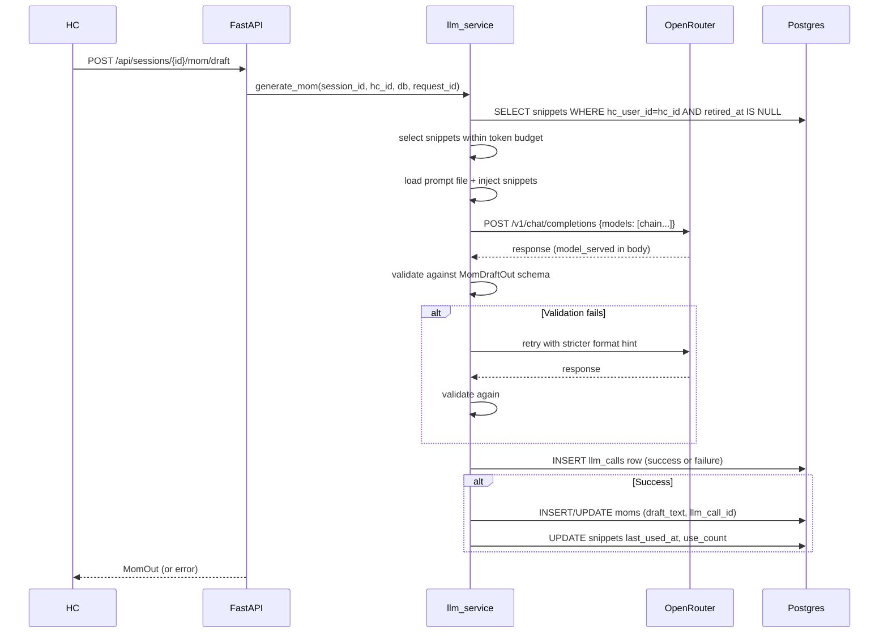

# SPEC-0002: LLM Service

**Status**: Draft
**Date**: 2026-05-02
**Owner**: SoJo
**Relates to**: ADR-0003 (primary), ADR-0001 §LLM model chain, ADR-0006 §5, `diagrams/0002-data-model.md`, `specs/Unit_001_HcCoreCycle/SPEC-0001-hc-core-cycle.md`

---

## Goal

Build the `backend/src/llm_service/` module that makes AI drafts work end-to-end via OpenRouter. Every LLM call goes through this module. It handles: model chain config, OpenRouter HTTP call, Pydantic output validation with one retry, `llm_calls` row on every call (success or failure), snippet capture when HC edits an AI draft, and snippet injection into the next prompt for that HC. The module is the single integration point — no LLM calls happen outside it.

---

## Non-goals

- No custom HTTP-layer retry loops; OpenRouter's built-in `models` array handles model fallback (ADR-0003 §3).
- No embedding-based snippet selection — deferred per ADR-0003.
- No snippet retirement sweep — P7 scope.
- No key-exchange or stylistic-pattern snippet types — deferred per ADR-0003.
- No real-time streaming of LLM output — request/response only at MVP.
- No per-user prompt fine-tuning.
- Full pre-session brief with AST + triage flags — P5 scope. P4 provides the LLM service module; P5 wires it into the workflow.
- Sentiment auto-detection — deferred per ADR-0003.

---

## Actors and roles

| Actor           | Role                    | What they can do                                                                    |
| --------------- | ----------------------- | ----------------------------------------------------------------------------------- |
| HC              | Authenticated (role=hc) | Triggers MOM draft generation; edits AI drafts (captures snippets); reads brief     |
| LLM Service     | Internal module         | Calls OpenRouter, validates output, writes `llm_calls`, captures/injects snippets |
| OpenRouter      | External                | Routes calls across model chain, handles provider-level fallback                    |
| SoJo / Operator | Admin                   | Edits `llm_config.yaml` to change model chain without code changes                |

---

## Domain terms

| Term                | Definition                                                                                                                                                   |
| ------------------- | ------------------------------------------------------------------------------------------------------------------------------------------------------------ |
| `llm_config`      | YAML file at `backend/src/llm_service/llm_config.yaml` holding model chain, thresholds, budgets. Editable without code changes; restart required to apply. |
| Validation retry    | One re-prompt with stricter format hint when Pydantic validation fails on LLM output.                                                                        |
| Snippet capture     | Diff-based extraction of HC's edit to an AI draft →`hc_style_snippets` row.                                                                               |
| Snippet injection   | Selecting top-N recent snippets for an HC and inserting them into the system prompt.                                                                         |
| `model_requested` | The first slug in the chain (what we asked OpenRouter to try).                                                                                               |
| `model_served`    | The slug that actually responded (may differ if OpenRouter fell back).                                                                                       |
| `fallback_count`  | How many models in the chain were tried before success, derived from chain position of `model_served`.                                                     |
| Prompt version      | Semver string from a prompt file's YAML frontmatter `version` field. Lands in `llm_calls.prompt_version`.                                                |

---

## User stories

- As an HC, after ending a session I want an AI-drafted MOM to appear immediately so I can review and edit rather than write from scratch.
- As an HC, I want the AI to learn my voice over time so successive drafts need fewer edits.
- As an HC, I want the AI draft to reflect my style (concise, specific, encouraging) without me having to re-teach it each time.
- As SoJo, I want to swap the LLM model chain without touching code so I can respond to model deprecations and quality issues immediately.

---

## Module structure

```
backend/src/llm_service/
├── __init__.py
├── config.py          # Loads llm_config.yaml; exports LLMConfig dataclass
├── client.py          # OpenRouter HTTP wrapper via make_http_client()
├── chain.py           # Builds OpenRouter `models` array from llm_config
├── retry.py           # Validation retry loop (1 retry with stricter hint)
├── snippets.py        # capture() + select() for hc_style_snippets
├── prompts.py         # Prompt file loader: YAML frontmatter + body
├── tracking.py        # write_llm_call() — inserts llm_calls row
└── schemas/
    ├── __init__.py
    ├── mom.py         # Pydantic output schema for MOM draft
    ├── brief.py       # Pydantic output schema for pre-session brief
    └── action_items.py  # Pydantic output schema for action item extraction
```

### `backend/src/llm_service/llm_config.yaml`

This file is the sole place where the model chain and tunable parameters live. SoJo edits it directly and restarts the app. No code change required for model chain updates.

```yaml
# llm_config.yaml — LLM service configuration
# Edit this file to change model chain, budgets, or thresholds.
# Changes take effect after app restart (uvicorn restart or Worker redeploy).
#
# Model chain: primary model is tried first. OpenRouter falls back through
# the list automatically on upstream throttling or model errors.
# All slugs must be valid OpenRouter model IDs (check openrouter.ai/models).

model_chain:
  - meta-llama/llama-3.3-70b-instruct:free   # primary
  - google/gemma-3-27b-it:free               # fallback 1
  - openai/gpt-oss-120b:free                 # fallback 2
  - nvidia/nemotron-3-super-120b-a12b:free   # fallback 3 (262K context)

# Reasoning escape hatch — NOT in the automatic chain.
# Called explicitly by application code for tasks that need step-by-step reasoning.
# This model may not be free-tier — confirm on openrouter.ai before production use.
reasoning_model: deepseek/deepseek-r1

# OpenRouter headers injected on every call (privacy — per ADR-0001)
no_training_header: true    # adds X-OR-Disable-Training: true header
no_retention_header: true   # adds appropriate provider routing policy

# Snippet settings
snippet_diff_threshold: 5         # min chars for an edit to become a snippet
snippet_whitespace_filter: true   # ignore whitespace-only diffs
snippet_token_budget: 2000        # max tokens of snippets injected per prompt
snippet_max_count: 10             # upper bound on snippet count regardless of budget

# Validation
validation_retry_count: 1         # retries on Pydantic validation failure
```

---

## Prompt files

Each file in `backend/prompts/` has YAML frontmatter followed by the prompt body:

```markdown
---
version: "1.0.0"
created: "2026-05-02"
notes: "Initial draft."
---
[prompt body — Jinja2 placeholders for dynamic context]
```

The `version` field is written directly to `llm_calls.prompt_version`. Bumping a prompt version means updating this field — no code change, visible in telemetry immediately.

### Files to create in P4

| File                                  | Purpose                                   |
| ------------------------------------- | ----------------------------------------- |
| `backend/prompts/mom_draft.md`      | MOM draft generation from session context |
| `backend/prompts/brief_assemble.md` | Pre-session brief assembly                |
| `backend/prompts/ai_assist.md`      | Generic in-session assist                 |

---

## New API endpoints

P4 adds two endpoints. Existing P3 endpoints are modified (snippet capture hook on MOM PATCH).

| Method | Path                             | Auth | Purpose                                                                              |
| ------ | -------------------------------- | ---- | ------------------------------------------------------------------------------------ |
| POST   | `/api/sessions/{id}/mom/draft` | HC   | Generate AI MOM draft; creates/updates MOM with `draft_text`, sets `llm_call_id` |
| GET    | `/api/sessions/{id}/brief`     | HC   | Generate (or return cached) pre-session brief                                        |

### `POST /api/sessions/{id}/mom/draft`

1. HC hits the endpoint (e.g., after session ends).
2. LLM service assembles prompt: session context + HC style snippets.
3. Calls OpenRouter with `models` array from `llm_config`.
4. Validates output against `MomDraftOut` Pydantic schema.
5. On validation failure: retries once with stricter format hint.
6. Writes `llm_calls` row (success or failure).
7. If MOM row doesn't exist for this session, creates it with `draft_text = llm_output`, `llm_call_id = llm_calls.id`.
8. If MOM already exists (manual entry), updates `draft_text` and `llm_call_id`.
9. Returns the MOM (same `MomOut` schema as existing GET endpoint).

### `GET /api/sessions/{id}/brief`

1. HC hits the endpoint (typically before a session).
2. Checks if a brief row already exists for this session → return it (cached).
3. If not: assembles prompt from previous session's MOM + recent check-ins + snippets.
4. Calls OpenRouter, validates, writes `llm_calls` row.
5. Creates `briefs` row with `brief_text = llm_output`, `llm_call_id`.
6. Returns brief.

### Existing endpoint modification — `PATCH /api/sessions/{id}/mom`

Snippet capture is added to the existing PATCH endpoint. When:

- `body.final_text` is provided, AND
- `mom.llm_call_id IS NOT NULL` (draft was AI-generated), AND
- `final_text != mom.draft_text` (HC actually changed something)

Then call `snippets.capture(db, mom, final_text, hc_user_id, client_id)`.

---

## Data

| Entity                | Read       | Write       | New fields / notes                                     |
| --------------------- | ---------- | ----------- | ------------------------------------------------------ |
| `llm_calls`         | N          | Y           | No schema change — all columns exist from P1          |
| `hc_style_snippets` | Y (inject) | Y (capture) | No schema change —`retired_at` already present      |
| `moms`              | Y          | Y           | `llm_call_id` column already exists; P4 populates it |
| `briefs`            | Y          | Y           | `llm_call_id` column already exists; P4 populates it |
| `sessions`          | Y          | N           | Read for context (session_number, client_id, etc.)     |
| `clients`           | Y          | N           | Read for client context in prompts                     |

**No migration required.** All needed tables and columns exist from P1.

---

## LLM call flow



---

## Snippet capture flow

When HC PATCHes `final_text` on an AI-generated MOM:

```
snippets.capture(
    original_text = mom.draft_text,      # AI draft
    hc_modified_text = body.final_text,  # HC's version
    hc_user_id = hc_user_id,
    client_id = mom.client_id,
    session_id = session_id,
)
```

1. Compute diff (difflib or similar — character-level diff).
2. Filter: skip diff segments shorter than `snippet_diff_threshold` chars.
3. Filter: skip diff segments that are whitespace-only (if `snippet_whitespace_filter` is set).
4. Each surviving segment → one `hc_style_snippets` row with `snippet_type='edit'`.

Gate: snippet capture only fires when `mom.llm_call_id IS NOT NULL`. Manually-entered MOMs (created via existing POST /mom with manual text) do not trigger capture — the diff between manual draft and manual edit is not a signal of HC voice correction.

---

## Snippet injection

Before each LLM call for an HC:

1. `SELECT * FROM hc_style_snippets WHERE hc_user_id = $hc AND retired_at IS NULL ORDER BY last_used_at DESC NULLS FIRST LIMIT $max_count`
2. Walk results: count tokens (`tiktoken` or character estimate), stop before `snippet_token_budget` exceeded.
3. Format selected snippets as system prompt examples.
4. After successful call: `UPDATE hc_style_snippets SET last_used_at = now(), use_count = use_count + 1 WHERE id IN (selected ids)`.

Tenant safety: the query always filters by `hc_user_id` from JWT. No cross-HC snippet contamination possible.

---

## `llm_calls` row — write semantics

Every call writes exactly one row, before returning to the caller.

| Scenario                                                 | Row written | Key fields                                                                                               |
| -------------------------------------------------------- | ----------- | -------------------------------------------------------------------------------------------------------- |
| Happy path                                               | Yes         | `model_served` = actual model, `validation_failed=false`, `error_message=null`                     |
| OpenRouter fallback (primary throttled, fallback served) | Yes         | `model_requested` = chain[0], `model_served` = whichever served, `fallback_count` = chain position |
| Validation failure, retry succeeds                       | Yes         | `validation_failed=false`, `fallback_count` reflects retry                                           |
| Validation failure, retry also fails                     | Yes         | `validation_failed=true`, `error_message` = schema error                                             |
| Network error / OpenRouter 4xx/5xx                       | Yes         | `model_served=null`, `error_message` = error detail                                                  |

`fallback_count` is computed as: index of `model_served` in `llm_config.model_chain`. If `model_served` is not in our chain (OpenRouter chose something else), `fallback_count` = -1 as a sentinel.

`input_tokens` and `output_tokens` come from OpenRouter's `usage` field in the response. If unavailable (error path), use 0.

`latency_ms` = wall time from HTTP call start to row write.

`request_id` = `request.state.request_id` passed in from the FastAPI handler.

---

## PII in logs (ADR-0006)

Per ADR-0006 §3, the following must NEVER appear in stdout/structured logs from any LLM service code:

- Snippet content (`original_text`, `hc_modified_text`)
- MOM content (`draft_text`, `final_text`)
- Session transcript content
- Client email, name, phone

Log lines referencing these must use IDs only. The `scrub()` function from `backend/src/telemetry/scrub.py` must be applied to any log line that touches these values. A unit test must assert that running a sample prompt through the logger produces no PII in the output.

---

## Decisions to make before implementation

### Open question A — Snippet selection algorithm

**Background**: When assembling snippets for injection, how do we order and select within the 2K-token budget?

**ADR-0003 §6 default (recommended)**: Sort by `last_used_at DESC NULLS FIRST` — unused-but-recent snippets get priority over recently-injected ones (gives variety; prevents the same few snippets from dominating). Take top N until token budget is hit.

**Alternative**: Sort by `created_at DESC` — simplest, most deterministic, no "variety" logic. Predictable debugging.

**Tradeoffs**:

- `last_used_at` approach ensures variety (ADR-0003 rationale), but is slightly less predictable.
- `created_at` approach is easier to reason about and unit test, but the most-recently-used snippets may never re-enter rotation.
- At MVP with <50 snippets per HC, the difference is negligible.

**Recommendation**: ADR-0003 default (`last_used_at DESC NULLS FIRST`). Switch to `created_at` only if SoJo finds the rotation confusing.

> **Decision needed — owner: SoJo — by: before P4 implementation begins**
> Options: (A) `last_used_at DESC NULLS FIRST` [recommended], (B) `created_at DESC`, (C) other

---

### Open question B — PII in `llm_calls` table

**Background**: ADR-0006 §5 already decided: *"never write the prompt or response text into `llm_calls`"*. The `llm_calls` schema has no `prompt_text` or `completion_text` columns. This ADR is Accepted.

The starter spec raised this as an open question with three options:

- **Option A (store as-is)**: Add `prompt_text` and `completion_text` columns to `llm_calls`. Same DPDP boundary as MOMs. Easy debugging. Requires schema migration.
- **Option B (redact)**: Same as A but run `scrub()` before write. Harder to debug.
- **Option C (column encryption)**: Same as A but encrypt at column level. Implementation cost + key management.

**ADR-0006's standing answer** is effectively "none of the above" — `llm_calls` is metadata only. The prompt is recoverable from the prompt file (versioned in git); the response is stored in `moms.draft_text` or `briefs.brief_text`.

**If SoJo wants to reconsider**: it requires (1) an ADR-0006 amendment, (2) a schema migration adding columns, and (3) a decision on which of A/B/C. Recommendation: confirm ADR-0006 stands for P4. Revisit if debugging LLM output quality becomes painful.

> **Decision needed — owner: SoJo — by: before P4 implementation begins**
> Options: (A) confirm ADR-0006 stands — no prompt/completion text in `llm_calls` [recommended], (B) amend ADR-0006 to allow storage (requires migration + ADR amendment)

---

## Edge cases and failure modes

| Case                                                 | Behavior                                                                                                        |
| ---------------------------------------------------- | --------------------------------------------------------------------------------------------------------------- |
| OpenRouter 401 (bad key)                             | `llm_calls` row written with `error_message`, `model_served=null`; HTTP 503 returned to caller            |
| All chain models fail                                | Same as 401;`error_message` includes last failure; `fallback_count` = chain length - 1                      |
| Validation fails after retry                         | `llm_calls` row with `validation_failed=true`; HTTP 422 with `{"detail": "LLM output failed validation"}` |
| MOM already has AI draft (re-draft)                  | Existing MOM `draft_text` overwritten; `llm_call_id` updated; `final_text` cleared                        |
| HC PATCHes MOM before draft exists                   | No snippet capture (not AI-generated); normal PATCH behavior unchanged                                          |
| Snippet diff < threshold                             | No snippet row created                                                                                          |
| Snippet injection — zero snippets                   | Prompt generated without snippet section; no error                                                              |
| Token budget exceeded immediately (one snippet > 2K) | That snippet is skipped; zero snippets injected rather than exceeding budget                                    |
| OpenRouter returns unexpected `model` in response  | `model_served` recorded as returned; `fallback_count = -1` (sentinel)                                       |
| Brief already exists for session                     | Return cached brief; no new LLM call                                                                            |

---

## Acceptance criteria

These are the Stage 1 criteria (Claude Code self-verifies before presenting to SoJo for manual verification):

- [ ] `uv run pytest -v` from `backend/` — all tests pass (target: ~130+ including P4 tests)
- [ ] `POST /api/sessions/{id}/mom/draft` returns valid MOM with `draft_text` populated by LLM
- [ ] One `llm_calls` row written per call; all fields non-null on happy path
- [ ] Mock primary model HTTP 500 → OpenRouter fallback fires → `model_served ≠ model_requested`, `fallback_count > 0` in `llm_calls`
- [ ] Mock LLM returning invalid JSON → retry fires → on success `validation_failed=false`; on double failure `validation_failed=true`
- [ ] `llm_calls` row written even on hard failure (network error, 401, all-models-fail)
- [ ] HC PATCHes MOM with >5-char non-whitespace diff → `hc_style_snippets` row created with `snippet_type='edit'`, `original_text`, `hc_modified_text`, `client_id` set
- [ ] HC PATCHes MOM with whitespace-only diff → no snippet row
- [ ] HC PATCHes MOM with <5-char diff → no snippet row
- [ ] HC PATCHes a manually-entered MOM (no `llm_call_id`) → no snippet row
- [ ] Next MOM draft for same HC includes snippets in assembled prompt (logged at DEBUG)
- [ ] Snippet token budget enforced: with >2K tokens of snippets, assembly stops within budget
- [ ] `GET /api/sessions/{id}/brief` returns brief; second call returns cached brief (no second `llm_calls` row)
- [ ] `llm_config.yaml` — changing model chain, restarting app, calling draft endpoint → new model slug appears in `llm_calls.model_requested`
- [ ] Bumping `version` in prompt file → new version string in `llm_calls.prompt_version` on next call
- [ ] `grep -r "httpx.AsyncClient(" backend/src | grep -v lib/http.py` → empty
- [ ] `grep -rn "model_chain\|llama-3.3\|gemma-3" backend/src` → model slugs appear only in `llm_config.yaml`, not in Python source
- [ ] PII unit test: feed prompt containing a name/email through log path → assert redacted in output
- [ ] Cross-tenant: HC2 cannot see HC1's snippets (query always filters by `hc_user_id`)
- [ ] Cascade: delete client → all that client's `hc_style_snippets` purged (re-verify P1 cascade)

---

## Out of scope (for this spec)

- Snippet retirement sweep (P7)
- Full AST + triage flags in brief (P5 — P4 brief is session context only)
- Snippet visibility to HC ("what AI has learned") — deferred per ADR-0001
- Embedding-based snippet retrieval — deferred per ADR-0003
- Exchange and pattern snippet types — deferred per ADR-0003
- Column-level encryption for `llm_calls` content — deferred (Question B)
- Action item extraction endpoint (build-plan mentions `ai_assist.md`; prompt file created in P4, endpoint wired in P5)

---

## Changelog

| Date       | Change         | Reason                                                              |
| ---------- | -------------- | ------------------------------------------------------------------- |
| 2026-05-02 | Initial draft. | P4 session start. Model chain verified live against OpenRouter API. |
