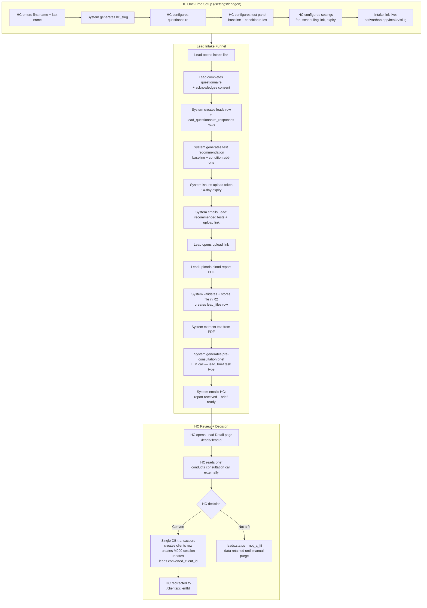

# SPEC-0001: Client Discovery Pipeline

**Status**: Draft
**Date**: 2026-06-26
**Owner**: SoJo
**Relates to**: `Unit_001_HcCoreCycle/SPEC-0001-hc-core-cycle.md` (conversion endpoint triggers Stage 1 client creation), `decisions/0005-auth-strategy.md` (upload token pattern), `decisions/0003-llm-strategy.md` (lead_brief prompt), `decisions/0006-observability.md` (llm_calls telemetry), `domain/glossary.md` (Lead, hc_slug, pre-consultation brief), `domain/compliance-india.md` (DPDP consent, data residency, retention)
**Implemented by phases**: _(populated as phases complete)_

---

## Goal

The Client Discovery Pipeline automates the intake journey a prospective client (Lead) must complete before their first coaching session (M000). Without it, HCs manage this manually — sharing questionnaire links, following up on lab results, reading raw PDFs during the consultation call — which is error-prone, time-consuming, and inconsistent.

The pipeline runs in four stages: health screening questionnaire → lab test recommendation → blood report collection → AI-generated pre-consultation brief. The HC's only mandatory touchpoint is reading the brief before the initial consultation call. Every step before that is system-automated with zero HC intervention required.

The result: a Lead who reaches the HC's calendar has already been screened, has baseline clinical data on file, and has given the HC a structured brief to walk into the call with. Unserious or unqualified leads drop off naturally during the process.

---

## Non-goals

- **Initial consultation call itself**: the platform supports preparation for the call, not the call.
- **Payment processing**: consultation fee is configured in the platform, but payment collection is handled via an external scheduling link (Calendly or similar). Native payment via Razorpay is a future enhancement.
- **WhatsApp notification delivery**: email only at MVP. WhatsApp Business API integration is deferred.
- **Partial brief (questionnaire-only)**: the pre-consultation brief is generated once, after blood report upload. No intermediate brief is produced.
- **Google Forms integration**: the questionnaire is built natively in Parivarthan. No Google Forms webhook or dependency is introduced.
- **OCR for handwritten / scan-based reports**: machine-generated PDFs (Thyrocare, SRL, Metropolis) extract cleanly. Handwritten or photographed reports are accepted but will not feed the AI brief.
- **Form builder (drag-and-drop, conditional logic, branching)**: HC configures a questionnaire using fixed question types (free text, multiple choice, scale 1–10) with no conditional logic.
- **Automated lead expiry**: leads past their expiry window are purged via a manual HC action at MVP. A scheduled job is a later phase.
- **Slug customisation by HC**: the intake URL slug is system-generated and permanently frozen at creation. No UI to change it exists at any layer.

---

## Actors and roles

Cross-reference `domain/actors.md`.

| Actor | Role | What they do in this pipeline |
|---|---|---|
| Health Coach (HC) | Primary platform user | Configures pipeline once (questionnaire, test panel, settings); receives notifications; reviews brief; takes conversion/rejection decision |
| Lead | Prospective client, no platform account | Completes questionnaire; receives lab recommendation by email; uploads blood report via token-gated link |
| System | Automation | Generates lab test recommendation; sends emails; generates AI pre-consultation brief; issues upload tokens |

---

## Domain terms

New terms introduced here. Each must also be added to `domain/glossary.md`.

| Term | Definition |
|---|---|
| **Lead** | A prospective client who has submitted a screening questionnaire but has not yet completed M000. Distinct from a Client. Exists in the DB as a `leads` row with no platform account. |
| **Intake funnel** | The four-stage automated sequence a Lead completes before becoming a Client: questionnaire → lab recommendation → blood report → pre-consultation brief. |
| **hc_slug** | A system-generated, permanently immutable URL identifier for the HC's public intake form. Format: `firstname-lastname-XXXXX` (all lowercase, 5-char alphanumeric suffix e.g. `a3k9m`). Generated once on first leadgen setup. No update path exists at any layer. |
| **Pre-consultation brief** | AI-generated summary the HC reads before the initial consultation call. Inputs: Lead's questionnaire responses + blood report text. Generated automatically when the blood report is uploaded. HC-internal — never shared with the Lead. |
| **Lead upload token** | A cryptographically secure, expiring token that grants a Lead one-time access to the blood report upload page. Stored as a SHA-256 hash in `lead_upload_tokens`. Pattern is identical to `client_invite_tokens` (ADR-0005). |
| **Standard baseline panel** | The set of blood tests required of every Lead, regardless of questionnaire responses. Configured by the HC once in their Test Panel settings. |
| **Condition-specific add-on** | Additional tests recommended on top of the baseline when a Lead's questionnaire response matches a configured keyword rule (e.g. "PCOD" → hormonal panel). |

---

## User stories

- As an HC, I want a shareable intake link so that prospective clients can begin the screening process without me manually sending forms.
- As an HC, I want the system to recommend blood tests automatically based on the client's responses so that I receive relevant clinical data without coordinating it myself.
- As an HC, I want a structured AI brief before the initial consultation call so that I walk into the call already prepared — questionnaire context, abnormal values surfaced, discussion points suggested.
- As an HC, I want to see all my leads in a pipeline view so that I know who is stuck at which stage and can take action (remind, convert, or reject).
- As a Lead, I want a simple, mobile-friendly form so that I can complete the intake questionnaire without needing to create an account.
- As a Lead, I want clear instructions about which blood tests to get so that I understand what is being asked of me and why.
- As a Lead, I want a straightforward upload experience so that I can submit my lab reports without technical friction.

---

## Flow



### Stage 1 — HC one-time setup

1. HC opens `/settings/leadgen` for the first time.
2. System prompts for `first_name` and `last_name` (not yet stored on the `users` row — collected here).
3. System generates slug: `lower(first_name)-lower(last_name)-<5-char-alphanumeric>`. Written to `hc_leadgen_config.hc_slug`. Immutable from this point — no update endpoint exists.
4. HC configures intake questionnaire (Intake Form tab): six required fields always present and non-removable (full name, age, email, phone, primary health goal, current health concerns); HC adds custom questions of three types: free text, multiple choice (up to 6 options), scale 1–10.
5. HC configures test panel (Test Panel tab): selects standard baseline tests from a curated list of common Indian health tests; adds condition-specific rules (keyword string → additional test name).
6. HC configures settings (Setup tab): consultation fee (INR), duration (minutes), scheduling link (external paste-in), lead expiry window (days).
7. HC copies intake link from the page header. Shares it via their own channels (WhatsApp, email, website, Instagram bio).

### Stage 2 — Lead completes questionnaire

1. Lead opens `parivarthan.app/intake/:slug` on any device (mobile-first design).
2. Page renders: HC's name, HC's profile photo, questionnaire. No platform branding that confuses the Lead about who they are engaging with.
3. Consent notice displayed before the submit button is reachable: *"Your responses will be shared only with [HC Name] for the purpose of your initial health consultation. We do not share your information with any third party."* Lead must tick acknowledgement.
4. Lead submits.
5. System creates `leads` row (`status: questionnaire_submitted`), `lead_questionnaire_responses` rows (one per question), records `consent_given_at` and `consent_purpose` on the `leads` row.
6. Page transitions to a confirmation state (same page, no redirect): *"Thank you. We've received your responses and will send your next steps to [email] shortly."*

### Stage 3 — Lab test recommendation generated and emailed

Fires immediately after Stage 2 with no HC involvement.

1. System loads HC's test panel config.
2. Standard baseline panel selected in full.
3. Each `lead_questionnaire_responses.response_text` matched case-insensitively (`ILIKE`) against each condition rule's keyword list.
4. Matching condition-specific tests appended; result deduplicated.
5. Recommendation stored as JSONB in `leads.test_recommendation`:
   ```json
   {
     "standard": ["CBC", "HbA1c", "TSH", "Lipid Profile", ...],
     "additions": [
       {"test": "Hormonal Panel (LH, FSH, AMH)", "triggered_by": "PCOD"}
     ],
     "all_tests": ["CBC", "HbA1c", "TSH", "Lipid Profile", "Hormonal Panel (LH, FSH, AMH)", ...]
   }
   ```
6. `leads.status` → `tests_recommended`.
7. System generates `lead_upload_tokens` row (raw token never stored — SHA-256 hash stored; 14-day expiry).
8. System sends email to Lead via Resend:
   - Subject: "Your health screening next steps — [HC Name]"
   - Body: bulleted list of recommended tests, brief explanation, upload link `parivarthan.app/upload/:raw_token`, 14-day deadline.

### Stage 4 — Lead uploads blood report

1. Lead opens `parivarthan.app/upload/:token`.
2. System validates token server-side before rendering any UI (hash match, not expired, not yet used). Invalid states show a plain-language message only — no upload UI shown.
3. Page renders: HC name, upload instructions, consent notice for health data storage, file upload area.
4. Lead selects files. Client-side pre-validation: PDF/JPEG/PNG only, ≤10 MB per file, ≤5 files, ≤30 MB total.
5. On submit: server re-validates MIME type via magic bytes (not file extension), re-checks size.
6. Each file uploaded to R2 at key: `leads/<lead_id>/reports/<epoch_ms>_<sanitized_filename>`.
7. `lead_files` row created per file after R2 confirms success. Token NOT consumed on upload failure — Lead can retry.
8. Token marked `used_at = NOW()` after all files accepted successfully.
9. `leads.status` → `report_uploaded`.
10. System attempts text extraction from each uploaded PDF.
    - Success: extracted text passed to brief generation.
    - Empty result (scan/handwritten): brief generation proceeds; brief notes "Blood report uploaded but could not be parsed automatically — review the PDF directly."
11. System calls LLM (`lead_brief` task type) — see §LLM involvement.
12. `leads.brief_text` and `leads.brief_llm_call_id` populated.
13. HC notified by email: *"Lab reports received from [Lead Name]. Pre-consultation brief is ready."* with a deep link to `/leads/:leadId`.

### Stage 5 — HC reviews brief, conducts initial consultation

1. HC opens email, clicks link to Lead Detail page `/leads/:leadId`.
2. Lead Detail page shows:
   - Questionnaire responses (all question-answer pairs)
   - Recommended tests (with rationale for condition-specific additions)
   - Uploaded blood report files (each with a download link)
   - Pre-consultation brief (full AI-generated text)
3. HC reads brief. Consultation call conducted externally (Zoom, phone — out of platform scope).

### Stage 6 — Conversion or rejection

**Path A — Convert to Client:**
1. HC clicks "Convert to Client" on Lead Detail page.
2. Confirmation modal pre-populated with Lead's name, email, phone, primary health goal.
3. HC confirms.
4. Single DB transaction:
   - `clients` row created (same logic as `POST /api/clients` in SPEC-0001 Stage 1).
   - M000 session created and linked to the new client.
   - M000 session notes pre-populated with Lead's questionnaire responses + brief text (verbatim, not re-generated).
   - `leads.converted_at` = NOW(), `leads.converted_client_id` = new client UUID, `leads.status` = `converted`.
   - If transaction fails at any point: full rollback via savepoint. No partial state persists.
5. HC redirected to `/clients/:clientId`.
6. Blood report files remain in `lead_files` — accessible from Client Detail page by joining through `leads.converted_client_id`. Files are not copied or migrated; the `lead_files` rows become the client's permanent intake history.

**Path B — Not a Fit:**
1. HC clicks "Not a Fit". Destructive action requires confirmation.
2. `leads.status` = `not_a_fit`. Data retained until manual purge.

**Manual purge (MVP):**
- Pipeline tab header shows count of leads past their `lead_expiry_days` threshold.
- "Purge expired leads" action archives and deletes all past-expiry leads in one operation:
  - R2 objects at `leads/<lead_id>/` deleted for each affected lead.
  - `lead_files`, `lead_questionnaire_responses`, `lead_upload_tokens`, `leads` rows deleted.
  - All in a single DB transaction per lead.

---

## Data

### New tables

**`leads`**

| Column | Type | Notes |
|---|---|---|
| `id` | UUID PK | |
| `hc_user_id` | UUID FK → users.id | Tenant scope. All queries filter by this. |
| `full_name` | TEXT NOT NULL | |
| `email` | TEXT NOT NULL | |
| `phone` | TEXT | |
| `status` | TEXT NOT NULL | Enum: `questionnaire_submitted`, `tests_recommended`, `report_uploaded`, `consultation_scheduled`, `converted`, `not_a_fit`, `archived` |
| `test_recommendation` | JSONB | Null until Stage 3. Shape: `{standard, additions, all_tests}` |
| `brief_text` | TEXT | Null until Stage 4 brief generation. |
| `brief_llm_call_id` | UUID FK → llm_calls.id | Null until brief generated. |
| `consent_given_at` | TIMESTAMPTZ | Set at questionnaire submission. DPDP required. |
| `consent_purpose` | TEXT | Verbatim purpose statement. DPDP required. |
| `converted_at` | TIMESTAMPTZ | Null unless converted. |
| `converted_client_id` | UUID FK → clients.id | Null unless converted. |
| `archived_at` | TIMESTAMPTZ | Null unless archived / purged. |
| `created_at` | TIMESTAMPTZ DEFAULT NOW() | |

Constraint: `UNIQUE (hc_user_id, email)` — prevents duplicate leads from the same email to the same HC.

---

**`lead_questionnaire_responses`**

| Column | Type | Notes |
|---|---|---|
| `id` | UUID PK | |
| `lead_id` | UUID FK → leads.id ON DELETE CASCADE | |
| `question_key` | TEXT | Stable identifier from HC's questionnaire config (e.g. `q_energy_level`). |
| `question_text` | TEXT | Verbatim question at submission time. Preserved even if HC later edits their questionnaire. |
| `response_text` | TEXT | Lead's answer. |
| `submitted_at` | TIMESTAMPTZ | |

---

**`lead_upload_tokens`**

| Column | Type | Notes |
|---|---|---|
| `id` | UUID PK | |
| `lead_id` | UUID FK → leads.id ON DELETE CASCADE | |
| `token_hash` | TEXT NOT NULL UNIQUE | SHA-256 of raw token. Raw token never stored. Identical pattern to `client_invite_tokens` (ADR-0005). |
| `expires_at` | TIMESTAMPTZ NOT NULL | 14 days from creation. |
| `used_at` | TIMESTAMPTZ | Null = not yet used. Set after successful upload session. |
| `created_at` | TIMESTAMPTZ DEFAULT NOW() | |

---

**`lead_files`**

| Column | Type | Notes |
|---|---|---|
| `id` | UUID PK | |
| `lead_id` | UUID FK → leads.id ON DELETE CASCADE | |
| `hc_user_id` | UUID FK → users.id | Direct tenant scoping — do not rely solely on lead join. |
| `filename` | TEXT | Original filename, sanitised. |
| `s3_key` | TEXT | R2 key: `leads/<lead_id>/reports/<epoch_ms>_<sanitised_filename>` |
| `mime_type` | TEXT | Validated server-side via magic bytes. |
| `file_size_bytes` | INTEGER | |
| `uploaded_at` | TIMESTAMPTZ DEFAULT NOW() | |
| `purpose` | TEXT DEFAULT 'blood_report' | Reserved for future file types per lead. |

---

**`hc_leadgen_config`**

| Column | Type | Notes |
|---|---|---|
| `id` | UUID PK | |
| `hc_user_id` | UUID FK → users.id UNIQUE | One row per HC. |
| `hc_slug` | TEXT UNIQUE NOT NULL | System-generated. Immutable. Format: `firstname-lastname-XXXXX`. |
| `questionnaire` | JSONB | Array of question objects: `{key, text, type, options?, required}` |
| `test_panel` | JSONB | `{standard_tests: [...], condition_rules: [{keywords: [...], tests: [...]}]}` |
| `consultation_fee_inr` | INTEGER | Nullable until configured. |
| `consultation_duration_min` | INTEGER DEFAULT 45 | |
| `scheduling_link` | TEXT | External calendar link (Calendly, Google Calendar). |
| `notification_delivery` | TEXT DEFAULT 'email' | Enum: `email`. WhatsApp variants deferred. |
| `lead_expiry_days` | INTEGER DEFAULT 60 | |
| `updated_at` | TIMESTAMPTZ | |

---

### Modified tables

**`users`** — two new columns for slug generation:

| Column | Type | Notes |
|---|---|---|
| `first_name` | TEXT | Collected during first leadgen setup. Nullable (HCs without leadgen have no value here). |
| `last_name` | TEXT | Same. |

These are not sourced from Google OAuth (which returns only `display_name`). They are entered by the HC during `/settings/leadgen` first-time setup.

---

### Entity read/write by stage

| Entity | Stage 1 | Stage 2 | Stage 3 | Stage 4 | Stage 5 | Stage 6 |
|---|---|---|---|---|---|---|
| `users` | Write (first_name, last_name) | — | — | — | — | — |
| `hc_leadgen_config` | Write | Read | Read | — | — | — |
| `leads` | — | Write | Write | Write | Read | Write |
| `lead_questionnaire_responses` | — | Write | Read | — | Read | — |
| `lead_upload_tokens` | — | — | Write | Write | — | — |
| `lead_files` | — | — | — | Write | Read | — |
| `clients` | — | — | — | — | — | Write (on convert) |
| `sessions` | — | — | — | — | — | Write (M000 on convert) |
| `llm_calls` | — | — | — | Write | — | — |

---

## API surface

### HC-facing (JWT required — `require_role('hc')`)

| Method | Path | Purpose |
|---|---|---|
| `GET` | `/api/leadgen/config` | Fetch full leadgen config (questionnaire, test panel, settings, slug) |
| `PATCH` | `/api/leadgen/config` | Update any config section. Slug field is ignored if included — read-only. |
| `POST` | `/api/leadgen/config/init` | First-time setup — accepts `first_name`, `last_name`; generates slug; creates config row. |
| `GET` | `/api/leads` | List leads, cursor-paginated, filterable by `status` |
| `GET` | `/api/leads/:id` | Lead detail — responses, recommendation, files (with download URLs), brief |
| `PATCH` | `/api/leads/:id` | Update status: `not_a_fit` or `archived` only. Status transitions are one-way. |
| `POST` | `/api/leads/:id/remind` | Issue a new upload token and resend the upload link email. Old token remains valid until its own expiry. |
| `POST` | `/api/leads/:id/convert` | Atomic conversion: create client, create M000, link lead → client. |
| `POST` | `/api/leads/purge-expired` | Purge all leads past `lead_expiry_days`. Returns count of records deleted. |

### Public (no JWT — lead-facing)

| Method | Path | Auth | Purpose |
|---|---|---|---|
| `GET` | `/api/intake/:slug` | None | Fetch HC's name, photo, and questionnaire. Response is an allowlist — no other HC data exposed. |
| `POST` | `/api/intake/:slug` | None | Submit questionnaire → create lead → trigger recommendation + token issuance + email. Rate-limited: 5 req/hour/IP via `slowapi`. |
| `GET` | `/api/upload/:token` | Token | Validate token; return HC name and contextual copy for the upload page. |
| `POST` | `/api/upload/:token/files` | Token | Upload blood report files (multipart). Validates MIME via magic bytes. Stores to R2. Creates `lead_files` rows. Triggers brief generation after all files accepted. |

All HC-facing endpoints enforce `leads.hc_user_id = current_tenant()`. Cross-tenant access returns 404, never 403 (consistent with platform pattern — do not leak existence).

---

## LLM involvement

| | Detail |
|---|---|
| **Task type** | `lead_brief` |
| **Prompt file** | `backend/prompts/lead_brief.md` — YAML frontmatter with `task_type: lead_brief`, version, changelog |
| **Schema** | `backend/src/llm_service/schemas/lead_brief.py` (Pydantic model) |
| **Trigger** | Automatically after blood report upload completes (Stage 4, step 11) |
| **Inputs** | HC questionnaire config (question labels + types), Lead's questionnaire responses, `leads.test_recommendation`, extracted blood report text (empty string if unextractable) |
| **Output** | Structured brief: key questionnaire findings, blood report highlights (or gap note if unextractable), suggested discussion points for the initial consultation, any flags (concerning responses, abnormal-looking values) |
| **Snippet injection** | None. The HC has no style history with this Lead. |
| **Observable** | `llm_calls` row written per ADR-0006: prompt version, input tokens, output tokens, model used, latency ms, cost INR. `leads.brief_llm_call_id` set to this row's ID. |
| **On failure** | `leads.brief_text` remains NULL. HC notification email says: *"Lab report received but brief could not be generated. Review files directly from the Lead profile."* Lead status still advances to `report_uploaded`. The failure is recorded in `llm_calls` with `status='failed'` and `error_detail` (per the P7 migration adding those columns). |

Cross-reference `decisions/0003-llm-strategy.md`.

---

## Coach-reviewed gate

The pre-consultation brief is HC-internal. It is never delivered to the Lead. No `status` field governs it (unlike MOMs) because there is no client-facing delivery path. The brief is written to `leads.brief_text` and read only by the HC from `/leads/:leadId`.

Blood report files are stored on behalf of the Lead and accessible only to the HC who owns the lead. No file is ever exposed through a client-facing endpoint.

---

## Edge cases and failure modes

| Case | Behaviour |
|---|---|
| Same email submits questionnaire twice to same HC | `UNIQUE(hc_user_id, email)` on `leads` rejects the second insert. `POST /api/intake/:slug` returns HTTP 409. Page shows: *"Our records show you've already submitted your intake form for this coach. If you have questions, please contact [HC Name] directly."* |
| Lead submits questionnaire but never uploads report | Token expires after 14 days. Lead stays at `tests_recommended` in the Pipeline tab. HC can click "Remind" to issue a new token and resend the email at any time. |
| Blood report PDF is scan-based or handwritten (unextractable) | Text extraction returns empty string. Brief generation proceeds. Brief section for blood data reads: *"Blood report uploaded but could not be parsed automatically — please review the attached PDF directly."* HC can download the original file. No error state surfaced to Lead. |
| R2 upload fails mid-transfer | Token NOT marked used. `lead_files` row NOT created (DB row created only after R2 confirms success). Lead sees: *"Upload failed. Please wait a moment and try again. Your link is still valid."* Retry is safe and idempotent. |
| LLM brief generation fails (timeout, 5xx from OpenRouter) | `leads.brief_text` remains NULL. `llm_calls` row written with `status='failed'`. HC notification email reads: *"Lab report received, but brief generation failed. Review files directly from the Lead profile."* HC can view raw questionnaire responses and download the PDF. |
| Conversion DB transaction partially fails | Full rollback via savepoint. No `clients` row, no M000 session, no `leads.converted_client_id` are left in partial state. HC sees error message. Lead remains at `report_uploaded`. HC can retry. |
| HC sends intake link to the same person twice | Second questionnaire submission hits the `UNIQUE(hc_user_id, email)` constraint → 409 → plain-language confirmation message. No duplicate lead created. |
| Slug collision at generation | 5-char alphanumeric suffix (36^5 ≈ 60 million combinations) makes collision negligible at any realistic HC count. No collision-detection logic is implemented. If a collision somehow occurs (astronomically unlikely), the `UNIQUE` constraint on `hc_leadgen_config.hc_slug` raises a DB error, caught and retried with a freshly generated suffix. |
| HC has not completed leadgen setup but tries to access `/leads` | `hc_leadgen_config` row does not exist → API returns a structured "setup incomplete" response (not a 500). Frontend redirects HC to setup flow. |
| Lead opens an expired upload link | Page shows: *"This upload link has expired. Please contact [HC Name] for a new link."* No upload UI shown. |
| Lead opens an already-used upload link | Page shows: *"Your reports have already been uploaded successfully. No further action needed."* |

---

## Acceptance criteria

### Setup

- [ ] `POST /api/leadgen/config/init` with `first_name` + `last_name` generates a slug matching `^[a-z]+-[a-z]+-[a-z0-9]{5}$` and creates `hc_leadgen_config` row
- [ ] `PATCH /api/leadgen/config` with `hc_slug` in the body silently ignores the field — slug in DB unchanged
- [ ] No endpoint exists that updates `hc_slug` — verified by grepping for any PATCH/PUT route that writes `hc_slug`
- [ ] Intake link `parivarthan.app/intake/:slug` returns 200 with questionnaire config for a configured HC

### Lead questionnaire submission

- [ ] `POST /api/intake/:slug` creates `leads` row with correct `hc_user_id` (resolved from slug)
- [ ] `lead_questionnaire_responses` rows created — one per question, preserving `question_text` verbatim
- [ ] `leads.consent_given_at` and `leads.consent_purpose` non-null after submission
- [ ] Second submission from same email to same HC returns 409 — no duplicate `leads` row
- [ ] 6th submission from same IP within 1 hour returns 429 (tested in integration with mocked clock)
- [ ] `GET /api/intake/:slug` response contains only `{hc_name, hc_photo_url, questionnaire}` — no other HC data

### Lab recommendation and token

- [ ] Standard baseline tests always present in `leads.test_recommendation.all_tests` regardless of questionnaire responses
- [ ] Condition-specific tests added only when keyword matches — no false additions (tested with known keywords)
- [ ] `lead_upload_tokens` row created with non-null `token_hash` and `expires_at` 14 days from creation
- [ ] Raw token not present anywhere in the DB — only SHA-256 hash stored
- [ ] Email sent to Lead via Resend with upload link containing the raw token

### Blood report upload

- [ ] `GET /api/upload/:expired_token` returns token-expired page, not upload UI
- [ ] `GET /api/upload/:used_token` returns already-used page, not upload UI
- [ ] `POST /api/upload/:token/files` with a PDF whose extension is `.jpg` but magic bytes are PDF: accepted (MIME from bytes, not extension)
- [ ] `POST /api/upload/:token/files` with a `.exe` file: rejected regardless of declared MIME type
- [ ] File stored in R2 under `leads/<lead_id>/reports/` prefix — verified by checking key structure
- [ ] `lead_files` row created only after R2 confirms success
- [ ] Token `used_at` set only after all files in the batch are accepted
- [ ] On R2 failure: token NOT marked used — Lead can retry

### Brief generation

- [ ] `llm_calls` row written for every brief generation (success and failure)
- [ ] `leads.brief_llm_call_id` populated on success
- [ ] `leads.brief_text` is non-null on success; null on LLM failure
- [ ] On LLM failure: `leads.status` = `report_uploaded` (not blocked), HC email mentions failure
- [ ] Brief for a Lead with unextractable PDF: generated, contains gap note, does not error

### Tenant isolation

- [ ] `GET /api/leads/:id` for a lead owned by HC2 accessed with HC1's JWT returns 404
- [ ] `POST /api/leads/:id/convert` by wrong HC returns 404
- [ ] Cross-tenant isolation verified in integration tests for all HC-facing lead endpoints

### Conversion

- [ ] Conversion creates `clients` row, M000 session, and populates `leads.converted_client_id` in a single transaction
- [ ] M000 session notes pre-populated with questionnaire responses + brief text on conversion
- [ ] Integration test: kill DB connection mid-conversion → assert no `clients` row, no M000 session, `leads.converted_client_id` still null (rollback verified)
- [ ] Blood report files accessible from Client Detail page via `leads.converted_client_id` join — no file duplication

### Purge

- [ ] `POST /api/leads/purge-expired` deletes `lead_files` rows, `lead_questionnaire_responses` rows, `lead_upload_tokens` rows, and `leads` row for each expired lead
- [ ] R2 objects under `leads/<lead_id>/` deleted for each purged lead
- [ ] `converted` leads are never purged regardless of age

### DPDP

- [ ] Consent captured at questionnaire submission — `consent_given_at` and `consent_purpose` non-null before any `lead_questionnaire_responses` rows are created (same transaction)
- [ ] Intake page and upload page carry `<meta name="robots" content="noindex">`
- [ ] No lead's email, phone, or response data appears in structured logs — scrubbed by existing `scrub()` before logging

---

## Open questions

- **M000 session notes pre-population on conversion**: the spec prescribes pre-populating M000 session notes with questionnaire responses + brief text. This is the default if no decision is made. SoJo should confirm before Phase 1 implementation starts whether this is desired, or whether the HC prefers to start with blank session notes.
  - Owner: SoJo — by: before Phase 1 implementation begins

---

## Out of scope (future)

- WhatsApp notification delivery (Twilio / Meta Business API)
- Payment processing for initial consultation (Razorpay)
- Native calendar / scheduling (replacing external Calendly link)
- Automated lead expiry (scheduled Cloud Run job or `pg_cron`)
- OCR for handwritten / scan-based blood reports (Google Vision, AWS Textract)
- Conditional logic or branching in the questionnaire
- Multi-step wizard UI for questionnaire
- Lead analytics: conversion rate, funnel drop-off by stage
- Referral source tracking ("how did you hear about this coach")
- Questionnaire response sentiment analysis
- Slug aliases or redirect after rename (slug is immutable — no redirect scenario exists)

---

## Changelog

| Date | Change | Reason |
|---|---|---|
| 2026-06-26 | Initial draft. | Client Discovery Pipeline design session complete — all architectural decisions locked, brainstorming approved by SoJo. |
