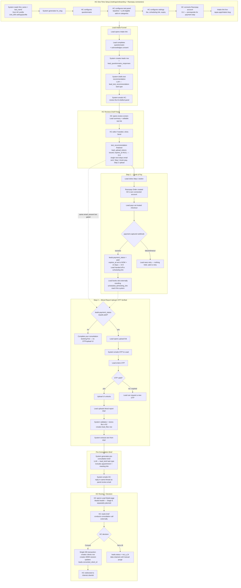

# SPEC-0001: Client Discovery Pipeline

**Status**: Accepted — major redesign 2026-08-24, see Decisions log and Changelog
**Date**: 2026-06-26
**Owner**: SoJo
**Relates to**: `Unit_001_HcCoreCycle/SPEC-0001-hc-core-cycle.md` (conversion endpoint triggers Stage 1 client creation), `decisions/0005-auth-strategy.md` (upload token pattern), `decisions/0003-llm-strategy.md` (lead_brief + lead_test_recommendation prompts), `decisions/0006-observability.md` (llm_calls telemetry), `domain/glossary.md` (Lead, hc_slug, pre-consultation brief), `domain/compliance-india.md` (DPDP consent, data residency, retention), `Unit_006_PlatformFoundations/SPEC-0001-platform-foundations.md` (`users.first_name`/`last_name` — resolved dependency, see Open questions), `Unit_004_OneStopSpot/SPEC-0001-one-stop-spot.md` (F4 — the other HC↔Razorpay surface in this codebase; this spec's payment work must not duplicate that onboarding, see Decisions log D-2)
**Implemented by phases**: `PHASE-01-leadgen-data-layer-and-setup.md` (Stage 1 — shipped), `PHASE-02-public-intake-and-lab-recommendation.md` (Stage 2 — shipped, its rule-based recommendation engine is superseded by PHASE-04, see D-4), `PHASE-03-blood-report-upload-and-brief-generation.md` (shipped, extended by PHASE-06's OTP gate), `PHASE-04-ai-test-recommendation-and-hc-review.md` (shipped), `PHASE-05a1-payment-and-scheduling-handoff.md` (renamed 2026-08-27 from `PHASE-05-payment-and-scheduling-handoff.md` — payment shipped and manually verified in real Razorpay test mode 2026-08-27 — Order creation, hosted Checkout, real webhook delivery all confirmed; upload-token-unlock leg of the walkthrough not yet reconfirmed. The bare redirect-to-`scheduling_link` handoff is also shipped; the scheduling round-trip is NOT reopened here — see `PHASE-05b1`), `PHASE-05a2-razorpay-oauth-technology-partner-migration.md` (renamed 2026-08-27 from `PHASE-05b-razorpay-oauth-technology-partner-migration.md` — written, execution gated on SoJo's Razorpay Technology Partner setup, application submitted, approval pending — see its own §6), `PHASE-05b1-calcom-scheduling-mvp.md` (new 2026-08-27 — written, execution gated on Cal.com account setup and a live metadata-passthrough verification — see its own §6), `PHASE-05b2-native-scheduling-platform.md` (new 2026-08-27 — deliberately unscoped placeholder for the future native-scheduling direction, not started), `PHASE-06-otp-secured-upload-and-two-part-brief.md` (planned)

---

## Goal

The Client Discovery Pipeline automates the intake journey a prospective client (Lead) must complete before their first coaching session (M000). Without it, HCs manage this manually — sharing questionnaire links, following up on lab results, reading raw PDFs during the consultation call, chasing payment — which is error-prone, time-consuming, and inconsistent.

The pipeline runs in eight stages: health screening questionnaire → AI-drafted test recommendation with HC review → payment for the first consultation → scheduling handoff → blood report collection (OTP-verified) → AI-generated pre-consultation brief → HC reviews brief and conducts the call → conversion or rejection.

Unlike the original single-pass design, the HC now has **two** mandatory touchpoints, not one: reviewing/finalizing the AI-drafted test panel before it reaches the Lead (Stage 3), and reading the full brief before the call (Stage 7). Both are intentionally kept to a single, fast action each — this pipeline exists to remove HC coordination overhead, not add a second inbox to manage.

The result: a Lead who reaches the HC's calendar has already been screened, has paid, has baseline clinical data on file, and has given the HC a structured brief to walk into the call with. Unserious or unqualified leads drop off naturally during the process — now including a real economic filter (payment), not just an attention filter (form completion).

---

## Decisions log

Decisions made during the 2026-08-24 redesign session with SoJo, encoded here so later phases don't have to rediscover the reasoning.

| # | Decision | Context |
|---|---|---|
| D-1 | **Payment for the first consultation is native Razorpay (test mode during dev), not an external scheduling tool's own payment feature.** | Evaluated and rejected: Calendly+Stripe (Stripe/PayPal don't serve India's UPI rail, which is how Indian clients actually pay; Calendly payment collection also requires a paid plan), Cal.com self-hosted (same India-gateway gap, Razorpay is an unapproved open feature request), Zoho Bookings (has native Razorpay, but gated behind a paid plan — not $0). Razorpay test mode is $0 for the entire dev/testing period, no KYC needed, and covers mock UPI/card/netbanking success *and* failure simulation. |
| D-2 | **Tapas is never the merchant of record. Each HC connects their own Razorpay account before this pipeline's payment step can be used for their Leads.** | Mirrors the one other payment surface already designed in this codebase — `Unit_004_OneStopSpot` F4's HC↔Client billing, which made the identical choice for the identical reason: Tapas collecting money and passing it on to HCs would make Tapas a payment intermediary, triggering RBI Payment Aggregator licensing. This spec's payment work reuses that same posture rather than inventing a second, inconsistent one. Where the HC connects their Razorpay account is a shared capability both this spec and Unit_004's future F4 work need — flagged in Open questions to avoid duplicate builds. |
| D-3 | **Payment and scheduling are fully decoupled — no slot-hold-then-pay.** | Confirmed by reading Razorpay's own API documentation: the Orders API has no reservation/hold primitive of any kind (it's a payment gateway, not a booking system), and no third-party booking tool integrates Razorpay as anything other than "collect payment, then let the booking layer's own logic handle the calendar." Lead pays first (a payment either succeeds or fails, nothing time-limited); only after success is the Lead handed off to scheduling. The actual scheduling mechanism (which calendar tool, how availability is sourced) is owned by a separate, out-of-scope workstream and is not designed here. |
| D-4 | **Test recommendation moves from deterministic keyword-matching to an LLM call over the Lead's free-text answers — but only for condition-specific additions, not the HC's standard baseline panel.** | The HC-configured "standard baseline" tests (every Lead gets these regardless of what they wrote) stay exactly as they are — a deterministic, HC-owned minimum. Only the old `ILIKE`-keyword-matched "condition-specific add-ons" (PHASE-02's rule engine) are replaced with an LLM reading the Lead's actual questionnaire answers and reasoning about which additional tests are relevant. This is a smaller, lower-risk change than replacing the whole recommendation with a from-scratch AI judgment, and it preserves the existing `{standard, additions, all_tests}` JSON shape most of this spec's downstream logic already assumes. |
| D-5 | **The AI's draft panel is never sent to the Lead automatically.** The HC reviews it on a single-purpose, intentionally minimal screen (Lead's questionnaire-derived summary, then an editable test list) and one action both finalizes and sends — there is no separate "save draft" state. | SoJo's explicit call: this screen is temporary/minimal by design, and a save-without-send state risks a reviewed-but-forgotten panel sitting unsent while the Lead waits. The HC is assumed busy; the flow is built for lowest possible HC effort, not for iterative drafting. |
| D-6 | **The blood-report upload link gets an OTP gate**, delivered to the Lead's email today, with the schema left open for a phone/SMS channel later (not built now). | Closes a real trust gap this spec's own history had already identified and shelved: PHASE-02's carry-over notes flagged "deferred OTP" as a considered-but-not-built idea for exactly this kind of link. Today, possessing the upload URL is the *only* proof of identity — if it's forwarded or intercepted, someone else can complete the upload as the Lead. OTP raises the bar to "controls the Lead's own registered contact channel," without requiring Leads to have platform accounts (a deliberate non-goal elsewhere in this spec). |
| D-7 | **The AI output becomes two distinct artifacts, not one.** The **draft test recommendation** (Stage 3 — Lead's questionnaire summary + AI-suggested additional tests, HC-reviewed before the Lead ever sees it) is a *different* artifact from the **pre-consultation brief** (Stage 6 — the full clinical brief generated after blood report upload, unchanged concept from the original design, now enriched with the confirmed appointment time and meeting link). The two are never conflated in this doc's terminology — see Domain terms. | Keeps the existing "no partial pre-consultation brief" non-goal intact and true: the draft test recommendation is not a preview of the clinical brief, it's a distinct, earlier artifact with a different purpose (test-panel review, not consultation prep). |
| D-8 | **One Lead-facing "next steps" email, not two.** Sent once, at the moment the HC clicks Send (Stage 3 step 8) — not resent at payment success. It presents two numbered steps: Step 1 (book & pay) and Step 2 (upload blood test results), each with a real button from the first send. The Step 2 button is never dead: `lead_upload_tokens` is issued at Send-time (moved out of Stage 4, where it originally sat), but its `expires_at` is left NULL until `leads.payment_status` flips to `paid` — the upload page checks payment status before anything else, and shows a plain-language "complete your consultation booking first" state (not the OTP/upload UI) if clicked early. The "leave buffer time for your blood test" note lives in this email's Step 2 copy, not on the payment/scheduling page — added 2026-08-25 (SoJo). | Rejected sending two separate emails ("email blasting" — SoJo's words) once it became clear the second email added nothing the first couldn't already carry: the upload link doesn't need Stage 4 to *complete* before it can exist, only before it can be *used*, and that's a server-side gate, not a reason to withhold the link itself. Delaying the `expires_at` clock to payment-success time (rather than starting it at issuance) keeps the original 14-day upload window intact regardless of how long the Lead takes to get around to booking — a Lead who takes 10 days to book still gets the full 14 days to complete their blood test, not 4. |

---

## Non-goals

- **Initial consultation call itself**: the platform supports preparation for the call, not the call.
- **Native scheduling / calendar**: Stage 4's scheduling handoff hands the Lead to an externally-owned scheduling mechanism (not designed in this spec — a separate, out-of-scope workstream). This spec only gates *access* to that handoff behind successful payment.
- **Payment aggregation / Tapas as merchant of record**: see D-2. Tapas never touches Lead payment funds. If an HC has not connected their own Razorpay account, this pipeline's payment step cannot be reached for their Leads — see Edge cases.
- **Refunds, disputes, partial payments, recurring/subscription billing for the consultation fee**: single one-time charge only. Razorpay-side refund tooling exists but nothing in this pipeline automates or surfaces it.
- **WhatsApp / SMS OTP delivery**: OTP is email-only at MVP (D-6). The schema supports a future channel; the channel itself is not built.
- **WhatsApp notification delivery generally**: email only at MVP for all Lead/HC notifications. WhatsApp Business API integration is deferred.
- **Partial pre-consultation brief**: the pre-consultation brief (Stage 6) is generated once, after blood report upload. No intermediate version of *that specific artifact* is produced — the Stage 3 draft test recommendation is a distinct artifact, not a partial brief (D-7).
- **Google Forms integration**: the questionnaire is built natively in Tapas. No Google Forms webhook or dependency is introduced.
- **OCR for handwritten / scan-based reports**: machine-generated PDFs (Thyrocare, SRL, Metropolis) extract cleanly. Handwritten or photographed reports are accepted but will not feed the AI brief.
- **Form builder (drag-and-drop, conditional logic, branching)**: HC configures a questionnaire using fixed question types (free text, multiple choice, scale 1–10) with no conditional logic.
- **Automated lead expiry**: leads past their expiry window are purged via a manual HC action at MVP. A scheduled job is a later phase.
- **Slug customisation by HC**: the intake URL slug is system-generated and permanently frozen at creation. No UI to change it exists at any layer.

---

## Actors and roles

Cross-reference `domain/actors.md`.

| Actor             | Role                                    | What they do in this pipeline                                                                                                              |
| ----------------- | ---------------------------------------- | ------------------------------------------------------------------------------------------------------------------------------------------- |
| Health Coach (HC) | Primary platform user                   | Configures pipeline once (questionnaire, test panel, settings, Razorpay account connection); reviews and finalizes each Lead's AI-drafted test panel (one action: send); receives payment automatically via their own Razorpay account; reads pre-consultation brief; takes conversion/rejection decision |
| Lead              | Prospective client, no platform account | Completes questionnaire; reviews and pays for the finalized test panel + consultation; schedules externally; verifies via OTP and uploads blood report |
| System            | Automation                              | Drafts test recommendation via LLM; creates Razorpay orders and verifies payment webhooks; hands off to scheduling on payment success; sends OTP; generates AI pre-consultation brief; issues upload tokens |

---

## Shared surfaces

**Binding convention, not advisory** — added 2026-08-13 after Stage 1's HC-facing setup page shipped under PHASE-01 as a standalone route (`/settings/leadgen`) with no in-app nav link, a gap PHASE-01's own final review flagged but left unresolved (`docs/SESSION_LOG.md`, PHASE-01 entry). It sat unlinked until `Unit_006_PlatformFoundations` PHASE-01 (built independently, on its own branch) introduced a Settings hub (`frontend/src/app/(app)/settings/(hub)/layout.tsx`) with a reserved but empty "Onboarding" sidebar slot. The two were reconciled 2026-08-13: Stage 1's setup UI now lives at `/settings/onboarding`, inside that hub, filling the slot Unit_006 reserved for it. See Changelog.

This spec does not own the Settings hub, the top-level app nav, or the `/api/settings/*` namespace — `Unit_006_PlatformFoundations` does. Any future phase in this spec that adds HC-facing settings UI (e.g. the purge/deletion flow implied by the DPDP edge cases below, or the Razorpay-account-connection UI this redesign now needs) must:

1. Land as a new entry in `SETTINGS_SECTIONS` inside `frontend/src/app/(app)/settings/(hub)/layout.tsx` — never a standalone top-level route. This is `Unit_006_PlatformFoundations` PHASE-01's own established convention (see that unit's PHASE-01 doc §7–§8), not one invented here.
2. Check `Unit_006_PlatformFoundations/SPEC-0001-platform-foundations.md` §8 (carry-over) first — PHASE-02 (account/data deletion) and PHASE-03 (consent) are already earmarked to claim sidebar slots in that same hub, and may have shipped or changed shape since this note was written.
3. Get nav placement confirmed with SoJo while writing that phase's plan, not after building it — the mistake Unit_006 PHASE-01 itself made and documented as a lesson learned.
4. **Check `Unit_004_OneStopSpot/SPEC-0001-one-stop-spot.md`'s F4 section before building any Razorpay-account-connection UI** — this spec's Stage 1 now needs the HC to have connected a Razorpay account (D-2), and Unit_004's F4 needs the identical capability for ongoing client billing. Building two separate "connect your Razorpay account" flows would be the same class of mistake the first_name/last_name and settings/onboarding duplications already were this session — see Open questions.
5. **Proactive note, added 2026-08-27, no live conflict today**: `PHASE-05b1-calcom-scheduling-mvp.md` introduces `hc_scheduling_accounts`, a per-HC scheduling-tool connection — the same class of shared capability `hc_payment_accounts` already is. Checked: `Unit_004_OneStopSpot/SPEC-0001-one-stop-spot.md` has no scheduling/booking concept today (its own Google Calendar work, F6/D-30/PHASE-01e, is HC-side session-linking, not a connection Unit_003 would reuse or that would reuse this). Flagging now so a future Unit_004 scheduling need checks here first, the same discipline point 4 already applies to Razorpay.

---

## Domain terms

New terms introduced here. Each must also be added to `domain/glossary.md`.

| Term                                | Definition                                                                                                                                                                                                                                                           |
| ------------------------------------ | ----------------------------------------------------------------------------------------------------------------------------------------------------------------------------------------------------------------------------------------------------------------- |
| **Lead**                      | A prospective client who has submitted a screening questionnaire but has not yet completed M000. Distinct from a Client. Exists in the DB as a `leads` row with no platform account.                                                                                |
| **Intake funnel**             | The eight-stage automated sequence a Lead completes before becoming a Client: questionnaire → draft test recommendation + HC review → payment → scheduling handoff → blood report upload (OTP-verified) → pre-consultation brief → HC review + call → conversion.  |
| **hc_slug**                   | A system-generated, permanently immutable URL identifier for the HC's public intake form. Format: `firstname-lastname-XXXXX` (all lowercase, 5-char alphanumeric suffix e.g. `a3k9m`). Generated once on first leadgen setup. No update path exists at any layer. |
| **Draft test recommendation** | The AI-drafted test panel (standard baseline + LLM-suggested condition-specific additions) generated immediately after questionnaire submission, shown only to the HC for review — never seen by the Lead until the HC sends it. Distinct from the pre-consultation brief (D-7). |
| **Pre-consultation brief**    | AI-generated summary the HC reads before the initial consultation call. Inputs: Lead's questionnaire responses + finalized test recommendation + blood report text + confirmed appointment time/meeting link. Generated automatically when the blood report is uploaded. HC-internal — never shared with the Lead. |
| **Lead upload token**         | A cryptographically secure, expiring token that grants a Lead one-time access to the blood report upload page, gated behind OTP verification (D-6). Stored as a SHA-256 hash in `lead_upload_tokens`. Base pattern is identical to `client_invite_tokens` (ADR-0005); OTP fields are additive.       |
| **Upload OTP**                | A short-lived, single-use numeric code emailed to the Lead when they open the upload link, required before the upload UI unlocks. Proves control of the Lead's registered contact channel, not just possession of the URL. |
| **Standard baseline panel**   | The set of blood tests required of every Lead, regardless of questionnaire responses. Configured by the HC once in their Test Panel settings. Stays deterministic under D-4 — never AI-drafted.                                                                                                                                                                                                        |
| **Condition-specific add-on** | Additional tests recommended on top of the baseline. As of this redesign, drafted by an LLM reading the Lead's questionnaire responses (D-4) rather than keyword-matched — always HC-reviewable before the Lead sees them.                                                                                                                          |
| **Consultation payment**      | The one-time fee a Lead pays, via the HC's own connected Razorpay account, to confirm their first consultation. Gates the scheduling handoff (D-3). Tapas never holds these funds (D-2).                                                                            |

---

## User stories

- As an HC, I want a shareable intake link so that prospective clients can begin the screening process without me manually sending forms.
- As an HC, I want the system to draft blood test recommendations from what the client actually told me, so I don't have to read every questionnaire myself before knowing what to suggest — but I still want the final say before it reaches the client.
- As an HC, I want to be paid for the first consultation automatically, through my own Razorpay account, without Tapas ever touching the money.
- As an HC, I want a structured AI brief before the initial consultation call so that I walk into the call already prepared — questionnaire context, abnormal values surfaced, discussion points suggested, and I can see the confirmed appointment on my own calendar.
- As an HC, I want to see all my leads in a pipeline view so that I know who is stuck at which stage and can take action (remind, convert, or reject).
- As a Lead, I want a simple, mobile-friendly form so that I can complete the intake questionnaire without needing to create an account.
- As a Lead, I want clear instructions about which blood tests to get, and to pay and book my consultation in one straightforward flow, so I understand what's being asked of me and can commit with confidence.
- As a Lead, I want confidence that only I can upload my own lab results using the link sent to me — not just anyone who happens to have the URL.
- As a Lead, I want a straightforward upload experience so that I can submit my lab reports without technical friction.

---

## Flow

```mermaid
flowchart TD
    subgraph Setup["HC One-Time Setup (/settings/onboarding + Razorpay connection)"]
        S1[System reads first_name + last_name\nfrom HC profile\nUnit_006 settings/profile] --> S2[System generates hc_slug]
        S2 --> S3[HC configures questionnaire]
        S3 --> S4[HC configures test panel\nbaseline + LLM-eligible add-on categories]
        S4 --> S5[HC configures settings\nfee, scheduling link, expiry]
        S5 --> S6[HC connects Razorpay account\nD-2 — prerequisite for payment step]
        S6 --> S7[Intake link live:\ntapas.app/intake/:slug]
    end

    subgraph Funnel["Lead Intake Funnel"]
        F1[Lead opens intake link] --> F2[Lead completes questionnaire\n+ acknowledges consent]
        F2 --> F3[System creates leads row\n+ lead_questionnaire_responses rows]
        F3 --> F4[System drafts test recommendation\nLLM — lead_test_recommendation task type]
        F4 --> F5[System emails HC:\nreview the AI-drafted panel]
    end

    subgraph HCReview["HC Reviews Draft Panel"]
        F5 --> H1[HC opens review screen:\nLead summary + editable test list]
        H1 --> H2[HC edits if needed, clicks Send]
        H2 --> H3[test_recommendation finalized\nlead_upload_tokens issued, expires_at NULL — D-8\nsingle next-steps email sent: Step 1 book+pay, Step 2 upload]
    end

    subgraph Payment["Step 1 — Book & Pay"]
        H3 --> P1[Lead clicks Step 1 button]
        P1 --> P2[Razorpay Order created\nHC's own connected account]
        P2 --> P3[Lead pays via hosted checkout]
        P3 --> P4{payment.captured webhook}
        P4 -->|success| P5[leads.payment_status = paid\nexpires_at set to NOW + 14 days — D-8\nLead handed off to scheduling link]
        P4 -->|failure/timeout| P6[Lead sees retry — nothing held, safe to retry]
        P5 --> P7[Lead books slot externally\nresulting scheduled_at/meeting_link reach this system]
    end

    subgraph Upload["Step 2 — Blood Report Upload, OTP Verified"]
        H3 -.->|same email, present but gated| U0{leads.payment_status\nequals paid?}
        P7 -.-> U0
        U0 -->|no| U0N[Complete your consultation\nbooking first — no OTP/upload UI]
        U0 -->|yes| U1[Lead opens upload link]
        U1 --> U2[System emails OTP to Lead]
        U2 --> U3[Lead enters OTP]
        U3 --> U4{OTP valid?}
        U4 -->|yes| U5[Upload UI unlocks]
        U4 -->|no / expired| U6[Lead can request a new OTP]
        U5 --> U7[Lead uploads blood report PDF]
        U7 --> U8[System validates + stores file in R2\ncreates lead_files row]
        U8 --> U9[System extracts text from PDF]
    end

    subgraph Brief["Pre-Consultation Brief"]
        U9 --> B1[System generates pre-consultation brief\nLLM — lead_brief task type\nincludes appointment + meeting link]
        B1 --> B2[System emails HC:\nreply in same thread as panel-review email]
    end

    subgraph Review["HC Review + Decision"]
        B2 --> R1[HC opens Lead Detail page\n/leads/:leadId — Stage 8, separately planned]
        R1 --> R2[HC reads brief\nconducts consultation call externally]
        R2 --> R3{HC decision}
        R3 -->|Convert| R4[Single DB transaction:\ncreates clients row\ncreates M000 session\nupdates leads.converted_client_id]
        R4 --> R5[HC redirected to\n/clients/:clientId]
        R3 -->|Not a fit| R6[leads.status = not_a_fit\ndata retained until manual purge]
    end

    Setup --> Funnel
```

### Stage 1 — HC one-time setup

1. HC opens `/settings/onboarding` for the first time — a sidebar entry inside `Unit_006_PlatformFoundations`'s Settings hub (see Shared surfaces below), not a standalone route.
2. System checks `users.first_name` and `users.last_name` — owned by `Unit_006_PlatformFoundations` PHASE-01 (HC Settings & Profile), not collected here. If either is null, leadgen setup cannot proceed: frontend redirects the HC to `/settings/profile` to complete their name first, then returns them to `/settings/onboarding`. This dependency is resolved — see Open questions.
3. Once both fields are present, system generates slug: `lower(first_name)-lower(last_name)-<5-char-alphanumeric>`. Written to `hc_leadgen_config.hc_slug`. Immutable from this point — no update endpoint exists.
4. HC configures intake questionnaire (Intake Form tab): six required fields always present and non-removable (full name, age, email, phone, primary health goal, current health concerns); HC adds custom questions of three types: free text, multiple choice (up to 6 options), scale 1–10.
5. HC configures test panel (Test Panel tab): selects standard baseline tests from a curated list of common Indian health tests (stays deterministic, D-4). Condition-specific keyword rules from the original design are retired — the LLM now drafts additions directly from questionnaire text (Stage 3).
6. HC configures settings (Setup tab): consultation fee (INR), duration (minutes), scheduling link (external paste-in — the handoff destination after payment, D-3), lead expiry window (days).
7. **HC connects their Razorpay account** (D-2). Until this is done, Stage 4's payment step cannot be reached for this HC's Leads — see Edge cases. Where this connection UI lives is a shared-capability question with `Unit_004_OneStopSpot` F4 — see Open questions; this spec builds only what it needs, following the Shared surfaces convention.
8. HC copies intake link from the page header. Shares it via their own channels (WhatsApp, email, website, Instagram bio). **The URL is channel-agnostic** — it identifies only the HC (via `hc_slug`), never how the Lead arrived at it.

### Stage 2 — Lead completes questionnaire

Unchanged from the original design.

1. Lead opens `tapas.app/intake/:slug` on any device (mobile-first design).
2. Page renders: HC's name, HC's profile photo, questionnaire. No platform branding that confuses the Lead about who they are engaging with.
3. Consent notice displayed before the submit button is reachable: *"Your responses will be shared only with [HC Name] for the purpose of your initial health consultation. We do not share your information with any third party."* Lead must tick acknowledgement.
4. Lead submits.
5. System creates `leads` row (`status: questionnaire_submitted`), `lead_questionnaire_responses` rows (one per question), records `consent_given_at` and `consent_purpose` on the `leads` row.
6. Page transitions to a confirmation state (same page, no redirect): *"Thank you. We've received your responses and will send your next steps to [email] shortly."*

### Stage 3 — AI drafts test recommendation, HC reviews and sends

Fires immediately after Stage 2 for the AI draft; the HC action that follows is this pipeline's first mandatory touchpoint.

1. System loads HC's test panel config (standard baseline) and the Lead's `lead_questionnaire_responses`.
2. System calls the LLM (`lead_test_recommendation` task type — see §LLM involvement) with the Lead's answers, asking it to suggest condition-specific additional tests beyond the standard baseline.
3. Result stored as JSONB in `leads.draft_test_recommendation` (same shape as the original `test_recommendation`: `{standard, additions, all_tests}`) — **not yet shown to the Lead.**
4. `leads.status` → `tests_drafted`.
5. System emails the HC: *"A new Lead completed their questionnaire — review the recommended tests before they're sent."* This email links to the real, built HC review screen (Stage 3 continued) — the redesign's own fix for the dead-link bug that prompted it. The Stage 6/7 brief-ready email still has an unrelated instance of that same bug class, unresolved — see Open questions.
6. HC opens the review screen: first, a summary of the Lead built from their questionnaire responses; then, an editable list of the AI-drafted tests (standard baseline shown but not editable here — that's an HC's own Test Panel setting; additions are add/remove-editable).
7. HC edits the additions list if they disagree with the AI, then clicks **Send** — a single action.
8. On Send: `leads.test_recommendation` (the final, Lead-facing version) is written from the HC's edited list, `leads.status` → `tests_recommended`. System also issues the Lead's `lead_upload_tokens` row now (D-8) — `expires_at` left NULL, activated at payment success (Stage 4 step 3) — and sends the Lead a single next-steps email covering both remaining steps at once (Stage 4): Step 1, book & pay; Step 2, upload blood test results (button present now, gated server-side until Step 1 completes).
9. There is no separate "save without sending" state (D-5) — closing the review screen without clicking Send leaves `leads.draft_test_recommendation` as the only record; the HC can reopen the same screen later to finish.

### Stage 4 — Lead pays, scheduling handoff

Both of this stage's steps were already emailed to the Lead in one message at the end of Stage 3 (D-8) — nothing is (re-)sent here. Stage 4 is what happens when the Lead clicks Step 1 of that email.

1. Lead clicks the "Book your consultation" button. System creates a Razorpay Order against the HC's connected account (D-2) for `hc_leadgen_config.consultation_fee_inr`.
2. Lead completes payment via Razorpay's hosted checkout (test mode during dev — mock UPI/card/netbanking, both success and induced-failure paths).
3. Razorpay sends a `payment.captured` webhook. System verifies the HMAC-SHA256 signature, checks idempotency (Razorpay retries webhooks — a given payment must only be processed once), and on success sets `leads.payment_status = paid`, `leads.payment_reference`, `leads.paid_at`. This is also the moment `lead_upload_tokens.expires_at` for this Lead's already-issued token (Stage 3 step 8) gets set to `NOW() + 14 days` (D-8) — the Step 2 button in the Lead's inbox becomes usable from this instant, with no new email required.
4. On payment failure or webhook timeout: nothing was held (D-3 — payment and scheduling are decoupled, so there's no reservation to release), and the upload token's `expires_at` stays NULL (Step 2 stays gated). Lead sees a plain "payment didn't go through, try again" state and can retry freely.
5. On payment success: Lead is handed off to the HC's configured `scheduling_link` (external — mechanism not designed here). The "leave enough time before your consultation to also complete your blood test" note is not repeated here — it's already in the Stage-3 email's Step 2 copy (D-8), on the record without cluttering this handoff.
6. Once the Lead has booked (confirmed by whatever mechanism the external scheduler provides — out of scope to design here, but the resulting appointment time and meeting link must reach this system so Stage 6's brief can include them), system records `leads.scheduled_at` and `leads.meeting_link`, and `leads.status` → `consultation_scheduled`. No email is sent for this — the external scheduler's own confirmation (calendar invite, etc.) covers it; this system's side is silent bookkeeping.

### Stage 5 — Lead uploads blood report (OTP-verified)

1. Lead clicks the "Upload your results" button — same button, same email, since Stage 3 step 8 (D-8). Opens `tapas.app/upload/:token`.
2. **Payment gate (D-8, new)**: system first checks `leads.payment_status` for this token's Lead. If not `paid`, render a plain-language "Complete your consultation booking first" state — no OTP prompt, no upload UI, no error (the link itself is valid, just not yet usable). This check runs before the existing token validation below, and independently of it.
3. System validates token server-side before rendering any UI (hash match, `expires_at` not NULL and not passed, not yet used). Invalid states show a plain-language message only — no upload UI shown. (A token with `expires_at` still NULL cannot reach this step — the payment gate above already caught it.)
4. **OTP gate (D-6)**: on a valid, paid, unexpired token, system emails a short-lived numeric OTP to the Lead's registered email (`otp_channel = 'email'`; schema supports future `'sms'`, not built). Upload UI does not render until the Lead enters the correct code.
5. Lead enters the OTP. System checks hash match, expiry (short — minutes, not days), and attempt count (rate-limited to prevent brute force). Wrong/expired code: Lead can request a new one (does not consume or invalidate the underlying upload token).
6. On OTP success: page renders — HC name, upload instructions, consent notice for health data storage, file upload area.
7. Lead selects files. Client-side pre-validation: PDF/JPEG/PNG only, ≤10 MB per file, ≤5 files, ≤30 MB total.
8. On submit: server re-validates MIME type via magic bytes (not file extension), re-checks size.
9. Each file uploaded to R2 at key: `leads/<lead_id>/reports/<epoch_ms>_<sanitized_filename>`.
10. `lead_files` row created per file after R2 confirms success. Token NOT consumed on upload failure — Lead can retry (does not require a fresh OTP if the underlying token session is still verified).
11. Token marked `used_at = NOW()` after all files accepted successfully.
12. `leads.status` → `report_uploaded`.
13. System attempts text extraction from each uploaded PDF (unchanged from original design — empty result on scan/handwritten reports feeds a gap note into the brief, not an error).

### Stage 6 — Pre-consultation brief generated and sent

1. System calls the LLM (`lead_brief` task type — see §LLM involvement) with: questionnaire responses, finalized `test_recommendation`, extracted blood report text, `leads.scheduled_at`, `leads.meeting_link`.
2. `leads.brief_text` and `leads.brief_llm_call_id` populated.
3. HC notified by email, **sent as a reply in the same thread as Stage 3's panel-review email** (same subject line — full RFC `In-Reply-To` threading not required, just easy for the HC to follow in their inbox): *"Lab reports received from [Lead Name]. Pre-consultation brief is ready — your confirmed appointment is [scheduled_at], meeting link: [meeting_link]."*
4. On LLM failure: `leads.brief_text` remains NULL, `llm_calls` row still written with the failure recorded, HC email reads *"brief generation failed"* instead — Lead's upload has already succeeded regardless (unchanged non-blocking contract from the original design).

### Stage 7 — HC reviews brief, conducts initial consultation

1. HC opens the brief-ready email. (**Known live bug, not yet fixed as of this Changelog entry** — see Open questions: this email still renders a "View pre-consultation brief" / "View Lead profile" CTA pointing at `/leads/:leadId`, which remains unbuilt. The email content itself is otherwise self-contained; only the CTA button is dead.)
2. HC reads the brief: questionnaire findings, blood report highlights, suggested discussion points, flags, plus the confirmed appointment time and meeting link from Stage 6.
3. Consultation call conducted via the meeting link (Google Meet, as configured by whatever scheduling mechanism Stage 4 hands off to) — the call itself remains out of platform scope.

### Stage 8 — Conversion or rejection

Unchanged from the original design.

**Path A — Convert to Client:**

1. HC clicks "Convert to Client" (from wherever the HC's Lead-facing surface ends up being — Lead Detail page work remains unplanned, see Open questions).
2. Confirmation modal pre-populated with Lead's name, email, phone, primary health goal.
3. HC confirms.
4. Single DB transaction:
   - `clients` row created (same logic as `POST /api/clients` in SPEC-0001 Stage 1).
   - M000 session created and linked to the new client.
   - M000 session notes pre-populated with Lead's questionnaire responses + brief text (verbatim, not re-generated).
   - `leads.converted_at` = NOW(), `leads.converted_client_id` = new client UUID, `leads.status` = `converted`.
   - If transaction fails at any point: full rollback via savepoint. No partial state persists.
5. HC redirected to `/clients/:clientId`.
6. Blood report files remain in `lead_files` — accessible from Client Detail page by joining through `leads.converted_client_id`. Files are not copied or migrated; the `lead_files` rows become the client's permanent intake history.

**Path B — Not a Fit:**

1. HC clicks "Not a Fit". Destructive action requires confirmation.
2. `leads.status` = `not_a_fit`. Data retained until manual purge.

**Manual purge (MVP):**

- Pipeline tab header shows count of leads past their `lead_expiry_days` threshold.
- "Purge expired leads" action archives and deletes all past-expiry leads in one operation:
  - R2 objects at `leads/<lead_id>/` deleted for each affected lead.
  - `lead_files`, `lead_questionnaire_responses`, `lead_upload_tokens`, `leads` rows deleted.
  - All in a single DB transaction per lead.

---

## Data

### New tables

**`leads`**

| Column                        | Type                      | Notes                                                                                                                                                |
| ------------------------------ | -------------------------- | -------------------------------------------------------------------------------------------------------------------------------------------------- |
| `id`                          | UUID PK                   |                                                                                                                                                      |
| `hc_user_id`                  | UUID FK → users.id       | Tenant scope. All queries filter by this.                                                                                                            |
| `full_name`                   | TEXT NOT NULL             |                                                                                                                                                      |
| `email`                       | TEXT NOT NULL             |                                                                                                                                                      |
| `phone`                       | TEXT                      |                                                                                                                                                      |
| `status`                      | TEXT NOT NULL             | Enum: `questionnaire_submitted`, `tests_drafted`, `tests_recommended`, `payment_pending`, `payment_failed`, `consultation_scheduled`, `report_uploaded`, `converted`, `not_a_fit`, `archived` |
| `draft_test_recommendation`   | JSONB                     | AI's first draft (Stage 3), HC-internal only. Null until Stage 3 LLM call completes. Shape: `{standard, additions, all_tests}`.                       |
| `test_recommendation`         | JSONB                     | Finalized, HC-approved, Lead-facing version. Null until HC clicks Send. Same shape.                                                                  |
| `payment_status`               | TEXT NOT NULL DEFAULT 'unpaid' | Enum: `unpaid`, `paid`, `failed`, `refunded`.                                                                                                    |
| `payment_reference`            | TEXT                      | Razorpay order/payment ID. Null until a payment attempt exists.                                                                                       |
| `paid_at`                      | TIMESTAMPTZ               | Null unless `payment_status = paid`.                                                                                                                  |
| `scheduled_at`                 | TIMESTAMPTZ               | Confirmed consultation appointment time. Null until scheduling handoff completes.                                                                     |
| `meeting_link`                 | TEXT                      | Google Meet (or whatever the scheduling handoff produces) link. Null until scheduling handoff completes.                                             |
| `brief_text`                  | TEXT                      | Null until Stage 6 brief generation.                                                                                                                 |
| `brief_llm_call_id`           | UUID FK → llm_calls.id   | Null until brief generated.                                                                                                                          |
| `consent_given_at`            | TIMESTAMPTZ               | Set at questionnaire submission. DPDP required.                                                                                                      |
| `consent_purpose`              | TEXT                      | Verbatim purpose statement. DPDP required.                                                                                                           |
| `converted_at`                 | TIMESTAMPTZ               | Null unless converted.                                                                                                                               |
| `converted_client_id`          | UUID FK → clients.id     | Null unless converted.                                                                                                                               |
| `archived_at`                  | TIMESTAMPTZ               | Null unless archived / purged.                                                                                                                       |
| `created_at`                   | TIMESTAMPTZ DEFAULT NOW() |                                                                                                                                                      |

Constraint: `UNIQUE (hc_user_id, email)` — prevents duplicate leads from the same email to the same HC.

---

**`lead_questionnaire_responses`** — unchanged from original design.

| Column            | Type                                  | Notes                                                                                       |
| ----------------- | ---------------------------------------| ------------------------------------------------------------------------------------------- |
| `id`              | UUID PK                               |                                                                                             |
| `lead_id`         | UUID FK → leads.id ON DELETE CASCADE |                                                                                             |
| `question_key`    | TEXT                                  | Stable identifier from HC's questionnaire config (e.g. `q_energy_level`).                  |
| `question_text`   | TEXT                                  | Verbatim question at submission time. Preserved even if HC later edits their questionnaire. |
| `response_text`   | TEXT                                  | Lead's answer.                                                                              |
| `submitted_at`    | TIMESTAMPTZ                           |                                                                                             |

---

**`lead_upload_tokens`** — extended with OTP fields (D-6).

| Column           | Type                                  | Notes                                                                                                  |
| ----------------- | -------------------------------------- | ------------------------------------------------------------------------------------------------------ |
| `id`              | UUID PK                               |                                                                                                        |
| `lead_id`         | UUID FK → leads.id ON DELETE CASCADE |                                                                                                        |
| `token_hash`      | TEXT NOT NULL UNIQUE                  | SHA-256 of raw token. Raw token never stored. Base pattern identical to `client_invite_tokens` (ADR-0005). |
| `expires_at`      | TIMESTAMPTZ                           | NULL until `leads.payment_status` flips to `paid` (D-8) — the row is created at Stage 3 Send-time, before payment, so the 14-day upload window is deliberately not started until the Lead can actually act on it. Set to `NOW() + 14 days` at that moment. NULL also functions as the payment gate's underlying signal (Stage 5 step 2), though the endpoint checks `leads.payment_status` directly rather than inferring it from this column, to keep the two concerns (payment state, token expiry) independently correct. |
| `used_at`         | TIMESTAMPTZ                           | Null = not yet used. Set after successful upload session.                                              |
| `otp_hash`        | TEXT                                  | SHA-256 of the current OTP. Null until first OTP send. Regenerated on each resend.                     |
| `otp_expires_at`  | TIMESTAMPTZ                           | Short-lived — minutes, not days. Null until first OTP send.                                            |
| `otp_verified_at` | TIMESTAMPTZ                           | Null until Lead enters the correct code. Gates the upload UI.                                          |
| `otp_attempts`    | INTEGER NOT NULL DEFAULT 0            | Incorrect-guess counter, rate-limits brute force.                                                       |
| `otp_channel`     | TEXT NOT NULL DEFAULT 'email'         | Enum: `email`. `sms` reserved for a future phase, not built.                                            |
| `created_at`      | TIMESTAMPTZ DEFAULT NOW()             |                                                                                                        |

---

**`lead_files`** — unchanged from original design.

| Column              | Type                                  | Notes                                                              |
| -------------------- | -------------------------------------- | ------------------------------------------------------------------ |
| `id`                 | UUID PK                               |                                                                    |
| `lead_id`            | UUID FK → leads.id ON DELETE CASCADE |                                                                    |
| `hc_user_id`         | UUID FK → users.id                   | Direct tenant scoping — do not rely solely on lead join.          |
| `filename`           | TEXT                                  | Original filename, sanitised.                                      |
| `s3_key`             | TEXT                                  | R2 key: `leads/<lead_id>/reports/<epoch_ms>_<sanitised_filename>` |
| `mime_type`          | TEXT                                  | Validated server-side via magic bytes.                             |
| `file_size_bytes`    | INTEGER                               |                                                                    |
| `uploaded_at`        | TIMESTAMPTZ DEFAULT NOW()             |                                                                    |
| `purpose`            | TEXT DEFAULT 'blood_report'           | Reserved for future file types per lead.                           |

---

**`hc_leadgen_config`**

| Column                         | Type                       | Notes                                                                           |
| ------------------------------- | ---------------------------- | ------------------------------------------------------------------------------- |
| `id`                            | UUID PK                    |                                                                                 |
| `hc_user_id`                    | UUID FK → users.id UNIQUE | One row per HC.                                                                 |
| `hc_slug`                       | TEXT UNIQUE NOT NULL       | System-generated. Immutable. Format: `firstname-lastname-XXXXX`.               |
| `questionnaire`                 | JSONB                      | Array of question objects: `{key, text, type, options?, required}`             |
| `test_panel`                    | JSONB                      | `{standard_tests: [...]}` — `condition_rules` retired by D-4; additions are now LLM-drafted, not stored as HC-configured rules. |
| `consultation_fee_inr`          | INTEGER                    | Nullable until configured. Now actually read and charged (D-1) — previously captured but unused.                              |
| `consultation_duration_min`     | INTEGER DEFAULT 45         |                                                                                 |
| `scheduling_link`               | TEXT                       | External scheduling handoff destination, reached only after payment success (D-3). |
| `notification_delivery`         | TEXT DEFAULT 'email'       | Enum: `email`. WhatsApp variants deferred.                                     |
| `lead_expiry_days`              | INTEGER DEFAULT 60         |                                                                                 |
| `updated_at`                    | TIMESTAMPTZ                |                                                                                 |

---

**`hc_payment_accounts`** (new — shared-capability candidate, see Open questions)

| Column                | Type                       | Notes                                                                              |
| ---------------------- | ---------------------------- | ----------------------------------------------------------------------------------- |
| `id`                   | UUID PK                    |                                                                                     |
| `hc_user_id`           | UUID FK → users.id UNIQUE | One row per HC. Existence of this row (with `connected_at` non-null) is the gate for Stage 4's payment step. |
| `credentials`          | `EncryptedJSON` (TEXT column, Fernet-encrypted, per `backend/src/db/encrypted_json.py` — the same reusable `TypeDecorator` `DEMOGRAPHICS_ENCRYPTION_KEY` already uses, parameterized with a new `razorpay_credentials_encryption_key` settings key so payment secrets and demographics never share a key) | `{key_id, key_secret, webhook_secret}` — all three the HC pastes in from their own Razorpay Dashboard (Settings → API Keys for the first two, Settings → Webhooks for the third — see connection flow below). NULL until connected. Read back transparently by the ORM (unlike `llm_calls`' raw-SQL pgcrypto pattern, these need to be usable in normal application code to call Razorpay's API and verify its webhooks, which is exactly what `EncryptedJSON` was built for). |
| `connected_at`         | TIMESTAMPTZ                | Null until the HC completes account connection (all three credential fields present and passed a live sanity check against Razorpay's API — see connection flow below).                                     |
| `created_at`           | TIMESTAMPTZ DEFAULT NOW()  |                                                                                     |
| `updated_at`           | TIMESTAMPTZ                | Set whenever `credentials` is replaced (HC reconnects/rotates a key).                |

Deliberately named and scoped independently of `hc_leadgen_config` — this table is a candidate to be shared with `Unit_004_OneStopSpot` F4 (ongoing HC↔Client billing, same underlying "HC's own Razorpay account" concept). See Open questions before building the connection UI. As of this Changelog entry, Unit_004's F4 has not started (confirmed via `git log` across worktrees — no `hc_payment_accounts` or Razorpay code exists anywhere yet), so this phase builds it first; whoever picks up F4 should reuse this table, not create a second one.

**Connection flow** (fleshes out `GET`/`POST /api/hc/payment-account*` below): the HC pastes in `key_id` and `key_secret` from Razorpay Dashboard → Settings → API Keys (test mode during dev, per D-1), and separately creates a webhook in Razorpay Dashboard → Settings → Webhooks pointing at `{API_BASE_URL}/api/payments/webhook`, choosing their own `webhook_secret` value there and pasting the same value into Tapas. This is a manual paste-in flow, not an OAuth "Connect" button — Razorpay does not offer a consumer OAuth flow for this simple self-onboarding tier (that exists only for Route/Partner integrations, which D-2 explicitly rejects). On submit, `POST /api/hc/payment-account/connect` makes one live, low-cost call to Razorpay's API using the pasted `key_id`/`key_secret` (e.g. fetch the account's own settlement/contact info) to confirm the credentials are real and test-mode before storing them and setting `connected_at` — a typo'd or live-mode key by mistake fails loudly at connection time, not silently at a future Lead's payment attempt.

**Webhook signature verification is per-HC, not platform-wide** — this is the one genuinely non-obvious piece of this design and it must be implemented exactly this way, not simplified: because each HC owns a separate Razorpay account with their own `webhook_secret`, `POST /api/payments/webhook` cannot verify against a single shared secret the way a single-tenant integration would. Flow: (1) parse the incoming JSON body — untrusted at this point — and read `hc_user_id` from `notes` (Razorpay's Orders API supports up to 15 `notes` key-value pairs, 256 chars each; Stage 4 step 1 sets `notes: {hc_user_id, lead_id}` when creating the Order, specifically so it round-trips into every webhook about that order). **Corrected 2026-08-25** (PHASE-05's final review): the primary read path is `payload.payment.entity.notes.hc_user_id` (a `payment.captured` event's envelope has a `payment` entity, not an `order` one — the earlier draft of this line was wrong), with a fallback to `payload.order.entity.notes.hc_user_id` if the primary path is empty, since neither path had been confirmed against a live Razorpay sandbox at implementation time and either could turn out to be where `notes` actually lands; (2) look up that `hc_user_id`'s `hc_payment_accounts.credentials.webhook_secret`; if no matching HC or no connected account (via either path), reject with 400 immediately — do not attempt verification with any other secret; (3) recompute HMAC-SHA256 over the **raw, unparsed request body** (not the re-serialized JSON — Razorpay's own docs flag float re-serialization as a real source of signature mismatches) using that HC's `webhook_secret`, and compare against the `X-Razorpay-Signature` header in constant time; (4) only on a match, trust the payload and advance `leads.payment_status`. An attacker cannot forge a valid signature without knowing the real secret regardless of what `hc_user_id` they claim in the body — the `notes` lookup only selects *which* secret to try, it never substitutes for verification. Which of the two paths is actually correct for a real Razorpay account remains unconfirmed pending the manual test-mode verification (see Open questions) — the fallback exists precisely so correctness doesn't depend on the answer.

---

### Modified tables

**`users`** — no longer modified by this spec.

`first_name` and `last_name` are owned by `Unit_006_PlatformFoundations` PHASE-01 (HC Settings & Profile) — added there, entered by the HC via `/settings/profile`, not by this pipeline. This spec only reads them (Stage 1, step 2). Not sourced from Google OAuth (which returns only `display_name`).

---

### Entity read/write by stage

| Entity                           | Stage 1 | Stage 2 | Stage 3          | Stage 4 | Stage 5 | Stage 6 | Stage 7 | Stage 8                 |
| --------------------------------- | -------- | -------- | ----------------- | -------- | -------- | -------- | -------- | ------------------------ |
| `users`                           | Read     | —       | —                 | —       | —       | —       | —       | —                        |
| `hc_leadgen_config`                | Write    | Read     | Read              | Read     | —       | —       | —       | —                        |
| `hc_payment_accounts`              | Write    | —       | —                 | Read     | —       | —       | —       | —                        |
| `leads`                            | —       | Write    | Write             | Write    | Write    | Write    | Read     | Write                     |
| `lead_questionnaire_responses`      | —       | Write    | Read              | —       | —       | Read     | Read     | —                        |
| `lead_upload_tokens`                | —       | —       | —                 | Write    | Write    | —       | —       | —                        |
| `lead_files`                        | —       | —       | —                 | —       | Write    | Read     | Read     | —                        |
| `clients`                           | —       | —       | —                 | —       | —       | —       | —       | Write (on convert)        |
| `sessions`                          | —       | —       | —                 | —       | —       | —       | —       | Write (M000 on convert)   |
| `llm_calls`                         | —       | —       | Write             | —       | —       | Write    | —       | —                        |

---

## API surface

### HC-facing (JWT required — `require_role('hc')`)

| Method    | Path                                   | Purpose                                                                                                                                                                                                  |
| --------- | ---------------------------------------- | ------------------------------------------------------------------------------------------------------------------------------------------------------------------------------------------------------- |
| `GET`   | `/api/leadgen/config`                   | Fetch full leadgen config (questionnaire, test panel, settings, slug)                                                                                                                                    |
| `PATCH` | `/api/leadgen/config`                   | Update any config section. Slug field is ignored if included — read-only.                                                                                                                               |
| `POST`  | `/api/leadgen/config/init`              | First-time setup — reads `users.first_name`/`users.last_name` (must already be set via Unit_006 profile settings; returns a structured error if either is null); generates slug; creates config row. |
| `GET`   | `/api/hc/payment-account`               | Return `{connected: bool}` — whether `hc_payment_accounts.connected_at` is set for this HC. Never returns the credentials themselves, not even to their own owner (write-only from the API's perspective once stored). Shared-capability endpoint — see Open questions before finalizing ownership.                                                                     |
| `POST`  | `/api/hc/payment-account/connect`       | Body: `{key_id, key_secret, webhook_secret}`. Validates all three are present, makes one live sanity-check call to Razorpay's API with the pasted credentials (see Data section's connection flow), and on success stores them (`EncryptedJSON`) and sets `connected_at`. Returns a structured error (not 500) if the sanity check fails — invalid key, live-mode key rejected during dev, or Razorpay unreachable. Shared-capability endpoint — see Open questions.                                                                                                        |
| `GET`   | `/api/leads/:id/test-recommendation`    | Fetch the Lead's questionnaire summary + draft test recommendation, for the HC review screen (Stage 3).                                                                                                  |
| `POST`  | `/api/leads/:id/test-recommendation/send` | Finalize (from the HC's edited list) and send to the Lead in one action (D-5). Writes `leads.test_recommendation`, advances status, triggers Stage 4's email.                                          |
| `GET`   | `/api/leads`                           | List leads, cursor-paginated, filterable by `status`                                                                                                                                                    |
| `GET`   | `/api/leads/:id`                       | Lead detail — responses, recommendation, payment status, schedule, files (with download URLs), brief. Not yet built — see Open questions.                                                               |
| `PATCH` | `/api/leads/:id`                       | Update status: `not_a_fit` or `archived` only. Status transitions are one-way. Not yet built.                                                                                                            |
| `POST`  | `/api/leads/:id/remind`                | Resend the Stage 3 next-steps email (D-8's single email — Step 1 book & pay, Step 2 upload) if the Lead lost it. **Correction, PHASE-05**: a Lead's upload token is not durable across resends — a raw token cannot be recovered from its stored hash, so this endpoint must mint a fresh `lead_upload_tokens` row (invalidating the prior unused one, same as a re-Send does — see PHASE-05's `leads.py` Send action) and re-send the email with the new link, not just resend the old email. Not yet built.                                                                                  |
| `POST`  | `/api/leads/:id/convert`               | Atomic conversion: create client, create M000, link lead → client. Not yet built.                                                                                                                        |
| `POST`  | `/api/leads/purge-expired`             | Purge all leads past `lead_expiry_days`. Returns count of records deleted. Not yet built.                                                                                                                |

### Public (no JWT — lead-facing)

| Method   | Path                                | Auth       | Purpose                                                                                                                                                              |
| -------- | ------------------------------------- | ----------- | ---------------------------------------------------------------------------------------------------------------------------------------------------------------------- |
| `GET`  | `/api/intake/:slug`                 | None        | Fetch HC's name, photo, and questionnaire. Response is an allowlist — no other HC data exposed.                                                                     |
| `POST` | `/api/intake/:slug`                 | None        | Submit questionnaire → create lead → trigger draft recommendation. Rate-limited: 5 req/hour/IP via `slowapi`.                                                        |
| `GET`  | `/api/leads/:id/payment`            | Lead's payment link | Fetch context for the payment page: HC name, consultation fee, current `payment_status`. If already `paid`, response signals the frontend to show the scheduling handoff CTA instead of a payment form (idempotent to reopen — no duplicate-order risk from the GET itself). |
| `POST` | `/api/leads/:id/payment/order`      | Lead's payment link | Create a Razorpay Order against the HC's connected account (their stored `key_id`/`key_secret`) for `hc_leadgen_config.consultation_fee_inr`, with `notes: {hc_user_id, lead_id}` set on the Order (see Data section — this is what lets the webhook find the right HC to verify against). Returns the Order ID + the HC's `key_id` (not the secret) for the frontend to open Razorpay's hosted Checkout.                                                                     |
| `POST` | `/api/payments/webhook`             | Per-HC Razorpay HMAC signature (see Data section's connection flow) | Server-to-server webhook receiver. Reads `notes.hc_user_id` from the (still-untrusted) body to select which HC's `webhook_secret` to verify against, recomputes HMAC-SHA256 over the raw body, rejects on any mismatch or unknown HC. Idempotent on `payment_reference` — a duplicate `payment.captured` delivery for an already-`paid` Lead is a no-op. On success: sets `leads.payment_status = paid`, `payment_reference`, `paid_at`, and `lead_upload_tokens.expires_at = NOW() + 14 days` for this Lead's already-issued token (D-8).                                     |
| `GET`  | `/api/upload/:token`                | Token       | Validate token; return HC name and contextual copy for the upload page. Checks the payment gate first (D-8) — a valid token for a not-yet-`paid` Lead returns a distinct "complete your booking first" state, not the upload page's normal contextual copy. Passing the payment gate does not by itself unlock the upload UI either — OTP verification is a separate step (D-6).        |
| `POST` | `/api/upload/:token/otp/send`       | Token       | Send (or resend) an OTP to the Lead's registered email.                                                                                                              |
| `POST` | `/api/upload/:token/otp/verify`     | Token       | Verify the entered OTP. On success, unlocks the upload UI for this token session.                                                                                    |
| `POST` | `/api/upload/:token/files`          | Token + OTP-verified | Upload blood report files (multipart). Validates MIME via magic bytes. Stores to R2. Creates `lead_files` rows. Triggers brief generation after all files accepted. |

All HC-facing endpoints enforce `leads.hc_user_id = current_tenant()`. Cross-tenant access returns 404, never 403 (consistent with platform pattern — do not leak existence).

---

## LLM involvement

This spec now has **two** distinct LLM task types (D-7) — kept clearly separate in naming and purpose.

### `lead_test_recommendation` (new)

|                        | Detail                                                                                                                                                                                                                                                                                                                                                         |
| ------------------------ | ----------------------------------------------------------------------------------------------------------------------------------------------------------------------------------------------------------------------------------------------------------------------------------------------------------------------------------------------------------------- |
| **Task type**          | `lead_test_recommendation`                                                                                                                                                                                                                                                                                                                                     |
| **Prompt file**        | `backend/prompts/lead_test_recommendation.md` — YAML frontmatter with `task_type: lead_test_recommendation`, version, changelog                                                                                                                                                                                                                                |
| **Schema**             | `backend/src/llm_service/schemas/lead_test_recommendation.py` (Pydantic model)                                                                                                                                                                                                                                                                                 |
| **Trigger**             | Automatically after questionnaire submission (Stage 2 → Stage 3), no HC involvement to *generate* the draft — HC involvement is required to *send* it (D-5)                                                                                                                                                                                                    |
| **Inputs**              | HC's standard baseline test list (context only, not modified), Lead's questionnaire responses                                                                                                                                                                                                                                                                   |
| **Output**              | Structured: `additions` — a list of `{test, rationale}` objects the LLM believes are warranted by the Lead's stated issues, on top of the standard baseline                                                                                                                                                                                                     |
| **Snippet injection**   | None. The HC has no style history with this Lead.                                                                                                                                                                                                                                                                                                              |
| **Observable**          | `llm_calls` row written per ADR-0006: prompt version, input tokens, output tokens, model used, latency ms, cost INR.                                                                                                                                                                                                                                            |
| **On failure**          | `leads.draft_test_recommendation` remains NULL. HC review screen falls back to standard-baseline-only with a note that AI drafting failed and additions must be added manually if warranted. `leads.status` does not advance past `tests_drafted` until the HC has reviewed (even an empty-additions) panel and sent it — this is not a blocking failure, just a degraded draft. |

### `lead_brief` (existing, extended)

|                             | Detail                                                                                                                                                                                                                                                                                                                                                         |
| --------------------------- | ------------------------------------------------------------------------------------------------------------------------------------------------------------------------------------------------------------------------------------------------------------------------------------------------------------------------------------------------------------- |
| **Task type**         | `lead_brief`                                                                                                                                                                                                                                                                                                                                                 |
| **Prompt file**       | `backend/prompts/lead_brief.md` — YAML frontmatter with `task_type: lead_brief`, version, changelog                                                                                                                                                                                                                                                       |
| **Schema**            | `backend/src/llm_service/schemas/lead_brief.py` (Pydantic model) — extended with `scheduled_at`/`meeting_link` fields                                                                                                                                                                                                                                        |
| **Trigger**           | Automatically after blood report upload completes (Stage 5 → Stage 6)                                                                                                                                                                                                                                                                                          |
| **Inputs**            | HC questionnaire config (question labels + types), Lead's questionnaire responses, `leads.test_recommendation` (finalized, not the draft), extracted blood report text (empty string if unextractable), `leads.scheduled_at`, `leads.meeting_link`                                                                                                          |
| **Output**            | Structured brief: key questionnaire findings, blood report highlights (or gap note if unextractable), suggested discussion points for the initial consultation, any flags (concerning responses, abnormal-looking values), confirmed appointment summary                                                                                                     |
| **Snippet injection** | None. The HC has no style history with this Lead.                                                                                                                                                                                                                                                                                                              |
| **Observable**        | `llm_calls` row written per ADR-0006: prompt version, input tokens, output tokens, model used, latency ms, cost INR. `leads.brief_llm_call_id` set to this row's ID.                                                                                                                                                                                       |
| **On failure**        | `leads.brief_text` remains NULL. HC notification email says: *"Lab report received but brief could not be generated. Review files directly."* Lead status still advances to `report_uploaded`. Failure identified via the existing `error_message` non-null convention (not a `status`/`error_detail` column — that convention does not exist in this codebase; corrected from the original spec text, which referenced a nonexistent "P7 migration"). |

Cross-reference `decisions/0003-llm-strategy.md`.

---

## Coach-reviewed gate

Both AI artifacts are HC-internal and HC-reviewed before anything reaches the Lead:

- The **draft test recommendation** is never sent to the Lead automatically — the HC's Stage 3 review-and-send action is the only path a test panel reaches the Lead through (D-5).
- The **pre-consultation brief** is never delivered to the Lead at all, at any stage. No `status` field governs it (unlike MOMs) because there is no client-facing delivery path.

Blood report files are stored on behalf of the Lead and accessible only to the HC who owns the lead. No file is ever exposed through a client-facing endpoint.

---

## Edge cases and failure modes

| Case                                                                                                                            | Behaviour                                                                                                                                                                                                                                                                                                                                                 |
| ------------------------------------------------------------------------------------------------------------------------------- | --------------------------------------------------------------------------------------------------------------------------------------------------------------------------------------------------------------------------------------------------------------------------------------------------------------------------------------------------------- |
| Same email submits questionnaire twice to same HC                                                                               | `UNIQUE(hc_user_id, email)` on `leads` rejects the second insert. `POST /api/intake/:slug` returns HTTP 409. Page shows: *"Our records show you've already submitted your intake form for this coach. If you have questions, please contact [HC Name] directly."*                                                                                 |
| HC has not connected a Razorpay account and a Lead reaches Stage 4                                                              | `POST /api/leads/:id/payment/order` returns a structured "consultation payment not yet available" response, not a 500. Lead sees a plain-language message to contact the HC directly. HC's Stage 1 setup is flagged incomplete on their own dashboard.                                                                                                  |
| Razorpay payment fails (declined card, insufficient funds, user cancels checkout)                                               | No webhook fires, or webhook reports failure. `leads.payment_status` stays `unpaid` or moves to `failed`. Lead sees a retry-safe state — nothing was held (D-3), so retrying is a fresh attempt, not a resume.                                                                                                                                          |
| Razorpay webhook never arrives (network issue, Razorpay outage)                                                                 | Lead may have actually paid but the system doesn't know yet. Out of scope for this spec to design a reconciliation job — flagged in Open questions as a real gap once real money is involved.                                                                                                                                                          |
| Razorpay sends the same webhook twice (documented retry behavior)                                                               | Webhook handler is idempotent on `payment_reference` — a second delivery of an already-processed payment is a no-op, not a double-charge or duplicate state write.                                                                                                                                                                                       |
| Lead enters the wrong OTP repeatedly                                                                                            | `otp_attempts` rate-limits guessing. Beyond the limit, Lead must request a fresh OTP (does not invalidate the underlying upload token).                                                                                                                                                                                                                   |
| OTP expires before the Lead enters it                                                                                           | Lead requests a new one via `POST /api/upload/:token/otp/send` — same token, fresh OTP.                                                                                                                                                                                                                                                                   |
| Lead submits questionnaire but never completes payment                                                                          | Lead stays at `tests_recommended` (or `payment_failed`) in the Pipeline tab. HC can follow up manually — no automated reminder for unpaid Leads at MVP.                                                                                                                                                                                                    |
| Blood report PDF is scan-based or handwritten (unextractable)                                                                   | Text extraction returns empty string. Brief generation proceeds. Brief section for blood data reads: *"Blood report uploaded but could not be parsed automatically — please review the attached PDF directly."* HC can download the original file. No error state surfaced to Lead.                                                                     |
| R2 upload fails mid-transfer                                                                                                    | Token NOT marked used. `lead_files` row NOT created (DB row created only after R2 confirms success). Lead sees: *"Upload failed. Please wait a moment and try again. Your link is still valid."* Retry is safe and idempotent.                                                                                                                         |
| LLM brief generation fails (timeout, 5xx from OpenRouter)                                                                       | `leads.brief_text` remains NULL. `llm_calls` row written with `error_message` set. HC notification email reads: *"Lab report received, but brief generation failed. Review files directly."* HC can view raw questionnaire responses and download the PDF.                                                                                            |
| LLM test recommendation drafting fails                                                                                          | `leads.draft_test_recommendation` remains NULL. HC review screen shows standard-baseline-only, with a note that AI drafting failed — HC can still add tests manually and send.                                                                                                                                                                          |
| Conversion DB transaction partially fails                                                                                       | Full rollback via savepoint. No `clients` row, no M000 session, no `leads.converted_client_id` are left in partial state. HC sees error message. Lead remains at `report_uploaded`. HC can retry.                                                                                                                                                    |
| HC sends intake link to the same person twice                                                                                   | Second questionnaire submission hits the `UNIQUE(hc_user_id, email)` constraint → 409 → plain-language confirmation message. No duplicate lead created.                                                                                                                                                                                                |
| Slug collision at generation                                                                                                    | 5-char alphanumeric suffix (36^5 ≈ 60 million combinations) makes collision negligible at any realistic HC count. No collision-detection logic is implemented. If a collision somehow occurs (astronomically unlikely), the `UNIQUE` constraint on `hc_leadgen_config.hc_slug` raises a DB error, caught and retried with a freshly generated suffix. |
| HC has not completed leadgen setup but tries to access `/leads`                                                                 | `hc_leadgen_config` row does not exist → API returns a structured "setup incomplete" response (not a 500). Frontend redirects HC to setup flow.                                                                                                                                                                                                        |
| HC's `users.first_name`/`users.last_name` are null and HC opens `/settings/onboarding`                                          | `POST /api/leadgen/config/init` returns a structured "profile incomplete" response (not a 500 or raw constraint error). Frontend redirects HC to `/settings/profile` to complete their name, then back to leadgen setup.                                                                                                                              |
| Lead opens an expired upload link                                                                                               | Page shows: *"This upload link has expired. Please contact [HC Name] for a new link."* No upload UI shown, no OTP sent.                                                                                                                                                                                                                                 |
| Lead opens an already-used upload link                                                                                          | Page shows: *"Your reports have already been uploaded successfully. No further action needed."*                                                                                                                                                                                                                                                          |
| Lead clicks the Step 2 (upload) button before completing Step 1 (D-8)                                                            | Token is valid (it was issued at Stage 3 Send-time) but `leads.payment_status != paid`, so `expires_at` is still NULL. `GET /api/upload/:token` returns the payment-gate state, not the normal token-validation outcome. Page shows: *"Please complete your consultation booking first — then come back to this same link to upload your results."* No OTP sent, no upload UI, no error (this is expected, not a failure).                                                                                                                                                                                                                                 |

---

## Acceptance criteria

### Setup

- [ ] `POST /api/leadgen/config/init`, given `users.first_name` + `users.last_name` already set, generates a slug matching `^[a-z]+-[a-z]+-[a-z0-9]{5}$` and creates `hc_leadgen_config` row
- [ ] `PATCH /api/leadgen/config` with `hc_slug` in the body silently ignores the field — slug in DB unchanged
- [ ] Intake link `tapas.app/intake/:slug` returns 200 with questionnaire config for a configured HC
- [ ] HC without a connected Razorpay account cannot complete Stage 4 for their Leads — verified end to end, not just at the payment-order endpoint

### Lead questionnaire submission

- [ ] `POST /api/intake/:slug` creates `leads` row with correct `hc_user_id` (resolved from slug)
- [ ] `lead_questionnaire_responses` rows created — one per question, preserving `question_text` verbatim
- [ ] `leads.consent_given_at` and `leads.consent_purpose` non-null after submission
- [ ] Second submission from same email to same HC returns 409 — no duplicate `leads` row

### AI test recommendation and HC review

- [ ] `leads.draft_test_recommendation` populated automatically after questionnaire submission, standard baseline always present regardless of AI output
- [ ] Draft is never visible to or sent to the Lead via any endpoint
- [ ] HC's Send action writes `leads.test_recommendation` from the HC's edited list, not the raw AI draft, when the HC made edits
- [ ] `llm_calls` row written for every `lead_test_recommendation` call, success and failure
- [ ] LLM failure does not block the HC from manually building and sending a panel

### Payment

- [ ] `POST /api/leads/:id/payment/order` fails with a structured error (not 500) if the HC has no connected Razorpay account
- [ ] Successful `payment.captured` webhook, HMAC-verified, sets `leads.payment_status = paid` and advances the Lead to scheduling handoff
- [ ] Invalid webhook signature is rejected, does not advance any Lead's state
- [ ] Duplicate webhook delivery (same `payment_reference`) is a no-op on the second delivery
- [ ] Failed payment leaves `leads.payment_status` in a retry-safe state — no partial charge, no held resource

### Scheduling handoff

- [ ] Lead is only shown the scheduling link after `leads.payment_status = paid`
- [ ] `leads.scheduled_at` and `leads.meeting_link` are populated once scheduling completes and reach the brief generation step

### Blood report upload — OTP

- [ ] `lead_upload_tokens` row is created at Stage 3 Send-time (D-8), not after payment — verify it exists and resolves to a valid token immediately after the HC's Send action, before any payment has occurred
- [ ] `lead_upload_tokens.expires_at` is NULL immediately after issuance and is set to `NOW() + 14 days` only when the owning Lead's `payment_status` becomes `paid` — never before
- [ ] `GET /api/upload/:token` for an unpaid Lead's token returns the payment-gate state (D-8), not the normal token-validation response, and never renders OTP/upload UI
- [ ] The same token, re-checked after `payment_status` flips to `paid`, passes the payment gate and proceeds to normal token validation — no new token or new email required
- [ ] Upload UI does not render any file-picker element until OTP verification succeeds
- [ ] Correct OTP within expiry unlocks the upload UI for that token session
- [ ] Incorrect OTP is rejected, `otp_attempts` increments, rate limit enforced
- [ ] Expired OTP is rejected; a fresh OTP can be requested without invalidating the upload token itself
- [ ] `GET /api/upload/:token`, `POST /api/upload/:token/otp/send`, `POST /api/upload/:token/otp/verify` do not leak Lead PII beyond what the original (pre-OTP) endpoint already allowed

### Brief generation

- [ ] `llm_calls` row written for every `lead_brief` generation (success and failure)
- [ ] `leads.brief_llm_call_id` populated on success
- [ ] Brief includes `scheduled_at`/`meeting_link` when present
- [ ] On LLM failure: `leads.status` = `report_uploaded` (not blocked), HC email mentions failure

### Tenant isolation

- [ ] All new HC-facing endpoints (`payment-account`, `test-recommendation`) enforce `leads.hc_user_id = current_tenant()` — cross-tenant access returns 404
- [ ] Webhook handler resolves the correct HC/Lead from Razorpay's payload without trusting client-supplied tenant claims

### DPDP

- [ ] Consent captured at questionnaire submission — unchanged from original design
- [ ] No lead's email, phone, response data, OTP, or payment reference appears in structured logs — scrubbed by existing `scrub()` before logging

---

## Open questions

- ~~**M000 session notes pre-population on conversion**~~ — **Resolved 2026-07-21**: confirmed by SoJo. M000 session notes are pre-populated with questionnaire responses + brief text on conversion, as originally spec'd default.
- ~~**Unit_006 PHASE-01 as a prerequisite**~~ — **Resolved 2026-08-21**: `Unit_006_PlatformFoundations` PHASE-01 was extended to ship `users.first_name`/`users.last_name` as required, user-editable fields. See that unit's Changelog.
- **Future in-platform discovery entry channel (forward-compatibility note, not a build item)**: Stage 1's intake URL (`/intake/:slug`) is deliberately channel-agnostic. No such surface is in scope for this unit.
- **Where does "HC connects Razorpay account" actually live, and who builds it first?** — **Partially resolved 2026-08-25, still needs a human hand-off.** Checked before starting PHASE-05: `git log --all` across this worktree shows no `hc_payment_accounts`/Razorpay code anywhere, and `SYNC_STATUS.md` shows `tapas_unit004` 7 commits behind `main` with nothing payment-related in that gap — Unit_004's F4 genuinely hasn't started, so no live conflict exists to resolve right now. PHASE-05 (this spec) builds `hc_payment_accounts` first, deliberately kept unit-agnostic (see Data section) rather than leadgen-specific. What's still outstanding: nobody has told whoever eventually drives Unit_004's F4 to reuse this table instead of building a second one — that hand-off is still SoJo's to make, ideally before F4's own implementation starts (ADR-style: same mistake class as first_name/last_name and settings/onboarding, but *avoided* this time only if the coordination actually happens, not merely because it was designed shareable). Owner: SoJo — by: whenever Unit_004 F4 is next picked up, whichever session that is.
- **Webhook reliability / reconciliation**: if a Razorpay webhook never arrives (network partition, Razorpay-side outage), a Lead may have paid without this system knowing. No reconciliation job is designed in this spec — flagged as a real gap now that actual money is involved, not merely a nice-to-have. Owner: SoJo — by: before PHASE-05 is considered production-ready (test-mode development can proceed without it).
- **Lead Detail page (`/leads/:leadId`) and the rest of the HC-facing lead-management endpoints** (`GET /api/leads`, `GET /api/leads/:id`, `PATCH /api/leads/:id`, `POST /api/leads/:id/remind`, `POST /api/leads/:id/convert`, `POST /api/leads/purge-expired`) remain entirely unbuilt and unplanned as their own phase. A real phase plan for this is still owed.
- **Stage 6/7 brief-ready email still links to the dead Lead Detail page — a live production bug, corrected here to say so (2026-08-25).** `backend/src/api/upload.py`'s `send_lead_brief_ready_email`/`send_lead_brief_failed_email` calls (PHASE-03, unchanged by PHASE-04) still render a CTA button pointing at `/leads/:leadId`. This spec previously and incorrectly claimed this was already resolved ("self-contained per PHASE-03's post-ship correction") — no such correction exists in PHASE-03's own doc or in code; that claim was a hallucination introduced during the 2026-08-24 redesign and is retracted here. This is the same bug class that prompted the entire redesign, now confirmed still live in a sibling email the redesign didn't touch. Caught by PHASE-04's final whole-phase review (2026-08-25), not fixed in that round — out of PHASE-04's diff scope (PHASE-03 code) and about to be substantially rewritten anyway once PHASE-06 restructures both these emails into the two-part B1/B2 brief. Owner: whichever phase touches `upload.py`'s brief emails next (PHASE-06 per the current plan) — by: before PHASE-06 is considered done. Interim risk: any HC who receives a brief-ready/brief-failed email today and clicks the CTA hits a 404 — low severity (the email body itself carries the needed information) but real and currently live in production.
- **Lead becomes invisible if the Stage-3 HC review email fails to send.** Flagged by PHASE-04's final whole-phase review (2026-08-25). `POST /api/intake/:slug`'s call to `send_test_recommendation_review_email` is non-blocking by design (a Lead's already-durably-committed submission must not become an error response over an email failure) — but with no `GET /api/leads` list UI and no `POST /api/leads/:id/remind` endpoint yet built, a failed send (or a failed retry-commit at `intake.py`'s fallback path) leaves the HC with no way to discover the Lead exists, and the Lead cannot self-recover by resubmitting (`UNIQUE(hc_user_id, email)` → 409 on retry). PHASE-03's own plan had explicitly assigned this exact gap to "whichever phase builds `/leads/:id/remind`" — confirmed at the time to be PHASE-04 — but PHASE-04's Not-in-scope section deferred `/remind` back out without reassigning an owner, leaving the gap unowned until now. Owner: SoJo, to decide whether the Lead list/detail page (which would also close this) should land before or alongside PHASE-05 — by: before PHASE-05 begins, since payment adds a funnel stage in front of a pipeline whose first stage already has no operator visibility into failures.
- **`leads.scheduled_at`/`meeting_link` were dead columns as of PHASE-05a1 (formerly PHASE-05) — this spec's own "Scheduling handoff" acceptance criteria could not be honestly ticked until PHASE-05b1.** Flagged by PHASE-05's final whole-phase review (2026-08-25). Nothing in `backend/src/` read or wrote either column as of that review, and `generate_lead_brief`'s signature took no appointment inputs at all — meaning the acceptance-criteria line "`leads.scheduled_at`/`meeting_link` are populated once scheduling completes and reach the brief generation step" and the LLM involvement section's "extended with `scheduled_at`/`meeting_link` fields" claim were both false at that time. This was a plan/spec gap, not an implementation defect in PHASE-05a1 itself: populating the columns from the external scheduler's own confirmation mechanism was explicitly out of scope for PHASE-05a1 per D-3, and threading the values into brief generation was left unowned. **Owner: PHASE-05b1 — corrected 2026-08-27 (SoJo), superseding this entry's own earlier resolution from the same day.** That earlier resolution said this work "stays inside PHASE-05's own existing scope... rather than becoming PHASE-06 or a new lettered sub-phase," reserving `PHASE-05b` specifically for the Razorpay OAuth/payment-auth branch. That reasoning is retracted here: SoJo instead adopted a 2×2 track/iteration numbering scheme under the "05" umbrella — `PHASE-05a1`/`PHASE-05a2` for the Razorpay payment track (manual, then OAuth), `PHASE-05b1`/`PHASE-05b2` for the scheduling track (Cal.com MVP, then a future native platform). The round-trip work this entry describes is now owned by `PHASE-05b1-calcom-scheduling-mvp.md` — by: before this spec's own acceptance criteria can be honestly claimed complete. `PHASE-05b2-native-scheduling-platform.md` tracks the future native direction once past one pilot HC, as a deliberately unscoped placeholder only.

---

## Out of scope (future)

- WhatsApp notification delivery, including WhatsApp OTP (Twilio / Meta Business API)
- Native calendar / scheduling (replacing the external scheduling handoff) — owned by a separate workstream, not this spec
- Refunds, disputes, partial payments, recurring/subscription billing for the consultation fee
- Payment reconciliation job for missed webhooks (see Open questions)
- Automated lead expiry (scheduled Cloud Run job or `pg_cron`)
- OCR for handwritten / scan-based blood reports (Google Vision, AWS Textract)
- Conditional logic or branching in the questionnaire
- Multi-step wizard UI for questionnaire
- Lead analytics: conversion rate, funnel drop-off by stage
- Referral source tracking ("how did you hear about this coach")
- Questionnaire response sentiment analysis
- Slug aliases or redirect after rename (slug is immutable — no redirect scenario exists)
- The Lead Detail page and remaining lead-management endpoints (see Open questions) — real future scope, just not designed here

---

## Changelog

| Date       | Change                                                                                                                                                                                                                                                                                                                                                                     | Reason                                                                                                                                                                                                                                                   |
| ---------- | ---------------------------------------------------------------------------------------------------------------------------------------------------------------------------------------------------------------------------------------------------------------------------------------------------------------------------------------------------------------------------- | ----------------------------------------------------------------------------------------------------------------------------------------------------------------------------------------------------------------------------------------------------------- |
| 2026-06-26 | Initial draft.                                                                                                                                                                                                                                                                                                                                                             | Client Discovery Pipeline design session complete — all architectural decisions locked, brainstorming approved by SoJo.                                                                                                                                 |
| 2026-07-21 | Moved `first_name`/`last_name` collection out of Stage 1 into a read-only dependency on `Unit_006_PlatformFoundations` PHASE-01; resolved the M000 pre-population open question; documented Stage 1's intake URL as channel-agnostic. | Brainstorming session with SoJo. |
| 2026-08-13 | Moved Stage 1's HC setup page to `/settings/onboarding`, inside `Unit_006_PlatformFoundations`'s Settings hub. Added the "Shared surfaces" section. | Reconciled two independently-built "onboarding" features after both units' branches merged into `main`. |
| 2026-08-21 | Resolved the "Unit_006 PHASE-01 as a prerequisite" open question. | `Unit_006_PlatformFoundations` PHASE-01 Tasks 4-6 landed self-service `first_name`/`last_name`. |
| 2026-08-24 | **Major redesign**, prompted by a post-ship review of PHASE-03 finding the HC notification email pointed at a Lead Detail page that doesn't exist, escalated with SoJo into a full rework of Stages 3-8: rule-based test recommendation replaced with LLM drafting + mandatory HC review/send step (D-4, D-5); native Razorpay payment added, HC-owned account per D-2 (payment was previously a documented non-goal — now core to the flow); payment and scheduling deliberately decoupled (D-3); blood-report upload link hardened with an OTP gate (D-6); the AI brief split into two distinct artifacts, draft test recommendation and pre-consultation brief, never conflated (D-7); pipeline grew from six stages to eight. Original Stage 3-6 content preserved in git history for this file, not duplicated here. | Payment mechanism and merchant-of-record posture decided in a separate SoJo planning session (handover brief, 2026-08-24) and confirmed compatible with `Unit_004_OneStopSpot` F4's existing HC-owned-Razorpay pattern; the rest of the redesign (AI recommendation, OTP, decoupled scheduling) worked through directly with SoJo, flaw by flaw, before any implementation began. |
| 2026-08-25 | PHASE-04 shipped (Stage 3: AI-drafted test recommendation + HC review/send screen). Retracted this doc's incorrect claim (introduced 2026-08-24) that the Stage 6/7 brief-ready email's dead Lead-Detail-page CTA was already resolved — it wasn't; that email is unchanged PHASE-03 code and the CTA is still live and broken in production today. Added two Open questions: the still-broken Stage 6/7 CTA (owner: PHASE-06), and a Lead-visibility gap if the Stage-3 HC review email fails to send (owner: SoJo, decide before PHASE-05). | PHASE-04's final whole-phase review (opus) caught both the false claim and the underlying unowned gap — see `.superpowers/sdd/PHASE-04-ai-test-recommendation-and-hc-review/progress.md` for the full review record. |
| 2026-08-25 | **`hc_payment_accounts` elaborated** from a placeholder single-column table into an implementable design ahead of writing PHASE-05: `{key_id, key_secret, webhook_secret}` stored as one `EncryptedJSON` column (reusing the existing Fernet-based `TypeDecorator` from `backend/src/db/encrypted_json.py`, not a new mechanism), a concrete paste-in connection flow with a live sanity-check call, and — the genuinely non-obvious part — a per-HC webhook signature verification design (`notes.hc_user_id` selects which HC's secret to try, real HMAC verification still required, confirmed against Razorpay's actual API docs via WebSearch rather than assumed). Added `GET /api/leads/:id/payment`, fleshed out the two `/api/hc/payment-account*` rows and the webhook row. Checked and partially resolved the "who builds this first" Open question — Unit_004's F4 hasn't started, no conflict today, but the Unit_004 hand-off itself is still outstanding. | Writing PHASE-05 surfaced that the existing `hc_payment_accounts` table (a single `razorpay_account_id TEXT` column) couldn't actually authenticate an API call or verify a webhook — Razorpay auth is `key_id`+`key_secret` Basic Auth, not an "account ID." Fixed before task-writing began, same discipline as every other self-scoped gap this session. |
| 2026-08-25 | **D-8 added**: Stage 3-5 redesigned around a single Lead-facing "next steps" email (not two), sent once at Send-time, with both a "book & pay" button and an "upload results" button present from the start — SoJo's explicit rejection of a second, later email as "email blasting." `lead_upload_tokens` issuance moved from Stage 4 (after payment) to Stage 3 step 8 (Send-time); its `expires_at` stays NULL until payment succeeds, so the 14-day upload window still starts from a meaningful moment, not from issuance. Stage 5 gets a new payment-status gate ahead of the existing OTP gate. The "leave buffer time for your blood test" note moved from the Stage 4 scheduling page into the email's Step 2 copy. Diagram, data model, API surface, edge cases, and acceptance criteria all updated to match. | Working through the Lead-facing email's design directly with SoJo after PHASE-04 shipped — the original design (separate emails for panel, payment/scheduling, and upload) undersold what one well-structured email could do, and actually held up worse against "don't ship dead CTAs" (this session's own recurring lesson) than the gated-single-email design once the token-timing question was resolved. |
| 2026-08-25 | **PHASE-05 shipped** (Stage 4/5: native Razorpay payment, single Lead-facing next-steps email with a gated upload button, per-HC webhook signature verification). 8 tasks, 2 task-level fix rounds (an already-paid Lead status-corruption bug in payment-order creation; a paid-but-no-scheduling-link dead-end on the payment page), plus a whole-phase final review that caught 3 more findings only visible in composition across tasks (a re-Send-invalidated upload link falsely claiming "already uploaded"; a paid Lead with an anomalous token count able to hit an unrecoverable 500; the webhook's `notes` JSON path resting on an unverified assumption, now hardened with a fallback). Corrected two more stale claims this doc had accumulated (`/remind`'s "durable token" claim; the webhook's exact `notes` path). Added an Open question for `leads.scheduled_at`/`meeting_link` being dead columns. Manual real-Razorpay-test-mode verification remains outstanding — no credentials exist in this environment yet. | See `PHASE-05-payment-and-scheduling-handoff.md` §6-9 and `.superpowers/sdd/PHASE-05-payment-and-scheduling-handoff/progress.md` (deleted after this entry — rulings preserved here and in the phase doc) for the full record. |
| 2026-08-27 | Manual real-Razorpay-test-mode round trip performed: real Order creation, real hosted Checkout, real webhook delivery from Razorpay's own servers, `payment_status` flip and redirect to `scheduling_link` all confirmed working for a real test Lead — closes the "no credentials exist in this environment" gap noted 2026-08-25. Redirect landed on a 404 at the HC's configured `scheduling_link` (a stale/unpublished Calendly URL) — confirmed to be a Calendly-side configuration issue, not a Tapas defect; Tapas correctly handed off to exactly the URL the HC configured, per D-3. The upload-token-unlock leg of PHASE-05's manual walkthrough (reopen the Step 2 link post-payment) has not yet been reconfirmed. Separately, decided the `leads.scheduled_at`/`meeting_link` open question (below) stays owned by PHASE-05 itself rather than becoming PHASE-06 or a new lettered sub-phase. | SoJo, testing PHASE-05 end to end before deciding how to sequence the scheduling round-trip work. |
| 2026-08-27 | **Renamed the PHASE-05 family into a 2×2 track/iteration scheme**: `PHASE-05-payment-and-scheduling-handoff.md` → `PHASE-05a1-payment-and-scheduling-handoff.md` (Razorpay payment track, iteration 1 — manual/MVP, content unchanged, only its header corrected); `PHASE-05b-razorpay-oauth-technology-partner-migration.md` → `PHASE-05a2-razorpay-oauth-technology-partner-migration.md` (same track, iteration 2 — OAuth, content unchanged); added new `PHASE-05b1-calcom-scheduling-mvp.md` (scheduling track, iteration 1 — Cal.com, each-HC-owns-their-account, written and ready, execution gated on account setup + a live metadata-passthrough check) and `PHASE-05b2-native-scheduling-platform.md` (scheduling track, iteration 2 — future native platform, a deliberately unscoped placeholder only). Supersedes this doc's own 2026-08-27 Open-questions resolution and the 2026-08-27 Changelog row above, both of which said the scheduling round-trip would stay inside `PHASE-05`'s own scope rather than getting a new lettered sub-phase — see the corrected Open-questions entry above for the retraction. | SoJo decided a single reopened file conflated two genuinely orthogonal tracks (payment-auth mechanism vs. scheduling round-trip) under one ambiguous name; the 2×2 scheme names each track's MVP/scaled iterations consistently and leaves room for the two follow-on phases already known to be coming (Razorpay OAuth, native scheduling) without overloading a single letter. |
