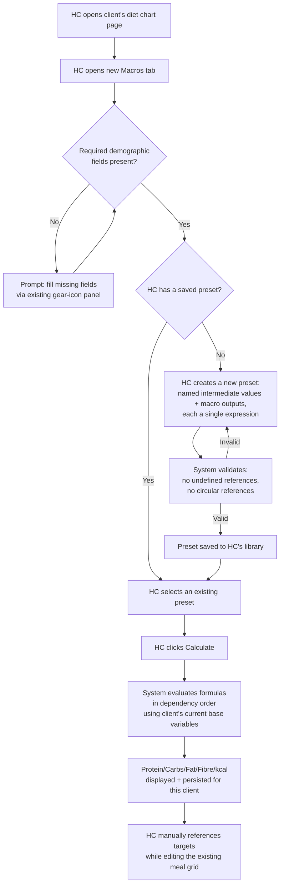

# SPEC-0001: Agnostic Macro Calculator

> **Unit**: `Unit_005_MacroDrivenDietCharts`
> **Series note**: This is **Part A** of a three-part initiative. Part B (Recipe/Food Macro Library) and Part C (Wiring targets + library into the diet chart) are deliberately **not** specified here — they haven't been brainstormed yet. They will land as `SPEC-0002` and `SPEC-0003` under this same Unit once each is designed. See §Out of scope.

**Status**: Draft
**Date**: 2026-07-08
**Owner**: SoJo
**Relates to**: `Unit_004_OneStopSpot/SPEC-0001-one-stop-spot.md` (D-16 — the private HC diet-chart editor this feature extends is explicitly unchanged/untouched by Unit_004's client-snapshot work), `Unit_003_ClientDiscoveryPipeline/SPEC-0001-client-discovery-pipeline.md` (confirmed as not a source of structured client variables — see §Data), `domain/glossary.md`, `domain/compliance-india.md` (DPDP — new fields on an already-encrypted column)
**Implemented by phases**: _(populated as phases complete)_

---

## Goal

Give HCs a macro/calorie target calculator that is fully agnostic to methodology. Instead of picking from a fixed list of textbook formulas (Mifflin-St Jeor, Katch-McArdle, etc.) the way competitor coaching platforms do, the HC defines their own formulas from a library of client variables, constants, and chained intermediate values, saves the formula set as a reusable named preset, and applies it to any client to produce target daily protein, carbs, fat, fibre, and calories. This is a deliberate niche differentiator — most HC platforms force a coach's own established method into a rigid dropdown or exclude it entirely — and it is the foundation of a larger goal: reducing the HC's manual nutrition-planning work so the platform earns trust as something that does real work, not just records it.

---

## Non-goals

- **No conditional or branching logic** in formulas (no if/then, no piecewise rules). Each named value is a single arithmetic expression.
- **No recipe/food macro library or meal-plan generation.** That is Part B (future `SPEC-0002`).
- **No automatic population of the diet chart grid** from computed targets. That is Part C (future `SPEC-0003`). In this spec, computed targets are a reference number set the HC reads while building the chart manually, exactly as they do today.
- **No unit toggle.** Metric only (kg, cm) for v1 — no lb/inch entry.
- **No activity-level category picker with an app-provided multiplier table.** `activity_level` is a raw HC-entered number; the app does not encode any Sedentary/Light/Moderate/Active multiplier scale.
- **No history or versioning of computed targets.** One current value per client, overwritten on each recalculation.
- **No changes to the existing diet-chart editor's `generate`/`PATCH` endpoints, `DietChart.parameters` shape, or the templates library.** This feature is additive — a new tab alongside the existing editor.
- **No change to `clients.health_metrics`.** That is a separate, freeform feature being built elsewhere (per prior confirmation with SoJo); this spec's demographic fields are fully decoupled from it.
- **No client-facing surface whatsoever.** This is 100% an HC-internal tool.

---

## Actors and roles

Cross-reference `domain/actors.md`.

| Actor             | Role                  | What they can do                                                                                                                                                                                                       |
| ----------------- | --------------------- | ---------------------------------------------------------------------------------------------------------------------------------------------------------------------------------------------------------------------- |
| Health Coach (HC) | Primary and only user | Enters client demographic values; authors and saves reusable formula presets; runs a calculation for a client; views computed targets (never edited directly — only ever produced by recalculation, per §Edge cases) |
| Client            | Not involved          | No interaction, no visibility — this subsystem has zero client-facing surface                                                                                                                                         |
| System            | Automation            | Evaluates saved formulas deterministically (sandboxed expression evaluation, no arbitrary code execution); persists computed targets                                                                                   |

---

## Domain terms

New terms introduced here — also added to `domain/glossary.md`.

| Term                       | Definition                                                                                                                                                                                                                                                                          |
| -------------------------- | ----------------------------------------------------------------------------------------------------------------------------------------------------------------------------------------------------------------------------------------------------------------------------------- |
| **Macro Calculator** | The HC-facing tool described in this spec: formula authoring + target computation, surfaced as a tab on the existing per-client diet-chart editor page.                                                                                                                             |
| **Formula Preset**   | An HC-authored, named, reusable set of formulas (an ordered list of intermediate values and macro outputs). Saved once, applied across any number of clients — mirrors the existing diet-chart-templates library pattern.                                                          |
| **Base variable**    | A client biometric value the calculator can reference:`weight`, `target_weight`, `height`, `waist`, `hip`, `neck`, `activity_level` (new fields on `clients.demographics`), plus `age` (derived from the existing `dob` field) and `gender` (existing field). |
| **Constant**         | A numeric value available to formulas that isn't a base variable: either a system-provided**editable default** (kcal-per-gram for protein/carbs/fat/fibre) or an **HC-defined custom constant** scoped to a preset.                                                     |
| **Derived value**    | A named intermediate value computed by one formula within a preset (e.g. BMR, TDEE) and referenced by name in later formulas in the same preset — this chaining is what makes layered, real-world methods (most of which are BMR/TDEE-based) expressible.                          |
| **Macro target**     | The final computed daily protein/carbs/fat/fibre grams and total kcal for a client, produced by running a preset against that client's current base variables.                                                                                                                      |

---

## User stories

- As an HC, I want to define my own macro-calculation formulas from client variables and constants so that I can use the exact method I trust, instead of one the app forces on me.
- As an HC, I want to save a formula set once and reuse it across every client so that I don't rebuild the same setup repeatedly.
- As an HC, I want formulas to reference intermediate values like BMR or TDEE so that layered methods — how most real nutrition formulas actually work — are expressible, not just flat one-line arithmetic.
- As an HC, I want the kcal-per-gram constants to be editable, not fixed by the app, so the calculator doesn't quietly assume one nutrition philosophy (fibre's kcal contribution in particular is genuinely contested across methods).
- As an HC, I want to see a client's computed target macros clearly on the diet chart page so I can reference them while building the actual meal plan.
- As an HC, I want a clear error if my formula references something that doesn't exist or creates a circular dependency, so I never save something that will silently fail later.

---

## Flow

1. HC opens a client's diet chart page and selects the new **Macros** tab.
2. If required demographic fields for the selected/new preset are missing, the HC is prompted to fill them in via the existing gear-icon Settings panel on the client detail page (this spec adds 7 new fields there — see §Data).
3. HC either selects an existing saved Formula Preset from their personal library, or creates a new one.
4. Creating/editing a preset: the HC adds named values in order. Each is either a macro output (protein, carbs, fat, fibre) or a derived/intermediate value (e.g. BMR, TDEE), and each has a single arithmetic expression that may reference base variables, constants, and any earlier-defined named value in the same preset.
5. On save, the system validates the preset: every referenced name must resolve to something defined earlier (base variable, constant, or earlier derived value), and no circular references are allowed. Invalid presets are rejected with a specific error naming the problem.
6. HC names and saves the preset — it becomes available for any client going forward.
7. HC clicks **Calculate** for the current client. The system evaluates the preset's formulas in dependency order using that client's current base variable values, producing daily protein/carbs/fat/fibre in grams and total kcal.
8. The result is displayed on the Macros tab and persisted against the client, overwriting any previous computed target for that client.
9. The HC references these numbers manually while building the meal grid in the existing (unchanged) diet-chart editor — no automatic linkage yet.

---

## Data

Cross-reference `diagrams/0002-data-model.md` (to be updated when this is implemented, not before — per this repo's diagram-maintenance rule, that file reflects built state, not planned state).

| Entity                                | Read | Write | New fields?                                                                                                                                                                                                                                                                                                                                                            |
| ------------------------------------- | ---- | ----- | ---------------------------------------------------------------------------------------------------------------------------------------------------------------------------------------------------------------------------------------------------------------------------------------------------------------------------------------------------------------------- |
| `clients`                           | Y    | Y     | 7 new keys inside the existing`demographics` JSONB (`EncryptedJSON`, already encrypted at rest — no migration needed): `weight`, `target_weight`, `height`, `waist`, `hip`, `neck`, `activity_level`. All plain numeric strings, metric units. `age` is derived from the existing `dob` key at calculation time, not stored separately.         |
| `macro_formula_presets` (new table) | Y    | Y     | `id`, `hc_user_id` FK, `name`, `definition JSONB` (ordered list: `{key, label, expression, is_macro_output}` for values, plus `{key, label, value}` for constants — same JSONB-parameters pattern already used by `DietChart`), `archived_at`, `created_at`, `updated_at`                                                                         |
| `client_macro_targets` (new table)  | Y    | Y     | `id`, `client_id` FK (unique — one current row per client, overwritten on recalculation per non-goals), `hc_user_id` FK, `preset_id` FK, `protein_g`, `carbs_g`, `fat_g`, `fibre_g`, `kcal_total`, `inputs_snapshot JSONB` (the base variable values actually used, for auditability — "why did this number come out this way"), `computed_at` |

**Why not source variables from `clients.health_metrics` or Unit_003's Lead data**: verified directly against both. `health_metrics` is a fully freeform HC-typed list with no guaranteed keys or naming consistency. Unit_003's `leads` table has no biometric columns at all — even age is stored as free-text `lead_questionnaire_responses.response_text`, and blood report data is never persisted as structured values, only as a narrative LLM brief. Neither produces reliable structured numbers today or after Unit_003 ships, so this spec's dedicated `demographics` fields are the correct long-term source, not a temporary workaround.

---

## API surface

| Method     | Path                                                 | Auth | Purpose                                                                                                                                                                                                             |
| ---------- | ---------------------------------------------------- | ---- | ------------------------------------------------------------------------------------------------------------------------------------------------------------------------------------------------------------------- |
| `GET`    | `/api/macro-presets`                               | HC   | List the HC's saved presets (excludes archived)                                                                                                                                                                     |
| `POST`   | `/api/macro-presets`                               | HC   | Create a new preset; server validates references + circularity before insert                                                                                                                                        |
| `PATCH`  | `/api/macro-presets/{id}`                          | HC   | Edit a preset; same validation as create                                                                                                                                                                            |
| `DELETE` | `/api/macro-presets/{id}`                          | HC   | Archive a preset (`archived_at` set — soft delete, same pattern as diet-chart templates)                                                                                                                         |
| `POST`   | `/api/clients/{client_id}/macro-targets/calculate` | HC   | Body:`{preset_id}`. Evaluates the preset against the client's current `demographics`; upserts `client_macro_targets`; returns computed values or a structured error naming missing fields / failed evaluation |
| `GET`    | `/api/clients/{client_id}/macro-targets`           | HC   | Fetch the client's current computed target, if any                                                                                                                                                                  |

All routes tenant-scoped to `hc_user_id`; cross-tenant access returns 404, never 403, per existing platform pattern.

---

## LLM involvement (if any)

Not applicable. This is deterministic arithmetic expression evaluation — no LLM call anywhere in this flow.

---

## Coach-reviewed gate (if applicable)

Not applicable. There is no AI-generated content and no client-facing delivery path in this spec — the coach-reviewed gate pattern (`draft`/`reviewed`/`sent`) governs content that reaches a client, and nothing in this spec ever does.

---

## Edge cases and failure modes

| Case                                                                                          | Behavior                                                                                                                                                                                                           |
| --------------------------------------------------------------------------------------------- | ------------------------------------------------------------------------------------------------------------------------------------------------------------------------------------------------------------------ |
| Client is missing a demographic value the selected preset's formulas need                     | Calculate is blocked with an inline message naming exactly which field(s) are missing. No partial or estimated calculation is attempted.                                                                           |
| Formula references a name (variable/constant/derived value) that doesn't resolve              | Save is rejected with an inline error naming the unresolved reference. Never saved in a broken state.                                                                                                              |
| Circular reference between derived values (A references B, B references A)                    | Save is rejected with a "circular reference" error, detected via dependency-graph validation before save.                                                                                                          |
| Invalid arithmetic at calculation time (e.g. division by a variable that evaluates to zero)   | Calculation fails with an inline error naming which value failed to compute. No`NaN`/`Infinity` is ever stored.                                                                                                |
| HC archives a preset that produced a client's currently-stored target                         | The stored target values are unaffected and still shown;`preset_id` is retained for audit even though the preset is archived. Recalculating requires selecting an active preset.                                 |
| HC edits a client's demographic values after a target was already calculated                  | The existing stored target is left untouched until the HC explicitly recalculates — no silent auto-recompute, so the HC always knows exactly what produced a given number.                                        |
| Two HCs both reference the same client (not possible under current tenant model, but checked) | `client_macro_targets` and `macro_formula_presets` both carry `hc_user_id` directly (not solely via a join) for tenant scoping, matching the `lead_files` pattern already used elsewhere in this codebase. |

---

## Acceptance criteria

- [ ] `PATCH /api/clients/{id}` accepts the 7 new `demographics` keys (`weight`, `target_weight`, `height`, `waist`, `hip`, `neck`, `activity_level`) and persists them; existing 8 keys unaffected
- [ ] HC can create a formula preset containing at least one derived value (e.g. BMR) and reference it from a macro's formula (chaining works end-to-end)
- [ ] Saving a preset with an undefined variable/constant/derived-value reference is rejected with a named error
- [ ] Saving a preset with a circular reference between derived values is rejected
- [ ] `POST /api/clients/{id}/macro-targets/calculate` against a client with all required demographics present returns protein/carbs/fat/fibre/kcal and persists a row in `client_macro_targets`
- [ ] Calling calculate against a client missing a required demographic value returns a structured error naming the missing field(s), not a 500 or a silently wrong number
- [ ] Protein/carb/fat/fibre kcal-per-gram constants are pre-filled with sensible defaults but are editable per preset
- [ ] A saved preset appears in `GET /api/macro-presets` and can be successfully applied (calculated) against more than one client
- [ ] Cross-tenant isolation: HC2 cannot list, read, edit, or apply HC1's presets, and cannot read HC1's client's `client_macro_targets` — verified 404, not 403, in integration tests
- [ ] The Macros tab on the existing diet-chart editor page displays the client's current computed target (or an empty/prompt state if none exists yet)
- [ ] Archiving a preset does not delete or alter any client's already-computed `client_macro_targets` row

---

## Open questions

- Exact UI mechanism for formula authoring — free-text expression bar with autocomplete vs. click-to-insert variable/constant chips. A UX decision, not an architectural one; doesn't block backend/data-model work. — owner: SoJo — by: before PHASE-01 frontend implementation begins.
- Whether `client_macro_targets` should gain history/versioning once pilot HCs give feedback (raised and explicitly deferred during brainstorming, kept as an easy future extension since the schema already isolates it from `demographics`). — owner: SoJo — by: post-pilot review.

---

## Out of scope (for this spec, may be future)

- **Part B — Recipe/Food Macro Library** (future `SPEC-0002` under this Unit): platform-seeded macro data (India-anchored — IFCT is the likely candidate, licensing unverified) plus each HC's own custom recipes/reference meal plans, quantity → macro mapping.
- **Part C — Wiring** (future `SPEC-0003` under this Unit): connecting computed targets (this spec) and the recipe library (Part B) to actually populate the diet-chart grid, rather than the HC manually cross-referencing target numbers.
- Unit toggle (lb/inches) for demographic entry.
- Activity-level category picker with an app-provided multiplier table.
- Branching/conditional logic in formulas.
- History/versioning of computed macro targets.
- Any client-facing display of macro targets.

---

## Changelog

| Date       | Change                                                                                                                                                                                                                                                                                                                                       | Reason                                                                                                                                                                                                                                                                             |
| ---------- | -------------------------------------------------------------------------------------------------------------------------------------------------------------------------------------------------------------------------------------------------------------------------------------------------------------------------------------------- | ---------------------------------------------------------------------------------------------------------------------------------------------------------------------------------------------------------------------------------------------------------------------------------- |
| 2026-07-08 | Initial draft — Part A (Macro Calculator) of the Unit_005 macro-driven diet chart initiative. Brainstormed and locked with SoJo across a full session: agnostic-formula scope, variable sourcing (verified against Unit_003 and the existing Health Metrics feature rather than assumed), chaining decision, and the 3-part Unit structure. | Business goal: an agnostic macro calculator as a niche differentiator against competitor platforms' rigid formula dropdowns — first of a 3-part pipeline (Calculator → Recipe Library → Wiring) aimed at reducing HC manual nutrition-planning work and building product trust. |
